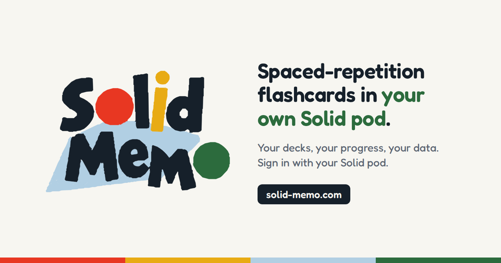

# Solid Memo

[](https://solid-memo.com/)

Spaced-repetition flashcards that live in your own Solid Pod.

The app, its vocabulary and shapes ([`ns/`](ns/)) and the ready-made
decks ([`decks/`](decks/)) are published together at
https://solid-memo.com/ ([docs/deployment.md](docs/deployment.md)).

## Develop

You need Node 24 (see [`.nvmrc`](.nvmrc)) and npm; Docker Engine 28.3.3
or later (or Docker Desktop) for the end-to-end tests; and, for the
optional pySHACL cross-check, Python 3 with
[`scripts/requirements-ci.txt`](scripts/requirements-ci.txt) installed.
The [dev container](.devcontainer/devcontainer.json) has all of them.

```sh
npm ci
npm run dev       # the site, from source
npm run check     # typecheck, tests (100% coverage), drift, formatting, the deck library, boundaries
npm run test:pod  # the end-to-end tests, against Solid servers started in Docker
```

How the code is laid out: [docs/architecture.md](docs/architecture.md);
how it is tested: [docs/testing.md](docs/testing.md); everything else:
[docs/](docs/README.md).

## License

Solid Memo is released under the [MIT License](LICENSE).

The ready-made decks carry their own licences, stated in each deck
(`dcterms:license`, [docs/deck-library.md](docs/deck-library.md)) and
shown in the app. The vendored SHACL shapes keep their own: the DCAT-AP shapes are CC BY 4.0
([licence](packages/vocab/vendor/dcat-ap/LICENSE)) and the SkoHub SKOS
shapes Apache 2.0 ([licence](packages/vocab/vendor/skohub/LICENSE)); see
[packages/vocab/vendor](packages/vocab/vendor/README.md).
