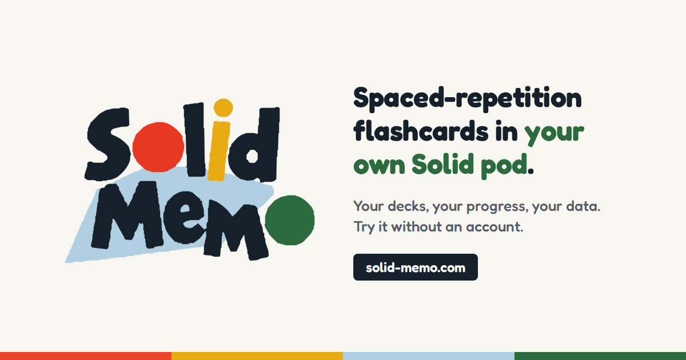

# Solid Memo

[](https://github.com/solid-memo/website/actions/workflows/ci.yml)
[](https://github.com/solid-memo/website/actions/workflows/interop.yml)

[](https://solid-memo.com/)

Spaced-repetition flashcards that live in your own Solid Pod.

The app, its vocabulary and shapes ([`ns/`](ns/)) and the ready-made
decks ([`decks/`](decks/)) are published together at
<https://solid-memo.com/> ([docs/deployment.md](docs/deployment.md)).

## About

Solid Memo helps you remember what you learn. You study flashcards, and
the app shows each card again just before you would forget it: this is
called spaced repetition. It comes with about a hundred ready-made decks
and a few short courses, in six languages, and you can write your own.

Most flashcard apps keep your cards and your study history on their own
servers. If the app closes, or you want to move, your history stays
behind. Solid Memo keeps them in your own
[Solid](https://solidproject.org/) Pod instead: an online data store that
you choose and control, from any provider or on your own server. Solid
Memo only reads and writes there, in an open format that other apps can
use too. You can also try it as a guest first, with everything kept in
your browser.

It is for:

- **learners** who want their study data to stay theirs;
- **deck and course authors**, who write, check and publish decks in
  Solid Memo Studio ([docs/studio.md](docs/studio.md));
- **developers** building on Solid, who can reuse its vocabulary, its
  shapes and its decks ([docs/vocab.md](docs/vocab.md),
  [docs/shapes.md](docs/shapes.md)).

How to use it: [docs/user-guide.md](docs/user-guide.md). What it is
for, and what it is not: [docs/objectives.md](docs/objectives.md). The
same, for learners, authors, technologists and decision makers:
[solid-memo.com/about](https://solid-memo.com/about/).

To see what the app does without signing in, open the report of its
[user journeys](https://solid-memo.com/journeys/): tests that use the
app in a browser as a person would, step by step, from the latest
deploy by CI ([docs/testing.md](docs/testing.md#user-journeys)).

## Status

Solid Memo is in **beta**. It works, but it still changes, and a new
version may change how things work. Its versions follow
[Semantic Versioning](https://semver.org/) at 0.x, tagged by hand; the
first is 0.1.0. What changed in each version is in
[CHANGELOG.md](CHANGELOG.md), and how versions are numbered is in
[docs/releasing.md](docs/releasing.md).

Your data is safe across versions: every data format is versioned, and
the app brings older data in your Pod up to date in place
([docs/migrations.md](docs/migrations.md)). The vocabulary, the shapes
and the library's decks have versions of their own, and a published
version is never changed.

## Run it on its own

Solid Memo is a static web page with no server-side code, so you can run
your own copy on any web host:

```sh
npm ci
npm run build   # the whole site, in apps/web/dist/
npm start       # builds it, then serves it at http://localhost:4173
```

Upload the contents of `apps/web/dist/` to any static web space
([docs/deployment.md](docs/deployment.md#manual-publish-any-static-web-space)).
[docs/reuse.md](docs/reuse.md) says what to change for your own copy,
and what must stay the same so that your users' data still works with
Solid Memo; [docs/configuration.md](docs/configuration.md) lists the
settings.

## Develop

You need Node 24 (see [`.nvmrc`](.nvmrc)) and npm; Docker Engine 28.3.3
or later (or Docker Desktop) for the end-to-end tests; and, for the
optional pySHACL cross-check, Python 3 with
[`scripts/requirements-ci.txt`](scripts/requirements-ci.txt) installed.
The [dev container](.devcontainer/devcontainer.json) has all of them.

```sh
npm ci
npm run dev       # the site, from source
npm run check     # typecheck, tests (100% coverage), drift, formatting, the deck library, boundaries
npm run test:pod  # the end-to-end tests, against Solid servers started in Docker
```

How the code is laid out: [docs/architecture.md](docs/architecture.md);
each package's own `README.md` says what it exports and may import;
how it is tested: [docs/testing.md](docs/testing.md); how it is written:
[docs/style.md](docs/style.md); everything else:
[docs/](docs/README.md).

## Contributing

Everyone is welcome to suggest a change, report a problem or send one.

- Report a bug or suggest a feature in the
  [issues](https://github.com/solid-memo/website/issues).
- Ask a question or share an idea in the
  [discussions](https://github.com/solid-memo/website/discussions).
- See the changes under way in the
  [pull requests](https://github.com/solid-memo/website/pulls), and send
  your own: [CONTRIBUTING.md](CONTRIBUTING.md) says how.
- Report a security problem privately, never in a public issue:
  [SECURITY.md](SECURITY.md).

How the project is run and who decides: [GOVERNANCE.md](GOVERNANCE.md).
What is planned: [ROADMAP.md](ROADMAP.md). How we treat each other:
[CODE_OF_CONDUCT.md](CODE_OF_CONDUCT.md).

English is the authoritative language of the code, the docs, commit
messages, issues and pull requests. The app itself speaks English,
Swedish, Korean, German, Spanish and French ([docs/i18n.md](docs/i18n.md)).

## License

Solid Memo is released under the [MIT License](LICENSE). That covers
everything in this repository, the documentation ([`docs/`](docs/)) and
the vocabulary and shapes ([`ns/`](ns/)) included, unless a file says
otherwise.

The ready-made decks carry their own licenses, stated in each deck
(`dcterms:license`, [docs/deck-library.md](docs/deck-library.md)) and
shown in the app. The vendored SHACL shapes keep their own: the DCAT-AP
shapes are CC BY 4.0 ([license](packages/vocab/vendor/dcat-ap/LICENSE))
and the SkoHub SKOS shapes Apache 2.0
([license](packages/vocab/vendor/skohub/LICENSE)); see
[packages/vocab/vendor](packages/vocab/vendor/README.md).
