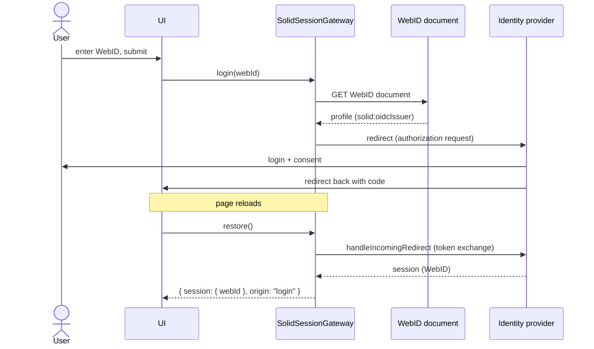

# Authentication

Login, session restore, and logout against a Solid identity provider using
Solid-OIDC. All authentication code lives in
[packages/solid/src/solidSessionGateway.ts](../packages/solid/src/solidSessionGateway.ts),
behind the `SessionGateway` port.

## Login flow

The user enters only their WebID (collected by the
[onboarding flow](onboarding.md), validated as an `https:` URL). The app
dereferences it (unauthenticated) and reads the `solid:oidcIssuer` triple to
find their identity provider, then starts the OIDC redirect flow. The issuer
is never inferred from the WebID's origin — the two often differ (a WebID on
`alice.datapod.igrant.io` is served by the issuer `datapod.igrant.io`) — and
must itself be an `https:` URL.

Alternatively the user picks a suggested provider ([onboarding](onboarding.md));
`loginWithIssuer` then skips the profile lookup and starts the same flow at
that issuer.

The app never handles credentials: no password field, no client secret, no
hand-rolled OIDC. The authn library registers the client dynamically and
runs the authorization-code + PKCE flow.

## Session restore

`restore()` runs on every page load (App's boot effect), through the
`restoreSession` use case, which falls back to a guest's session when a
guest studied in this browser ([guest-mode.md](guest-mode.md)). It completes a
pending OIDC redirect if one is in flight, otherwise silently restores a
previous session (`restorePreviousSession: true`). It returns a domain
`EstablishedSession` (`{ session, origin }`) or `null`. `origin` is
`"login"` when the library emitted its `LOGIN` event (a login redirect just
completed) and `"restored"` otherwise; the UI shows the "Pod connected"
onboarding step only for the former.

### Two apps on one origin

Solid Memo and the [Studio](studio.md) are two pages of one site. The
authn library keeps one session per origin, and a silent restore
always sends the user back to the page the session was logged in from.
Left alone, opening the Studio after logging in to Solid Memo would
land the user back in Solid Memo, and the other way round.

So `login` keeps the app it was started from in localStorage
(`solid-memo:session-page`), and `restore()` restores a previous session
only in that app. A session that keeps no app, as one from before the
Studio, can only have been logged in from Solid Memo, so it counts as
Solid Memo's: composition hands the gateway the site's root as that
default app. An app is its page's directory: `/`, `/index.html` and
`/studio` count as `/`, `/` and `/studio/`. Elsewhere the app shows its
landing page and takes a login of its own, which then becomes the
session's app. The identity provider
still knows the user, so this login usually asks only for consent.

## Authenticated requests

Repositories receive `fetch` by injection. The composition root injects
[authFetch](../packages/solid/src/authFetch.ts), a lazy wrapper that
delegates to the current default session's fetch at call time — never a
reference captured before login — behind a router that sends the
guest's URLs to the pod kept in the browser instead
([guest-mode.md](guest-mode.md)). Every pod read goes through it, the
WebID document's too: the storage gateway hands @inrupt/solid-client the
profile it read, since left to itself the library reads it with the
browser's own fetch.

## Logout

`logout()` clears the session via the authn library; the UI additionally
clears the react-query cache so no pod data outlives the session that
fetched it.
