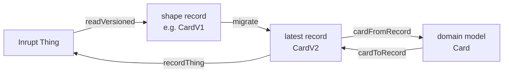
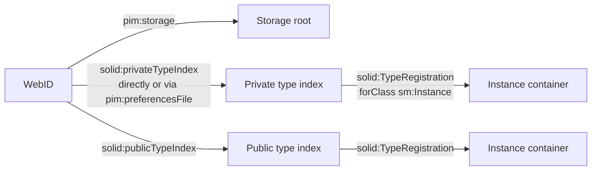
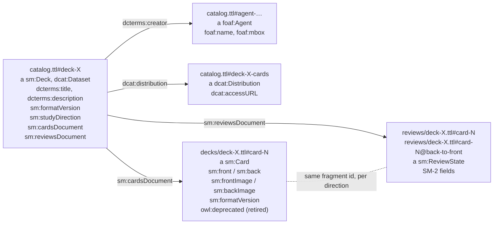
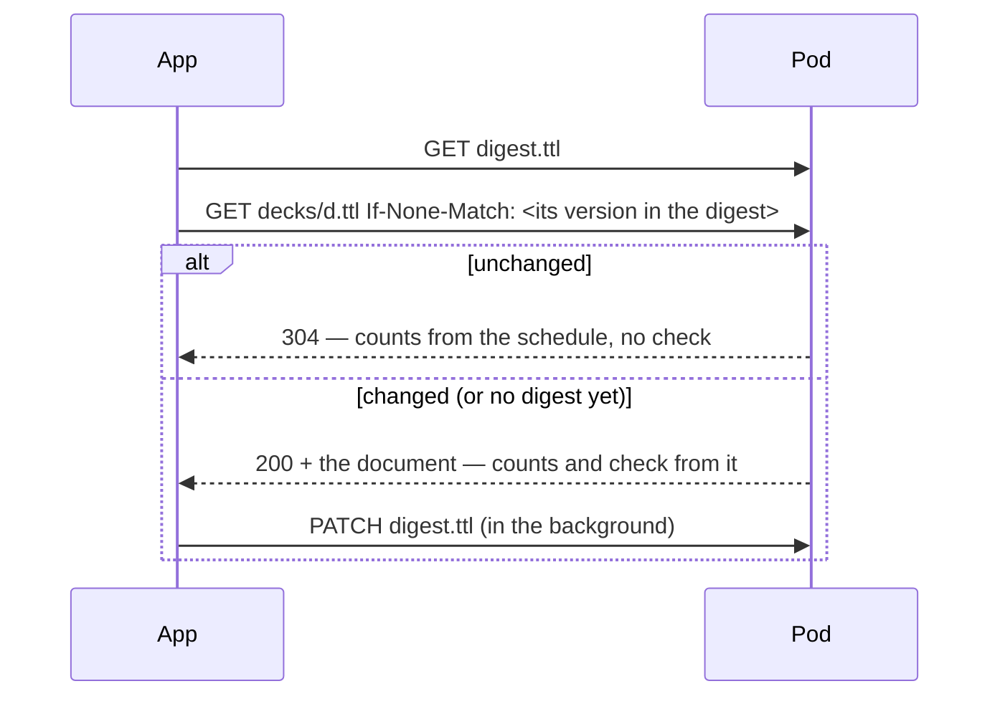

# Data model in the pod

Where Solid Memo stores data in a user's pod and how it finds it again.
Implemented in `packages/solid/src/` (vocabulary in
[vocab.ts](../packages/solid/src/vocab.ts), discovery in
[typeIndex.ts](../packages/solid/src/typeIndex.ts)).

## Vocabulary and shapes

Solid Memo mints its own terms under `https://pod.solid-memo.com/vocab/v1#`
(prefix `sm:` below) — no existing RDF vocabulary covers spaced repetition.
The terms are defined in [`https://pod.solid-memo.com/vocab/v1`](https://pod.solid-memo.com/vocab/v1) ([vocab.md](vocab.md));
what a valid subject of each class looks like, version by version, is a
SHACL shape on [`https://pod.solid-memo.com/shapes/`](https://pod.solid-memo.com/shapes/) ([shapes.md](shapes.md)). Both
are published on their own pods, and the app's constants, record types and
descriptors are generated from them. Readers ignore unknown triples and
writers never delete triples they don't understand.



## Discovery chain



- **Storage**: `pim:storage` triples in the (extended) profile via
  `getPodUrlAll`; when absent, the Solid Protocol Link-header walk-up
  (`rel="type"` targeting `pim:Storage` — capital S) from the WebID URL;
  manual URL entry as last resort. 0, 1, or N storages are all handled.
- **Instances**: one `solid:TypeRegistration` per instance, `solid:forClass
  sm:Instance`, in the private type index by default. `dcterms:title` on the
  registration names the instance (harmless extra triples). Reading accepts
  both `solid:instanceContainer` and `solid:instance`.
- **Type index links** are read from the WebID subject in the WebID
  document and in its extended profile documents (`rdfs:seeAlso` /
  `foaf:isPrimaryTopicOf`), plus `pim:preferencesFile` for the private one.
- **Missing indexes** (normal on Community Solid Server pods): the user is
  warned and chooses — create the private index (document under
  `<storage>settings/` plus a profile link) or register publicly. The link
  goes in the WebID document when it is writable, else in the first
  extended profile that accepts it (Inrupt PodSpaces: the WebID document on
  `id.inrupt.com` is read-only; `<storage>profile` is the writable one). An
  index document already at the target URL is adopted, not overwritten. If
  registration fails, instance creation fails loudly and the created
  container is cleaned up; there is no local fallback.
- **Deleting an instance** wipes the container recursively (children
  first, `meta.ttl` last, so a half-deleted instance still attaches by
  URL), then removes its registrations from both type indexes. Data goes
  before registration so a failure leaves the instance listed and the
  delete retryable.

## Instance layout

```
<storage>solid-memo/<name>/          (default path; user-editable)
├── meta.ttl        #it: a sm:Instance; dcterms:title; dcterms:created;
│                        after a format update dcterms:replaces (the
│                        backup) and dcterms:modified; sm:formatVersion 2
├── preferences.ttl #it: a sm:Preferences (created on first explicit save):
│                        study caps, sm:answerScale, sm:developerMode,
│                        sm:invalidDataPolicy, sm:theme,
│                        sm:formatVersion 4
├── catalog.ttl     one subject per deck (titles live ONLY here), a
│                        sm:Deck and dcat:Dataset: sm:formatVersion 6,
│                        dcterms:description, sm:studyDirection, optional
│                        dcterms:creator/license, dcat:theme,
│                        dcat:keyword (language-tagged),
│                        prov:wasDerivedFrom, the deck's own study caps
│                        (sm:deckNewCardsPerDay/MaxReviewsPerDay);
│                        beside each deck its
│                        dcat:Distribution (#deck-X-cards) and the
│                        foaf:Agent nodes of its creators (#agent-…)
├── decks/<deckId>.ttl    card corpus: one sm:Card per fragment (slow churn),
│                        sm:front/back text and/or sm:frontImage/backImage
│                        IRIs, optional sm:frontImageDescription/
│                        backImageDescription (a picture's alt text),
│                        sm:frontNote/backNote under each
│                        side and sm:backLabel above the back, each with
│                        sm:formatVersion; a retired card
│                        (owl:deprecated true) is kept but not studied
├── reviews/<deckId>.ttl  SM-2 state: one sm:ReviewState per card and
│                        direction (fast churn) — #<cardId> front→back,
│                        #<cardId>@back-to-front the other way; optional
│                        sm:previous* snapshot = state before the day's
│                        first review (restored by "reset the day");
│                        sm:formatVersion 2
├── history/<YYYY-MM>.ttl  the answer log (below): one sm:Answer per grade
│                        given in study that month, appended, never
│                        edited; sm:formatVersion 1
└── digest.ttl      derived data (below): a sm:DocumentReceipt per document
                         (#receipt-<path>) and a sm:DeckSchedule per deck
                         (#schedule-<path>), each stamped with the versions
                         it was learned from; sm:formatVersion 1
```

A deck's documents are found through its catalog entry
(`sm:cardsDocument`, `sm:reviewsDocument`), never by name: a library
upgrade moves them to `decks/<deckId>-<uuid>.ttl` and
`reviews/<deckId>-<uuid>.ttl` ([migrations](migrations.md#how-an-upgrade-is-applied)).

## Decks and cards

Granularity is chosen around the N+1 problem (no batch requests, no SPARQL
on Solid servers): reading a whole deck is one GET, and a study session
never rewrites card content.



- The **catalog** holds one subject per deck with its title and links to the
  two documents — the deck list renders from a single fetch. A deck's
  title and description are language-tagged text, one value per
  language: since deck format 5 in any language the user states, no
  English required (format 4 required one; see
  [i18n.md](i18n.md#text-in-the-users-languages)). Since deck
  format 3 a deck is a DCAT dataset (`dcat:Dataset`, see
  [vocab.md](vocab.md) and [validation.md](validation.md)): it always has
  a description (`dcterms:description`: what it covers and where its
  content came from — shown on the deck page with its URLs as links; a
  deck without one gets "Flashcards: <title>."@en and
  "Kortlek: <title>."@sv, app-written text for any title), and may name its
  authors (`dcterms:creator`, each a `foaf:Agent` node `#agent-<slug>`
  beside the deck, with `foaf:name` and a `mailto:` `foaf:mbox`; the app
  shows them as "Name <email>"), licence (`dcterms:license`, a URL),
  topics (`dcat:theme`, concepts of the [topics](vocab.md#concept-schemes)
  scheme) and keywords (`dcat:keyword`: since deck format 6
  language-tagged, several per language; untagged ones saved before
  are kept, their language unknown). Its cards document is named as
  its `dcat:distribution` (`#deck-X-cards`, with `dcat:accessURL`). A
  deck copied from the [deck library](deck-library.md) inherits the
  provenance and says which release it came from with
  `prov:wasDerivedFrom` (`dcterms:source` before format 3). Agents no
  deck names any more are removed with the deck that named them.
- **Card sides**: each side is text (`sm:front` / `sm:back`, a literal),
  a picture (`sm:frontImage` / `sm:backImage`, always an IRI — a string in
  its place is ignored) or both; a side with neither makes the subject
  not a card. A side's text is language-tagged, one value per language
  (`zxx` for codes, numbers and symbols), or, as saved before card
  format 5, one untagged literal whose language is not known, never
  both; the app keeps untagged text only while it is untouched. A note
  under a side (`sm:frontNote` / `sm:backNote`) and the label above the
  back (`sm:backLabel`) are language-tagged text in any language. Pictures are shown only when their URL is http(s); pod data
  is untrusted. A picture may have a description
  (`sm:frontImageDescription` / `sm:backImageDescription`,
  language-tagged), read to whoever cannot see it in its place; without
  one it is named by its side ("Picture on the front of the card"). The
  description is read while its side is asked, so it says what the
  picture shows without giving the answer away.
- **Direction**: a deck's `sm:studyDirection` says how it is studied — a
  concept of `sm:StudyDirections`: `sm:frontToBack`, `sm:backToFront` or
  `sm:bidirectional` (every card asked both ways). Formats 1 and 2 said
  it with the string `sm:direction` (absent meaning front→back, the only
  way there was before the field existed). Changed in the Browser; a
  library deck brings its own.
- **Study pace**: a deck may set its own daily limits,
  `sm:deckNewCardsPerDay` and `sm:deckMaxReviewsPerDay`, in place of the
  instance's `sm:newCardsPerDay` and `sm:maxReviewsPerDay`; a limit it
  does not set follows the preferences. Changed on the deck's own
  Preferences page (`#/deck-preferences`, from the deck's page); a
  library release never sets them, and a library upgrade keeps the
  copy's.
- **Format versions**: every subject the app writes carries
  `sm:formatVersion`, saying which version of its class's
  [shape](shapes.md) it conforms to: instance 1, decks 3 (DCAT),
  cards 2 (pictures), review states 2, preferences 4; the catalogue,
  agent and distribution nodes 1. Readers treat a
  missing version as 1 — data written before the field existed — read
  older versions as they are, and pass a newer stored version through
  unchanged. Bringing a pod up to the current versions is the user's
  call; see [migrations.md](migrations.md). A developer can check an
  instance against the shapes in the browser ([validation.md](validation.md)).
- **Cards** are hash-fragment subjects (`#card-<uuid>`, or the library's
  own ids such as `#sweden` for imported decks) inside one document per
  deck. Fragment ids are generated once at creation and never re-derived.
- **Review state** lives in a separate document per deck, joined to cards
  by the same fragment id — one subject per card *and direction*:
  `#<cardId>` for front→back (every state written before directions
  existed, which is what they all were) and `#<cardId>@back-to-front` for
  the other way. Card edits and review updates never touch each other's
  documents; removing a card removes both of its states.
- Cards/reviews documents are created lazily on first write; deck removal
  deletes both documents and the catalog subject; card removal also removes
  the card's review state.

Registration in the type index:

```turtle
<#sm-inst-9f3c1a> a solid:TypeRegistration ;
    solid:forClass sm:Instance ;
    solid:instanceContainer <https://pod.example/solid-memo/main/> ;
    dcterms:title "Japanese study" .
```

Beside it, the instance's catalogue is registered as a DCAT catalogue,
so other applications find its decks without knowing Solid Memo:

```turtle
<#sm-cat-4b7d2e> a solid:TypeRegistration ;
    solid:forClass dcat:Catalog ;
    solid:instance <https://pod.example/solid-memo/main/catalog.ttl#catalog> ;
    dcterms:title "Japanese study" .
```

`meta.ttl` makes a container self-describing: attach-by-URL reads it to
recover an instance that lost its registration. Deleting an instance
removes both registrations.

An instance's URL is not permanent: the [format update](migrations.md#the-pod-migration)
writes an updated copy at `<name>-<uuid>/` and switches the type index
registrations to it, keeping the original as a backup that the copy's
`dcterms:replaces` names. Anything that stores an instance URL must
expect it to move and find the instance through the type index again.

## The catalogue

`catalog.ttl#catalog` is a `dcat:Catalog` (shape `CatalogV1`) of the
instance's decks: a `dcterms:title` (the instance's name), a
`dcterms:description`, `dcterms:publisher` (the pod owner's WebID,
described in the same document as a `foaf:Agent` with the `foaf:name`
of their profile), the topics scheme and the EU data themes as
`dcat:themeTaxonomy`, and a `dcat:dataset` per deck, kept in step as
decks are added and removed. It is written when an instance is created,
and by the [format update](migrations.md) for an instance made before
there were catalogues; its registration is written when the update switches over. The whole document
conforms to DCAT-AP (a test holds what the app writes to it).

A deck's description, topics and keywords are edited in its Browser
("Describe deck"), the keywords one comma-separated list per language
the user states; the description is required, as DCAT-AP asks of
every dataset. Only the keyword languages the user states in an edit are
checked and stored in their canonical form ("iw" → "he"); a language tag
the deck already has, even one another app wrote that the app would not
accept from the user, is kept as stored.

## The answer log

Every grade given in study is kept, so statistics can be computed
([statistics.ts](../packages/domain/src/statistics.ts)): activity by
study day, streaks, and how well reviews were remembered. Once a day has
answers, a slim strip above the deck list (where a session usually
ends) says what the day came to (`todayOf`), led by the streak (with the record to beat,
or a new record cheered), then a word of praise and the day's numbers.
A review state
says only where a card stands now; the log is the history, and source
data, since nothing could rebuild it.

- **One document per study month** for the whole instance,
  `history/<YYYY-MM>.ttl` (`historyUrlOf`, by the month of the study day,
  so a day is never split): reading a year of statistics is twelve GETs
  whatever the number of decks.
- **One subject per answer**, `#answer-<time>-<random>`
  ([answer.ts](../packages/domain/src/answer.ts)): the deck's catalog
  entry and the card it was given to (either may since be removed; a
  removed deck's answers stay, as a removed deck), the direction, the SM-2
  grade (whichever answer scale gave it), when it was given and the study
  day it counts towards, fixed then so a later day-boundary change does
  not move it, and the prompt's interval before (absent on its first
  answer, which introduced it) and after.
- **Added without reading** (`appendToDocument`): one insert-only PATCH,
  without a precondition, since an answer names a subject no other writer
  does. Every server tested creates the document and its container when
  missing and keeps every one of several concurrent inserts
  (e2e/pod/src/history.integration.test.ts).
- **After the review, not in its way**: `recordReview` saves the review
  state, then queues the answer; it is added in the background, and one
  that fails waits, with those after it, for the next answer, the end of
  the session or the statistics page. An answer still queued when the
  tab closes is lost; the review it belongs to is not.
- **Resetting the day removes that deck's answers of the day**
  (`removeDay`: read, remove, save with If-Match, again on 412).
- Checked in the full check only ([validation.md](validation.md)): the
  current month changes every session, so checking it on every visit
  would download it every time.

## The digest

`digest.ttl` lets a visit skip what has not changed since the last one.
It holds only what Solid Memo learned of the other documents, each fact
stamped with the version (ETag) of the document it was learned from
([studyDigest.ts](../packages/domain/src/studyDigest.ts)):

- a **receipt** per document: at that version it conformed to the shapes
  (`sm:conformedTo` names the rules, a hash of the shape files the site
  was built with) and/or nothing in it was in an older format
  (`sm:latestFormat`);
- a **schedule** per deck, from given versions of its cards and reviews
  documents: prompts due by study day (`sm:dueOnDay "2026-10-01 12"`),
  prompts never reviewed, and the reviews and introductions of the day it
  was computed on. With today's preferences that gives the deck list the
  same counts as `buildStudyQueue` ([srs.md](srs.md#study-days-and-the-queue)).



- **A stale digest is never wrong, only slow.** Every fact is used only
  after the pod says its document is still at the stamped version; a
  document changed elsewhere (another device, another app) is read and
  checked in full, and the digest is repaired with what that read
  learned. So nothing else keeps it up to date: a write anywhere simply
  makes the facts about that document stale.
- **When a study session ends** (End session, leaving the screen, or the
  page being hidden) the deck's schedule and its reviews document's
  receipt are brought up to date, so the next visit finds them current.
- **Writes** are edits like any other (If-Match; [write check](validation.md#the-write-check)).
  Changes learned while a write is under way go in the next one; if the
  digest changed elsewhere meanwhile (412), it is read and changed again,
  six times in all, waiting a little longer before each (50 ms, then 100
  ms, …): another page learning a check's documents writes the digest
  several times running, and a write that tried again at once could lose
  to each. A failed write is dropped: the next visit learns it again.
- **Read leniently.** A subject that does not fit its shape is left out
  (and so relearned). The digest is not one of the documents an instance
  is [checked](validation.md) by: it is derived, and an invalid copy must
  not block the instance.
- **It is as good as the pod's ETags.** Community Solid Server 6 stamps
  its ETags in whole seconds, so a document changed elsewhere in the
  same second as Solid Memo read it keeps its ETag, and the digest takes
  it for unchanged until it changes again (7 stamps milliseconds). The
  same holds for `If-Match` (below).
- **A pod without ETags gains nothing.** node-solid-server (5.x, 6.0.0) gives no
  ETag on a read: nothing can be known to be unchanged, so nothing is
  kept, and every visit reads everything, as before.
- The [format update](migrations.md#the-pod-migration) copies the digest
  with the rest; the copy's documents have other versions, so it is
  relearned on the first visit.

## Write discipline

- Mutations always follow read → modify → save
  ([datasets.ts](../packages/solid/src/datasets.ts): `readDataset` or
  `getSolidDatasetOrNull`, then `saveDataset`), which issues a PATCH of the
  delta, or for a large edit one PUT of the whole document as read and
  edited (below), so unknown triples survive either way. Only brand-new
  documents are saved from `createSolidDataset()`.
- The [answer log](#the-answer-log) is the one exception: answers are
  added unread, with an insert-only PATCH, since adding a new subject
  cannot undo anyone else's write.
- **Every write states what it expects to find**, as an HTTP precondition,
  so a write never silently undoes someone else's (another tab, device or
  app):
  - an edit is sent with `If-Match: <the ETag the document was read with>`;
    had it changed since, the pod answers 412 and nothing is written. An
    edit is a PATCH or, when the PATCH would be larger than 64 KiB, one
    PUT of the whole document: node-solid-server reads at most 100 kB of a
    PATCH and fails past that, which an edit of every card of a large deck
    (a format update) exceeds. Without `If-Match` (no strong ETag, below),
    such a PUT would undo a change made elsewhere since the read, where a
    PATCH keeps it. Stating the language of a deck's untagged card sides
    (`stateCardLanguages`) is always one PUT (`saveDataset`'s `whole`):
    Community Solid Server's in-memory store cuts a document short after
    a PATCH holding text beyond ASCII, and such a bulk edit is all text;
  - a creation is sent with `If-None-Match: *` (by
    `@inrupt/solid-client` for datasets and containers, by the copier for
    files); had something appeared there meanwhile, 412;
  - deleting a document read before sends `If-Match` too.

  A 412 surfaces as a `PreconditionFailedError` naming the document
  ("changed elsewhere … Reload and try again"); nothing retries on its
  own. Weak ETags (`W/"…"`) are never sent in `If-Match`, whose
  comparison is strong; a document the pod gives no ETag, or one saved
  since it was read (pods need not return the new ETag), is written
  without `If-Match`. node-solid-server gives no ETag on a read and
  ignores `If-Match` (5.7.4 also `If-None-Match: *`; 5.8.8 and 6.0.0
  enforce that), so there no edit is conditional: a PATCH still keeps a change
  made elsewhere, a large edit's PUT does not. Community Solid Server 6's
  ETag only changes from one second to the next, so it misses a change
  made in the same second as the read. The end-to-end tests hold all of this
  against real servers, that one included ([testing.md](testing.md)).
- **An edit's PATCH body is written by Solid Memo** (`patchBody` in
  [datasets.ts](../packages/solid/src/datasets.ts)), not by
  `@inrupt/solid-client`: one triple a line, a space before each `.`.
  node-solid-server's parser fails on a triple whose closing `.` touches
  the term before it (`<#a> <#b> 1.}`), which is how
  `@inrupt/solid-client` writes every patch.
- **A document is downloaded once while it is unchanged.** A screen asks
  for the same document several times (a deck's cards for its study
  queue, the format check and the data check): a read already under way
  is shared, and a document read before is asked for with
  `If-None-Match: <its ETag>`; on 304 the dataset read then is returned
  (datasets are immutable). A write to the document forgets both. This is
  memory only, for the open page: nothing is stored in the browser.
  Logged in, the browser's own cache does not do this, so without it a
  login downloaded every deck three times.
- Reading builds the dataset in one pass
  ([linearDataset.ts](../packages/solid/src/linearDataset.ts)):
  `@inrupt/solid-client` copies the whole graph for every quad, which
  took 9 s for a deck of 3,000 cards.
- 404 is a normal state for not-yet-created documents; repositories treat it
  as empty, not as an error.
- No `.acl`/`.acr` resource is ever written except as a rebased copy of
  one that exists, by the [format update](migrations.md#the-pod-migration):
  a resource without its own ACL safely inherits its ancestors' access,
  while a malformed one replaces inheritance entirely and can lock the
  owner out (WAC) or expose data. Access control stays whatever the
  user's server dictates.
