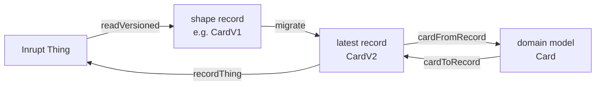
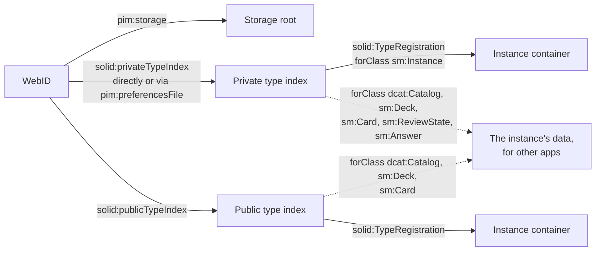
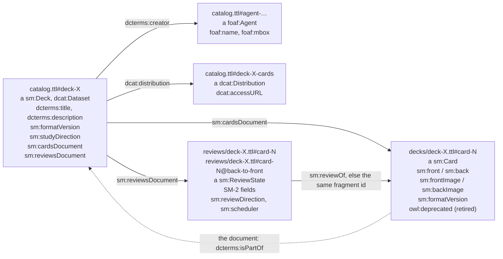
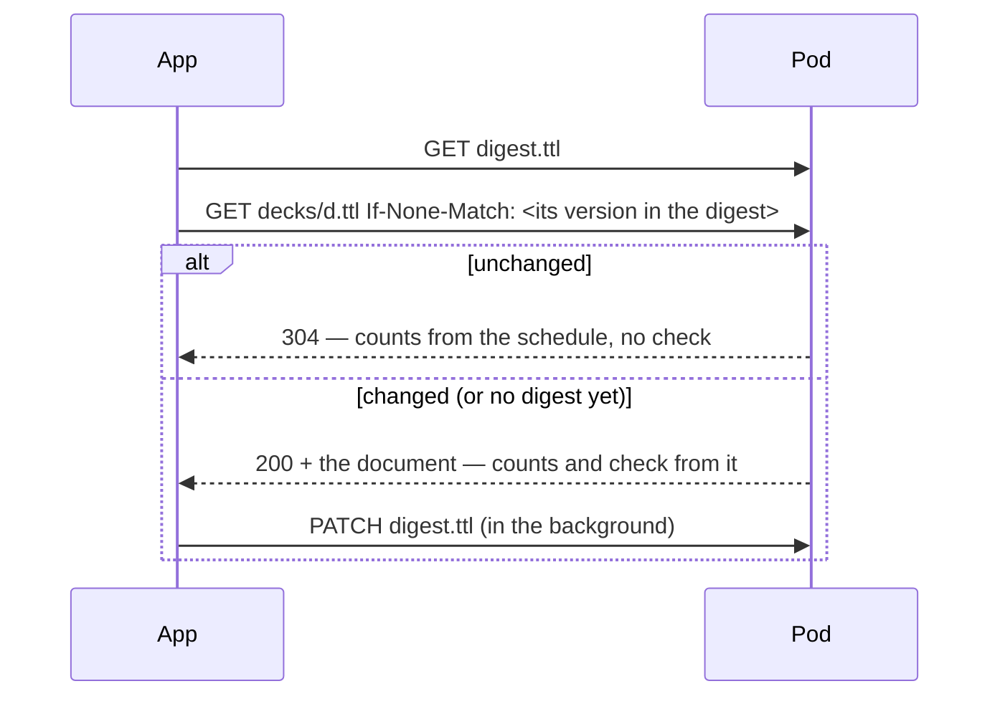

# Data model in the pod

Where Solid Memo stores data in a user's pod and how it finds it again.
Implemented in `packages/solid/src/` (vocabulary in
[vocab.ts](../packages/solid/src/vocab.ts), discovery in
[typeIndex.ts](../packages/solid/src/typeIndex.ts)).

## Vocabulary and shapes

Solid Memo mints its own terms under `https://solid-memo.com/ns/vocab/v1.ttl#`
(prefix `sm:` below) — no existing RDF vocabulary covers spaced repetition.
The terms are defined in [`ns/vocab/v1.ttl`](../ns/vocab/v1.ttl) ([vocab.md](vocab.md));
what a valid subject of each class looks like, version by version, is a
SHACL shape under [`ns/shapes/`](../ns/shapes/) ([shapes.md](shapes.md)). Both
are published with the site, and the app's constants, record types and
descriptors are generated from them. Readers ignore unknown triples and
writers never delete triples they don't understand. Every subject
Solid Memo writes carries `sm:formatVersion`; a subject with neither
that stamp nor a Solid Memo class, that is not the catalogue and that
no subject of Solid Memo's names as its creator, publisher or
distribution, is another app's, and so is a review state of another
scheduler; the data check only warns about them
([validation.md](validation.md#data-another-app-wrote)).



## Discovery chain



- **Storage**: `pim:storage` triples in the (extended) profile via
  `getPodUrlAll`; when absent, the Solid Protocol Link-header walk-up
  (`rel="type"` targeting `pim:Storage` — capital S) from the WebID URL;
  manual URL entry as last resort. 0, 1, or N storages are all handled.
- **Instances**: one `solid:TypeRegistration` per instance, `solid:forClass
  sm:Instance`, in the private type index by default. `dcterms:title` on the
  registration names the instance (harmless extra triples). Reading accepts
  both `solid:instanceContainer` and `solid:instance`. This is how
  Solid Memo finds its instances, and the only registration it reads to
  do so.
- **Each class of an instance's data** has a registration of its own,
  so another app finds the kind of data it knows by its class, without
  knowing Solid Memo's layout ([examples below](#registrations)):
  the catalogue (`dcat:Catalog`, `solid:instance` its subject
  `catalog.ttl#catalog`), the decks (`sm:Deck`, `solid:instance`
  `catalog.ttl`, the one document that holds every deck subject), the
  cards (`sm:Card`, `solid:instanceContainer` `decks/`), the review
  states (`sm:ReviewState`, `reviews/`) and the answers (`sm:Answer`,
  `history/`), each titled with the instance's name. Per the Type
  Indexes spec, `solid:instance` names the one resource holding the
  class's subjects, and `solid:instanceContainer` a container whose
  documents hold them. The catalogue's, the decks' and the cards'
  registrations go in each index that registers the instance. The
  review states' and answers' go in the private index only, even for an
  instance registered publicly: they say what the user studied and how
  well. Without a private index they are not registered anywhere.
  They are written when an instance is created, by a
  [format update](migrations.md#the-pod-migration) once it succeeded
  (a failure there leaves the update done), when a guest's study moves
  into the pod as a new instance ([guest-mode.md](guest-mode.md#as-a-new-instance)), and
  by **Register what is missing** under **Findable by other apps** in
  Preferences, which lists every registration that belongs in an index
  and whether it is there (not offered to a guest, whose pod no other
  app sees). A type index the profile links that cannot be read is
  left out there, and said to be unreadable; nothing is added to it. Never on opening an instance: that would fight other
  editors of the index, and add back what the user removed. Attaching
  an instance by URL writes its `sm:Instance` registration alone, and
  adding a guest's study to an instance writes none: the decks it adds
  are in the catalogue and the folders the registrations name.
- **Writing a type index** reads it, makes the change and saves it with
  `If-Match` the version read; when the index changed meanwhile (412),
  it is read and the change made again, three attempts in all
  (`changeIndex` in [typeIndex.ts](../packages/solid/src/typeIndex.ts)).
  A registration is added only when no equal one is there: the same
  class, naming the same resource under either predicate (the
  instance's container with or without its trailing slash, as reading
  takes it). Every registration of the instance's data, read back from
  the type indexes of real servers, is in
  [typeIndex.integration.test.ts](../e2e/pod/src/typeIndex.integration.test.ts).
- **Type index links** are read from the WebID subject in the WebID
  document and in its extended profile documents (`rdfs:seeAlso` /
  `foaf:isPrimaryTopicOf`), plus `pim:preferencesFile` for the private one.
- **Missing indexes** (normal on Community Solid Server pods): the user is
  warned and chooses — create the private index (document under
  `<storage>settings/` plus a profile link) or register publicly. The link
  goes in the WebID document when it is writable, else in the first
  extended profile that accepts it (Inrupt PodSpaces: the WebID document on
  `id.inrupt.com` is read-only; `<storage>profile` is the writable one). An
  index document already at the target URL is adopted, not overwritten. If
  registration fails, instance creation fails loudly and the created
  container is cleaned up; there is no local fallback. For an instance
  registered publicly, the review states' and answers' registrations
  are written to the private index afterwards, and a private index that
  refuses them does not fail the creation: they are left for
  **Register what is missing**.
- **Deleting an instance** deletes what Solid Memo wrote in its
  container and nothing else (`deleteInstanceData` in
  [instanceData.ts](../packages/solid/src/instanceData.ts)), then removes
  its registrations, of every class, from both type indexes (below).
  What it wrote: every deck's cards and reviews documents as the
  catalogue names them (only those
  below the container: the catalogue is data, and one naming a document
  elsewhere must not lead a delete there), the answer log's months
  (`history/<YYYY-MM>.ttl`), `preferences.ttl`, `digest.ttl` and
  `catalog.ttl`, in that order, so a delete that fails before the
  catalogue goes can be retried and find the decks again (a catalogue
  the pod serves but that cannot be read, as another app might leave
  it, is kept, and so are the decks' documents, which nothing else
  names; the rest goes as ever); then every [backup](migrations.md#the-backup)
  in `backups/`, each as its manifest names what it holds (its update's
  working copy, if any, whole), and `backups/` once empty; then
  `decks/`, `reviews/` and `history/`, each only if it is then empty;
  then `meta.ttl`, last of the documents, so a half-deleted instance
  still attaches by URL; and the container itself only if it is then
  empty. A document's access control goes with it: the Solid Protocol
  has the server delete a resource's ACL with it. Whether each document
  is there is asked first (HEAD), since node-solid-server answers a
  DELETE of what is not there with 401; what is gone counts as deleted.
  Anything else in the folder, which another app put there, is kept, and
  so is every container on its path: the user is told the folder was
  kept, and why, with a link to it (`KeptFolderNotice`). Data goes
  before registration so a failure leaves the instance listed and the
  delete retryable. Restoring the copy of a whole instance an earlier
  version's format update left deletes the updated instance, and
  deleting that copy the original, the same way
  ([migrations.md](migrations.md#backups-an-earlier-version-made)). Every blocking server
  the end-to-end tests start ([testing.md](testing.md#commands)), and
  Pivot and Community Solid Server 8, keeps another app's file and its
  folder, and deletes a folder holding only Solid Memo's documents with
  its access rules ([foreignData.integration.test.ts](../e2e/pod/src/foreignData.integration.test.ts)).
  Solid-Nextcloud lists a folder's ACL among what the folder contains, so
  there such a folder is kept, its access rules in it; what the advisory
  servers fail, and why, is their `expected-failures.json`.

### Registrations

In the type index, the instance's own registration, by which Solid Memo
finds it:

```turtle
<#sm-inst-9f3c1a> a solid:TypeRegistration ;
    solid:forClass sm:Instance ;
    solid:instanceContainer <https://pod.example/solid-memo/main/> ;
    dcterms:title "Japanese study" .
```

Beside it, one registration for each class of its data, so other
applications find each kind without knowing Solid Memo: its catalogue as
a DCAT catalogue, its decks, and the containers of its cards, review
states and answers.

```turtle
<#sm-cat-4b7d2e> a solid:TypeRegistration ;
    solid:forClass dcat:Catalog ;
    solid:instance <https://pod.example/solid-memo/main/catalog.ttl#catalog> ;
    dcterms:title "Japanese study" .

<#sm-deck-1c8e40> a solid:TypeRegistration ;
    solid:forClass sm:Deck ;
    solid:instance <https://pod.example/solid-memo/main/catalog.ttl> ;
    dcterms:title "Japanese study" .

<#sm-card-7a21d9> a solid:TypeRegistration ;
    solid:forClass sm:Card ;
    solid:instanceContainer <https://pod.example/solid-memo/main/decks/> ;
    dcterms:title "Japanese study" .
```

and, in the private type index only:

```turtle
<#sm-review-52f0b3> a solid:TypeRegistration ;
    solid:forClass sm:ReviewState ;
    solid:instanceContainer <https://pod.example/solid-memo/main/reviews/> ;
    dcterms:title "Japanese study" .

<#sm-answer-e9d417> a solid:TypeRegistration ;
    solid:forClass sm:Answer ;
    solid:instanceContainer <https://pod.example/solid-memo/main/history/> ;
    dcterms:title "Japanese study" .
```

`meta.ttl` makes a container self-describing: attach-by-URL reads it to
recover an instance that lost its registration. Deleting an instance
removes all of its registrations: the `sm:Instance` one by its
container, each other by the exact IRI it names
(`<container>catalog.ttl#catalog`, `<container>catalog.ttl`,
`<container>decks/`, `<container>reviews/`, `<container>history/`),
never by what lies under the container, where another app may have
registered data of its own. A registration that also registers
something else keeps it, and loses only the link to the instance's
data. Switching the registrations to another container, as restoring
the copy an earlier version's format update left does, likewise
replaces only the links to the instance's data, each with the same
resource of the other container, in every index that holds any of
them: the private index of an instance registered publicly holds only
its review states' and answers', and they move too. The other things a
shared registration names, and its title, stay as they were.

## Instance layout

```
<storage>solid-memo/<name>/          (default path; user-editable)
├── meta.ttl        #it: a sm:Instance; dcterms:title; dcterms:created;
│                        on an instance an earlier version's format
│                        update made, dcterms:replaces (that update's
│                        backup) and dcterms:modified; sm:formatVersion 2
├── preferences.ttl #it: a sm:Preferences (created on first explicit save):
│                        study caps, sm:answerScale, sm:developerMode,
│                        sm:invalidDataPolicy, sm:theme,
│                        sm:formatVersion 4
├── catalog.ttl     one subject per deck (titles live ONLY here), a
│                        sm:Deck and dcat:Dataset: sm:formatVersion 6,
│                        dcterms:description, sm:studyDirection, optional
│                        dcterms:creator/license, dcat:theme,
│                        dcat:keyword (language-tagged),
│                        prov:wasDerivedFrom, the deck's own study caps
│                        (sm:deckNewCardsPerDay/MaxReviewsPerDay), and
│                        for a course the chapters completed
│                        (sm:completedChapter);
│                        beside each deck its
│                        dcat:Distribution (#deck-X-cards) and the
│                        foaf:Agent nodes of its creators (#agent-…);
│                        and the deck groups (#group-…), a sm:DeckGroup
│                        and dcat:Catalog each: sm:formatVersion 1
├── decks/<deckId>.ttl    card corpus: one sm:Card per fragment (slow churn),
│                        sm:front/back text and/or sm:frontImage/backImage
│                        IRIs, optional sm:frontImageDescription/
│                        backImageDescription (a picture's alt text),
│                        sm:frontNote/backNote under each
│                        side and sm:backLabel above the back, each with
│                        sm:formatVersion; a retired card
│                        (owl:deprecated true) is kept but not studied;
│                        a course's card names its wrong options
│                        (sm:distractor, and schema:suggestedAnswer),
│                        sm:Distractor subjects beside it; the document
│                        itself (<>) dcterms:isPartOf the deck's entry
├── reviews/<deckId>.ttl  SM-2 state: one sm:ReviewState per card and
│                        direction (fast churn) — #<cardId> front→back,
│                        #<cardId>@back-to-front the other way — naming
│                        its card (sm:reviewOf), its direction
│                        (sm:reviewDirection) and sm:scheduler sm:sm2;
│                        optional sm:previous* snapshot = state before
│                        the day's first review (restored by "reset the
│                        day"); sm:formatVersion 2
├── history/<YYYY-MM>.ttl  the answer log (below): one sm:Answer per grade
│                        given in study or a course that month,
│                        appended, never edited; sm:formatVersion 1
├── digest.ttl      derived data (below): a sm:DocumentReceipt per document
│                        (#receipt-<path>) and a sm:DeckSchedule per deck
│                        (#schedule-<path>), each stamped with the versions
│                        it was learned from; sm:formatVersion 1
└── backups/<stamp>/  a backup an update made before it changed documents
                         in place (migrations.md#the-backup): manifest.ttl
                         (#it a sm:Backup, #entry-<n> a sm:BackupEntry per
                         document, sm:formatVersion 1), each document's
                         bytes as the server served them at its own path
                         with .orig added (one outside the instance, or
                         at staging/… or elsewhere/…, at
                         elsewhere/<n>.orig), application/octet-stream,
                         with the access its document has as its own;
                         while the update runs, its working copy in
                         staging/
```

A deck's documents are found through its catalog entry
(`sm:cardsDocument`, `sm:reviewsDocument`), never by name: a library
upgrade by an earlier version of the app moved them to
`decks/<deckId>-<uuid>.ttl` and `reviews/<deckId>-<uuid>.ttl`. This
app's upgrade writes them where they are
([migrations](migrations.md#how-an-upgrade-is-applied)).

## Decks and cards

Granularity is chosen around the N+1 problem (no batch requests, no SPARQL
on Solid servers): reading a whole deck is one GET, and a study session
never rewrites card content.



- The **catalog** holds one subject per deck with its title and links to the
  two documents — the deck list renders from a single fetch. A deck's
  title and description are language-tagged text, one value per
  language: since deck format 5 in any language the user states, no
  English required (format 4 required one; see
  [i18n.md](i18n.md#text-in-the-users-languages)). Since deck
  format 3 a deck is a DCAT dataset (`dcat:Dataset`, see
  [vocab.md](vocab.md) and [validation.md](validation.md)): it always has
  a description (`dcterms:description`: what it covers and where its
  content came from — shown on the deck page with its URLs as links; a
  deck without one gets "Flashcards: <title>."@en and
  "Kortlek: <title>."@sv, app-written text for any title), and may name its
  authors (`dcterms:creator`, each a `foaf:Agent` node `#agent-<slug>`
  beside the deck, with `foaf:name` and a `mailto:` `foaf:mbox`; the app
  shows them as "Name <email>"), licence (`dcterms:license`, a URL),
  topics (`dcat:theme`, concepts of the [topics](vocab.md#concept-schemes)
  scheme) and keywords (`dcat:keyword`: since deck format 6
  language-tagged, several per language; untagged ones saved before
  are kept, their language unknown). Its cards document is named as
  its `dcat:distribution` (`#deck-X-cards`, with `dcat:accessURL`). A
  deck copied from the [deck library](deck-library.md) inherits the
  provenance and says which release it came from with
  `prov:wasDerivedFrom` (`dcterms:source` before format 3). Agents no
  deck names any more are removed with the deck that named them.
- **Card sides**: each side is text (`sm:front` / `sm:back`, a literal),
  a picture (`sm:frontImage` / `sm:backImage`, always an IRI — a string in
  its place is ignored) or both; a side with neither makes the subject
  not a card. A side's text is language-tagged, one value per language
  (`zxx` for codes, numbers and symbols), or, as saved before card
  format 5, one untagged literal whose language is not known, never
  both; the app keeps untagged text only while it is untouched. A note
  under a side (`sm:frontNote` / `sm:backNote`) and the label above the
  back (`sm:backLabel`) are language-tagged text in any language. Pictures are shown only when their URL is http(s); pod data
  is untrusted. A picture may have a description
  (`sm:frontImageDescription` / `sm:backImageDescription`,
  language-tagged), read to whoever cannot see it in its place; without
  one it is named by its side ("Picture on the front of the card"). The
  description is read while its side is asked, so it says what the
  picture shows without giving the answer away. A card may say how its
  texts are written, `sm:textFormat` (`sm:markdown` or `sm:plainText`,
  [vocab.md](vocab.md#text-formats)): it covers the sides, the notes,
  the label and the card's distractors, never the pictures'
  descriptions. Without it the text is plain. The app keeps the marker
  through every edit and copy, an import or a course question joining
  the deck included. An edit trims plain text; text in any other
  format loses only the blank lines before it and the white space
  after it, so the spaces that start a Markdown code block survive an
  edit of another field. Wherever a side is
  shown whole (study, a library preview, a card's page, a library card),
  a tap (or Enter or Space on the button over it) enlarges its picture to
  the viewport's width or height, keeping its shape, and another tap,
  Escape, the focus moving on or a scroll puts it back
  ([ZoomableImage](../apps/web/src/ui/ZoomableImage.tsx)); in study,
  Space on a picture's button does not reveal the answer, while a grade's
  key still answers.
- **Direction**: a deck's `sm:studyDirection` says how it is studied — a
  concept of `sm:StudyDirections`: `sm:frontToBack`, `sm:backToFront` or
  `sm:bidirectional` (every card asked both ways). Formats 1 and 2 said
  it with the string `sm:direction` (absent meaning front→back, the only
  way there was before the field existed). Changed in the Browser; a
  library deck brings its own.
- **Study pace**: a deck may set its own daily limits,
  `sm:deckNewCardsPerDay` and `sm:deckMaxReviewsPerDay`, in place of the
  instance's `sm:newCardsPerDay` and `sm:maxReviewsPerDay`; a limit it
  does not set follows the preferences. Changed on the deck's own
  Preferences page (`#/deck-preferences`, from the deck's page); a
  library release never sets them, and a library upgrade keeps the
  copy's.
- **Format versions**: every subject the app writes carries
  `sm:formatVersion`, saying which version of its class's
  [shape](shapes.md) it conforms to: instance 1, decks 3 (DCAT),
  cards 2 (pictures), review states 2, preferences 4; the catalogue,
  agent and distribution nodes 1. Readers treat a
  missing version as 1 — data written before the field existed — read
  older versions as they are, and pass a newer stored version through
  unchanged. Bringing a pod up to the current versions is the user's
  call; see [migrations.md](migrations.md). A developer can check an
  instance against the shapes in the browser ([validation.md](validation.md)).
- **Cards** are hash-fragment subjects (`#card-<uuid>`, or the library's
  own ids such as `#sweden` for imported decks) inside one document per
  deck. Fragment ids are generated once at creation and never re-derived.
- **Review state** lives in a separate document per deck, one subject per
  card *and direction*, at `#<cardId>` for front→back (every state
  written before directions existed, which is what they all were) and
  `#<cardId>@back-to-front` for the other way. Since vocabulary 1.16
  every state the app writes also says what it is of, so another app
  needs no naming rule to join it to its card: `sm:reviewOf` names the
  card (`<cards document>#<cardId>`), `sm:reviewDirection` the direction
  (`sm:frontToBack` or `sm:backToFront`) and `sm:scheduler sm:sm2` the
  algorithm its fields belong to. A reader joins a state to its card in
  [reviewStateMapper.ts](../packages/solid/src/mappers/reviewStateMapper.ts)
  and [reviewRecord.ts](../packages/domain/src/reviewRecord.ts):
  - **What the state says wins.** The card is the one `sm:reviewOf`
    names and the direction the one `sm:reviewDirection` names, whatever
    the subject is called; each one the state leaves out comes from the
    fragment rule above (no `@back-to-front` suffix: front→back). So a
    state another app named `#state-7f3a` is read when it names its card,
    and `#card-1` naming card 2 is a state of card 2.
  - **A link into a cards document the deck had** names its card too.
    A [library upgrade](migrations.md#how-an-upgrade-is-applied) by an
    earlier version of the app moved the cards to
    `decks/<deckId>-<uuid>.ttl` and may have kept the reviews document,
    whose links still name the old document; so `sm:reviewOf`
    into any document beside the cards named `<deckId>.ttl` or
    `<deckId>-<…>.ttl` is read by its fragment, and the state's next
    write names the current cards document.
  - **What is not read**: a state whose `sm:reviewOf` names a subject
    outside the deck's cards documents (a card of another deck, or the
    document itself), one whose direction is neither way (say
    `sm:bidirectional`), and one of another scheduler (any value of
    `sm:scheduler` but the `sm:sm2` IRI, a literal too; absent means
    SM-2, as every state was before 1.16). Another scheduler's state is another app's data: it is
    never read as SM-2, never written over and never removed, and the
    [check](validation.md#data-another-app-wrote) only warns about it.
    It does not stop the app scheduling the card itself, beside it.
  - **One state per card and direction.** Where several are of the
    same, the one at the subject the fragment rule names counts, else
    the first by subject IRI (code-unit order); the others stay in the
    document, unread.
  - **Writing** a state goes onto the subject read for it, so a review
    of another app's `#state-7f3a` edits it in place. A state not yet in
    the document goes to the subject the fragment rule names, unless that
    subject is another's (a state of another card, another scheduler's,
    any other app's subject): then to a new `#review-<uuid>`, which names
    its card. A subject the fragment rule names for the same card and
    direction that cannot be read (half a snapshot, say) is written over,
    as before. A review of a state another app named its own way, beside
    another scheduler's state, is held against real servers in
    [foreignData.integration.test.ts](../e2e/pod/src/foreignData.integration.test.ts).

  - **Resetting the day** removes only the state read for each card and
    direction it undoes. A second state of the same, which the app never
    read, stays, and is the one read from then on.

  Card edits and review updates never touch each other's documents.
- Cards/reviews documents are created lazily on first write; deck removal
  deletes both documents and the catalog subject; card removal also
  removes the card's review states, both ways: every `sm:ReviewState` of
  the reviews document that is of it, by its `sm:reviewOf` or the
  fragment rule, read or not, and no other subject (another scheduler's
  state stays).
- **The cards document says whose it is.** Every write of a deck's cards
  document by the deck's own operations (import, adding, editing or
  removing a card, stating its languages, a course's question joining
  the deck, the format update's rewrite of outdated cards, a library
  upgrade's new document, a guest's deck added to an instance) adds `<> dcterms:isPartOf
  <catalog.ttl#deck-X>` once, on the document itself, so an app that
  finds a cards document finds its deck. A [repair](validation.md#repair)
  from the data check and a copy of the instance (the format
  update's, a guest's transfer into a new instance) leave the document as it was, so one
  untouched since vocabulary 1.16 does not say it yet. Another
  `dcterms:isPartOf` there stays: another app may point two decks at one
  document. The subject has no class, so no shape checks it, and the
  [data check](validation.md#flow) lists it as not a Solid Memo subject.

An instance's URL is permanent, and so is every document's and
subject's in it: the [format update](migrations.md#the-pod-migration)
and the [library upgrade](migrations.md#how-an-upgrade-is-applied)
write the documents where they are, after backing them up inside the
instance, and change no registration (the format update only adds
those missing). Another app may keep a link to
the instance, a deck, a card or a review state. The one way an
instance's address still changes is restoring the copy of a whole
instance that a format update by an earlier version of the app left as
its backup, which switches the registrations back to that copy.

## The catalogue

`catalog.ttl#catalog` is a `dcat:Catalog` (shape `CatalogV1`) of the
instance's decks: a `dcterms:title` (the instance's name), a
`dcterms:description`, `dcterms:publisher` (the pod owner's WebID,
described in the same document as a `foaf:Agent` with the `foaf:name`
of their profile), the topics scheme and the EU data themes as
`dcat:themeTaxonomy`, and a `dcat:dataset` per deck, kept in step as
decks are added and removed. Saving a deck adds only that deck's link,
and removing a deck removes only its own: a dataset another app listed
in the catalogue stays listed through every deck save, and writing the
catalogue itself keeps it too, beside every deck of the document. The
one link the catalogue loses when it is written whole is one to a
subject of its own document that is no `dcat:Dataset` (left by a deck
removed some other way): it would fail DCAT-AP's class check, and the
catalogue could not be written. A member another app described in the
document keeps its link whatever its class: the check only warns about
that link ([validation.md](validation.md#data-another-app-wrote)). A dataset in another document is
described there, so that class check does not hold it to its class
([validation.md](validation.md#profiles-dcat-ap-and-skos)), and an
instance listing one stays valid (held against real servers in
[foreignData.integration.test.ts](../e2e/pod/src/foreignData.integration.test.ts)). It is written when an instance is created,
and by the [format update](migrations.md) for an instance made before
there were catalogues. Its registration is written with the instance's
when the instance is created or a guest's study moves into the pod as a
new instance, and
by the format update and Preferences when missing
([Discovery chain](#discovery-chain)). The whole document
conforms to DCAT-AP (a test holds what the app writes to it).

A deck's description, topics and keywords are edited in its Browser
("Describe deck"), the keywords one comma-separated list per language
the user states; the description is required, as DCAT-AP asks of
every dataset. Only the keyword languages the user states in an edit are
checked and stored in their canonical form ("iw" → "he"); a language tag
the deck already has, even one another app wrote that the app would not
accept from the user, is kept as stored.

## Deck groups

The user arranges the deck list into named groups that can nest. A group
is a subject of `catalog.ttl` beside the decks, a `sm:DeckGroup` and a
`dcat:Catalog` (shape `DeckGroupV1`), never a `dcat:Dataset`: DCAT
nests catalogues, and DCAT-AP lets a catalogue list sub-catalogues with
`dcat:catalog` and datasets with `dcat:dataset`. DCAT has no ordered
membership (`dcat:prev`/`next` are series versions, which the library
uses as such), so the order is Solid Memo's own `sm:position`.

```turtle
<#catalog> a dcat:Catalog ; …
    dcat:dataset <#deck-a>, <#deck-b>, <#deck-c> ;   # still every deck
    dcat:catalog <#group-x1> .                       # the top-level groups
<#group-x1> a sm:DeckGroup, dcat:Catalog ;
    sm:formatVersion 1 ;
    dcterms:title "Languages"@en ;                   # one name, in the UI's language
    dcterms:description "Deck group: Languages."@en, "Kortleksgrupp: Languages."@sv ;   # generated
    dcterms:publisher <https://alice.example/profile/card#me> ;   # the catalogue's
    dcat:dataset <#deck-a>, <#deck-b> ;
    dcat:catalog <#group-y2> ;
    sm:position 0 .
<#deck-a> sm:position 0 .
```

- **The catalogue still lists every deck** with `dcat:dataset`; a group
  lists only its own members. The catalogue's `dcat:catalog` lists the
  top-level groups. An edit writes again only the links to the decks
  and groups the arrangement places: a member link to a dataset or
  catalogue in another document, or to one the document describes as
  such but the app cannot read, stays as it is.
- **A deck or group is in one parent**: the catalogue (top level) or one
  group. A deck no group lists is at the top level.
- **Positions count within one parent**, and the decks and groups of a
  parent share one sequence, 0 first. Members sort by position, those
  without one last, in document order. The first arrangement of a level
  writes positions 0…n−1 for every member at that level; new and
  imported decks get none.
- **An empty group stays** until the user removes it; removing a group
  moves its members, in order, into its place in its parent.
- `sm:position` on a deck and the catalogue's `dcat:catalog` belong to
  no shape (`DeckV6` and `CatalogV1` are unchanged), so writing a deck or
  the catalogue keeps them, and no deck format version was needed.

What is not one valid tree is read as one, rather than refused. A link
to nothing, from a group to itself, or of the wrong kind (a
`dcat:dataset` link to a group, a `dcat:catalog` link to a deck) is
ignored. A node several parents list goes to the group with the lowest
URL, except a group the catalogue's `dcat:catalog` lists, which stays at
the top level. A cycle is broken by moving the lowest-URL group in it to
the top level. A negative position counts as none, and on a tie of
positions decks come before groups, each kind in document order. A
group in a format newer than the app's makes the arrangement read-only,
and so, under the "Set invalid data aside" policy (`sm:blockSubject`,
the default), does a catalogue or group that does not conform, and so
does every list while that check is still running
([validation.md](validation.md#the-invalid-data-policy));
a group the app cannot read is never edited: its members show at
the top level, and the catalogue's `dcat:catalog` keeps its link.

**Writing an arrangement.** The screen sends an edit, not a finished
layout (`DeckTreeEdit` in
[deckTree.ts](../packages/domain/src/deckTree.ts): move a node after a
sibling, combine two into a new group, rename or remove a group, or, as
[keeping a guest's study](guest-mode.md#adding-to-an-instance) does,
graft new groups around decks the tree has at the end of the top level,
which changes nothing once one of its groups is there), and
the repository (`editDeckTree` in
[solidDeckRepository.ts](../packages/solid/src/solidDeckRepository.ts))
applies it to `catalog.ttl` as the pod holds it then:

- **read, apply, write once**: the document is read, the edit applied to
  the tree it states, and what changed written in one PATCH with
  `If-Match` ([write discipline](#write-discipline)); an edit that
  changes nothing sends nothing;
- **on 412 the edit is applied again** to the document as it is now,
  three attempts in all, so another tab's change is kept, not undone. A
  move names its neighbour, not an index, and a new group's URL is
  minted by the screen (`newDeckGroup`), so an edit means the same on
  the fresh tree and a retried combine is a no-op. An edit that no
  longer fits (its group or node gone) fails with `deckTreeChanged`;
- **a PATCH, never a whole PUT**: where the pod has no strong ETag, a PUT
  would undo what changed since the read, and a PATCH keeps it;
- **only the groups written and the catalogue are checked** before the
  write (`checkWrite`): a deck's `sm:position` belongs to no shape, and a
  deck that is set aside beside the one moved must not stop the move;
- **removing a deck** also removes it from every group's `dcat:dataset`,
  in the same write; its siblings keep their positions, and the next
  arrangement closes the gap.

## Courses

A [course](courses.md) is a library release with an outline of chapters
and steps. Its state in the pod uses the documents above and no new
type-index entries:

- **The outline stays in the release.** Chapters and steps are never
  copied: the app reads them from the release the deck's
  `prov:wasDerivedFrom` names.
- **The deck holds only the cards answered.** Starting a course writes
  an empty deck. A question answered for the first time writes its card,
  its `sm:Distractor` subjects and its first review state, under the
  release's fragment ids (`#q-why-solid-1a`, `#q-why-solid-1a-d1`),
  with its `sm:textFormat` when the release states one. The card names
  each distractor with `schema:suggestedAnswer` too (since vocabulary
  1.16), for an app that knows schema.org's questions but not Solid
  Memo's; the app reads only `sm:distractor`, and a write of the card
  adds or removes only the suggested answers that are its own
  distractors, so another app's stay. `schema:suggestedAnswer` belongs
  to no shape, as `sm:position` does. Library releases are frozen and
  do not state it: only the copy in the pod does.
  Removing a card removes the distractors it names.
- **Completed chapters are on the catalog entry**: one
  `sm:completedChapter <release#ch-…>` per chapter whose final review
  was passed. Like a deck's `sm:position`, it belongs to no shape, so
  every write of the entry keeps it and the deck format did not move. It
  is added with an If-Match PATCH, read and added again on a 412, three
  attempts in all, as a [deck group](#deck-groups) edit is. A deck
  [added from a guest's study](guest-mode.md#adding-to-an-instance)
  (`addDeck`) has the guest's completed chapters written with its new
  entry, in the same way.
- **Answers** go to the [answer log](#the-answer-log), with
  `sm:answerMode`.
- **Everything else is derived**: a step is done when each card it is
  checked by has a review state, and a chapter opens when the one
  before it is completed.

```turtle
# catalog.ttl
<#deck-x> a solid-memo:Deck , dcat:Dataset ; …
    prov:wasDerivedFrom <https://solid-memo.com/decks/solid-fundamentals/v1.ttl> ;
    solid-memo:completedChapter <https://solid-memo.com/decks/solid-fundamentals/v1.ttl#ch-why-solid> .
```

## The answer log

Every grade given in study is kept, so statistics can be computed
([statistics.ts](../packages/domain/src/statistics.ts)): activity by
study day, streaks, and how well reviews were remembered. Once a day has
answers, a slim strip above the deck list (where a session usually
ends) says what the day came to (`todayOf`), led by the streak (with the record to beat,
or a new record cheered), then a word of praise and the day's numbers.
A review state
says only where a card stands now; the log is the history, and source
data, since nothing could rebuild it.

- **One document per study month** for the whole instance,
  `history/<YYYY-MM>.ttl` (`historyUrlOf`, by the month of the study day,
  so a day is never split): reading a year of statistics is twelve GETs
  whatever the number of decks.
- **One subject per answer**, `#answer-<time>-<random>` (one added
  from a guest's study followed by the id of the deck it was added to)
  ([answer.ts](../packages/domain/src/answer.ts)): the deck's catalog
  entry and the card it was given to (either may since be removed; a
  removed deck's answers stay, as a removed deck), the direction, the SM-2
  grade (whichever answer scale gave it), when it was given and the study
  day it counts towards, fixed then so a later day-boundary change does
  not move it, and the prompt's interval before (absent on its first
  answer, which introduced it) and after. An answer to a
  [course](courses.md) question also says how it was given
  (`sm:answerMode sm:multipleChoice`) and, when it was wrong, which
  wrong option was chosen (`sm:chosenDistractor`, the distractor in the
  deck's cards document). An answer given in study says neither, which
  means recalled, so study writes its answers as before.
- **Added without reading** (`appendToDocument`): one insert-only PATCH,
  without a precondition, since an answer names a subject no other writer
  does. Every server tested creates the document and its container when
  missing and keeps every one of several concurrent inserts
  (e2e/pod/src/history.integration.test.ts). A
  [guest's study added to an instance](guest-mode.md#adding-to-an-instance)
  brings its answers the same way, a month's in one PATCH, or several
  where one would pass 64 KiB (`appendAll`); each takes the guest's id
  followed by the new deck's, so adding it again to the same deck
  changes nothing, and adding it to another deck (the guest's deck
  added anew) makes an entry of its own, never one naming two decks.
- **After the review, not in its way**: `recordReview` saves the review
  state, then queues the answer; it is added in the background, and one
  that fails waits, with those after it, for the next answer, the end of
  the session or the statistics page. An answer still queued when the
  tab closes is lost; the review it belongs to is not.
- **Resetting the day removes that deck's answers of the day**
  (`removeDay`: read, remove, save with If-Match, again on 412).
- Checked in the full check only ([validation.md](validation.md)): the
  current month changes every session, so checking it on every visit
  would download it every time.

## The digest

`digest.ttl` lets a visit skip what has not changed since the last one.
It holds only what Solid Memo learned of the other documents, each fact
stamped with the version (ETag) of the document it was learned from
([studyDigest.ts](../packages/domain/src/studyDigest.ts)):

- a **receipt** per document: at that version it conformed to the shapes
  (`sm:conformedTo` names the rules, a hash of the shape files the site
  was built with) and/or nothing in it was in an older format
  (`sm:latestFormat`);
- a **schedule** per deck, from given versions of its cards and reviews
  documents: prompts due by study day (`sm:dueOnDay "2026-10-01 12"`),
  prompts never reviewed, and the reviews and introductions of the day it
  was computed on. With today's preferences that gives the deck list the
  same counts as `buildStudyQueue` ([srs.md](srs.md#study-days-and-the-queue)).



- **A stale digest is never wrong, only slow.** Every fact is used only
  after the pod says its document is still at the stamped version; a
  document changed elsewhere (another device, another app) is read and
  checked in full, and the digest is repaired with what that read
  learned. So nothing else keeps it up to date: a write anywhere simply
  makes the facts about that document stale.
- **When a study session ends** (End session, leaving the screen, or the
  page being hidden) the deck's schedule and its reviews document's
  receipt are brought up to date, so the next visit finds them current.
- **Writes** are edits like any other (If-Match; [write check](validation.md#the-write-check)).
  Changes learned while a write is under way go in the next one; if the
  digest changed elsewhere meanwhile (412), it is read and changed again,
  six times in all, waiting a little longer before each (50 ms, then 100
  ms, …): another page learning a check's documents writes the digest
  several times running, and a write that tried again at once could lose
  to each. A failed write is dropped: the next visit learns it again.
- **Read leniently.** A subject that does not fit its shape is left out
  (and so relearned). The digest is not one of the documents an instance
  is [checked](validation.md) by: it is derived, and an invalid copy must
  not block the instance.
- **It is as good as the pod's ETags.** Community Solid Server 6 stamps
  its ETags in whole seconds, so a document changed elsewhere in the
  same second as Solid Memo read it keeps its ETag, and the digest takes
  it for unchanged until it changes again (7 stamps milliseconds). The
  same holds for `If-Match` (below).
- **A pod without ETags gains nothing.** node-solid-server (5.x, 6.0.0) gives no
  ETag on a read: nothing can be known to be unchanged, so nothing is
  kept, and every visit reads everything, as before.
- The [format update](migrations.md#the-pod-migration) does not write
  the digest; the documents it writes, and those a restore puts back,
  have new versions, so what it says of them is relearned on the next
  visit.

## Write discipline

- Mutations always follow read → modify → save
  ([datasets.ts](../packages/solid/src/datasets.ts): `readDataset` or
  `getSolidDatasetOrNull`, then `saveDataset`), which issues a PATCH of the
  delta, or for a large edit one PUT of the whole document as read and
  edited (below), so unknown triples survive either way. Only brand-new
  documents are saved from `createSolidDataset()`.
- The [answer log](#the-answer-log) is the one exception: answers are
  added unread, with an insert-only PATCH, since adding a new subject
  cannot undo anyone else's write.
- **Every write states what it expects to find**, as an HTTP precondition,
  so a write never silently undoes someone else's (another tab, device or
  app):
  - an edit is sent with `If-Match: <the ETag the document was read with>`;
    had it changed since, the pod answers 412 and nothing is written. An
    edit is a PATCH or, when the PATCH would be larger than 64 KiB, one
    PUT of the whole document: node-solid-server reads at most 100 kB of a
    PATCH and fails past that, which an edit of every card of a large deck
    (a format update) exceeds. Without `If-Match` (no strong ETag, below),
    such a PUT would undo a change made elsewhere since the read, where a
    PATCH keeps it. Stating the language of a deck's untagged card sides
    (`stateCardLanguages`) is always one PUT (`saveDataset`'s `whole`):
    Community Solid Server's in-memory store cuts a document short after
    a PATCH holding text beyond ASCII, and such a bulk edit is all text;
  - a creation is sent with `If-None-Match: *` (by
    `@inrupt/solid-client` for datasets and containers, by the copier for
    files); had something appeared there meanwhile, 412;
  - deleting a document read before sends `If-Match` too. Deleting an
    instance sends none: its documents go whatever they hold. A deck
    another tab adds meanwhile is missed, and its documents keep the
    folder in place, as another app's file would.

  A 412 surfaces as a `PreconditionFailedError` naming the document
  ("changed elsewhere … Reload and try again"); nothing retries on its
  own, except the writes that re-apply a change to the document as it
  is then: [the digest](#the-digest) and an edit of the
  [deck groups](#deck-groups), which is read, applied and written again,
  three times in all, before the 412 surfaces. Weak ETags (`W/"…"`) are never sent in `If-Match`, whose
  comparison is strong; a document the pod gives no ETag, or one saved
  since it was read (pods need not return the new ETag), is written
  without `If-Match`. node-solid-server gives no ETag on a read and
  ignores `If-Match` (5.7.4 also `If-None-Match: *`; 5.8.8 and 6.0.0
  enforce that), so there no edit is conditional: a PATCH still keeps a change
  made elsewhere, a large edit's PUT does not. Community Solid Server 6's
  ETag only changes from one second to the next, so it misses a change
  made in the same second as the read. The end-to-end tests hold all of this
  against real servers, that one included ([testing.md](testing.md)).
- **An edit's PATCH body is written by Solid Memo** (`patchBody` in
  [datasets.ts](../packages/solid/src/datasets.ts)), not by
  `@inrupt/solid-client`: one triple a line, a space before each `.`.
  node-solid-server's parser fails on a triple whose closing `.` touches
  the term before it (`<#a> <#b> 1.}`), which is how
  `@inrupt/solid-client` writes every patch.
- **A document is downloaded once while it is unchanged.** A screen asks
  for the same document several times (a deck's cards for its study
  queue, the format check and the data check): a read already under way
  is shared, and a document read before is asked for with
  `If-None-Match: <its ETag>`; on 304 the dataset read then is returned
  (datasets are immutable). A write to the document forgets both, and so
  does an update's backup of it or check of it
  ([migrations.md](migrations.md#the-pod-migration)): a server whose ETag
  outlives an edit made in the same second answers 304 for a document
  that changed. This is memory only, for the open page: nothing is
  stored in the browser. Logged in, the browser's own cache does not do
  this, so without it a login downloaded every deck three times; and it
  is never asked (`cache: "no-store"`), as it may keep a document the pod
  gives a modification time and no `Cache-Control` for days, and answer
  a plain read with it.
- Reading builds the dataset in one pass
  ([linearDataset.ts](../packages/solid/src/linearDataset.ts)):
  `@inrupt/solid-client` copies the whole graph for every quad, which
  took 9 s for a deck of 3,000 cards.
- 404 is a normal state for not-yet-created documents; repositories treat it
  as empty, not as an error.
- **What Solid Memo did not write, it does not delete or unlink.** A
  write touches only the triples it changes (a deck save adds or
  removes its own `dcat:dataset` link, never another app's), and a
  delete only resources Solid Memo knows it wrote: an instance, a
  backup (each file its manifest names, then the manifest), a copy of a
  whole instance an earlier version's update left, or the updated
  instance that copy's restore replaces, is deleted document by
  document, its folder only once empty
  ([deleting an instance](#discovery-chain)); the cards and reviews
  documents adding a guest's deck to an instance just created, when it
  fails before the deck's entry names them, are deleted each as read,
  with `If-Match` ([guest-mode.md](guest-mode.md#adding-to-an-instance)). Only a folder Solid Memo
  made whole and nothing names yet is deleted recursively: the guest's
  study moved into a new instance, when it fails half-way or a closed tab left it behind,
  an update's working copy (`staging/` in its backup's folder), an
  update's folder when the update fails before its manifest named
  anything, and a copy of a whole instance an earlier version's update
  left so: Solid Memo created it at a URL it found free, and all it holds
  is copies whose originals stay where they were.
- **An update writes only what it backed up, as it backed it up, and
  puts back what it wrote when it fails.** The format update and the
  library upgrade write a document only after a working copy of what
  they will write checked out, and only while the document is at the
  version whose bytes they backed up (`If-Match`, or checked just before
  where the server gives no ETag), held so by the write fence; a failure
  after that puts each document they wrote back, its bytes as the server
  served them before ([migrations.md](migrations.md#the-pod-migration));
  and no write puts an older format over a subject a newer version of
  the app wrote ([migrations.md](migrations.md#versions)).
- No `.acl`/`.acr` resource is ever written but an update's own files'
  ([backup](migrations.md#the-backup) and working copy), made from the
  access the document each is of has: the document's own access
  control, rebased, or, when it inherits, the rules its nearest folder
  with an access control of its own gives what is inside it
  (`acl:default`), each now of the file alone. An update writes no
  document's access control, so none is backed up. Nothing else's
  access changes: a resource without its own
  ACL safely inherits its ancestors' access, while a malformed one
  replaces inheritance entirely and can lock the owner out (WAC) or
  expose data. Access control stays whatever the user's server
  dictates.
