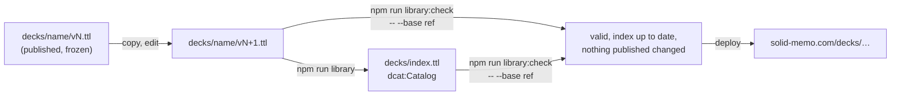
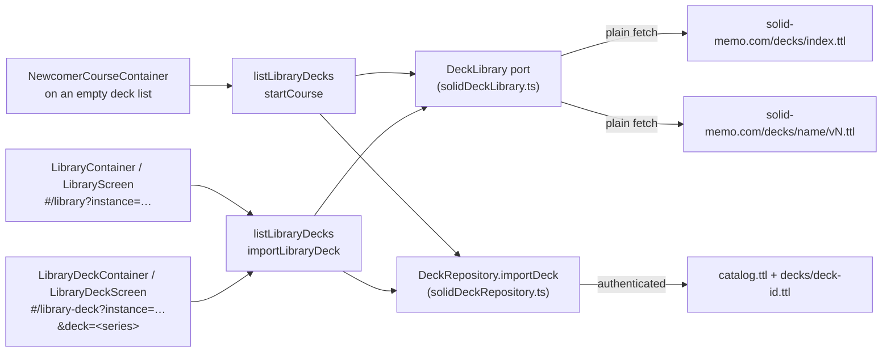
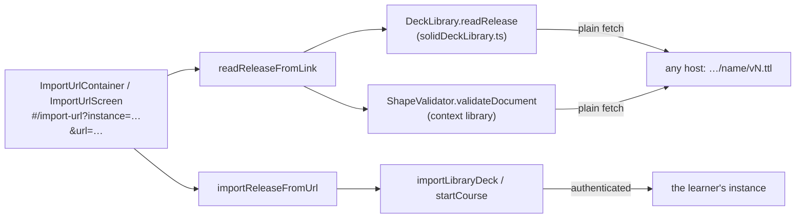

# Deck library

Ready-made decks that any user can copy into their own instance. The
library lives in this repository's [`decks/`](../decks/) folder and is
published with the site, next to the app
([deployment.md](deployment.md)), at `https://solid-memo.com/decks/`.
It is described with [DCAT](https://www.w3.org/TR/vocab-dcat-3/) and
conforms to [DCAT-AP](validation.md#profiles-dcat-ap-and-skos): the
library is a `dcat:Catalog`, each deck a `dcat:DatasetSeries` of its
versions, each version a `dcat:Dataset` with its cards and a Turtle
`dcat:Distribution`.

| Path under `decks/` | IRI | What |
|---|---|---|
| `index.ttl` | `https://solid-memo.com/decks/index.ttl` | The catalogue the app lists, generated from the versions and committed: each deck a series (`index.ttl#<name>`), its current version described in full but for its cards and how it was made, the publisher `index.ttl#solid-memo`, and the [course for newcomers](#courses). |
| `<name>/v<N>.ttl` | `https://solid-memo.com/decks/<name>/v<N>.ttl` | Version `N` of a deck, frozen once published; its cards are fragments of it (`…/v1.ttl#sweden`). |

Nothing else is in `decks/`: no lock file, no sources, no scripts. A
deck's name is lower-case letters, digits and dashes; its versions run
`v1.ttl`, `v2.ttl`, … without gaps. Every IRI ends in `.ttl`, as the
vocabulary's and the shapes' do: GitHub Pages serves a `.ttl` file as
`text/turtle` but negotiates no content, so an address without the
extension would be a 404. Each file states its own address as its
`@base`.



## A version

A version is one `sm:Deck` (also a `dcat:Dataset`), the document
itself (`<>`), in library deck format 5 (`LibraryDeckV5`,
[shapes.md](shapes.md)) or, from vocabulary 1.18, format 6
(`LibraryDeckV6`, the same properties), with its cards as hash-fragment
subjects in card format 4 or 5. A version stays at the format it was
published in; a new one is written at format 6, its series and
publisher still in the index:

- **Title and description** are language-tagged, one per language, one
  of them English (the library's curation policy, so that anyone who
  reads English can read every deck). **Keywords** are tagged too,
  several per language, in English and Swedish, and in Korean on a deck
  that adds them; the app shows only the reader's
  ([i18n.md](i18n.md#which-language)). **Topics** are `dcat:theme`s from
  [`ns/vocab/topics.ttl`](../ns/vocab/topics.ttl), next to the EU data
  theme `EDUC`; **languages** are EU authority-table IRIs described in
  [`ns/vocab/external.ttl`](../ns/vocab/external.ttl).
- **Creators** are `foaf:Agent` nodes of the document; **licences**
  are IRIs typed `dcterms:LicenseDocument`; the **sources** it was
  compiled from are `prov:wasDerivedFrom` IRIs, each a subject of its
  own with its title, creator and licence.
- **The release**: `dcat:version "N"`, `dcterms:issued`, one
  `adms:versionNotes` (a plain string: the shape allows one, untagged),
  `dcat:inSeries` and `dcat:isVersionOf` `<…/decks/index.ttl#<name>>`,
  `dcterms:publisher <…/decks/index.ttl#solid-memo>`, a
  `dcat:distribution <#turtle>` pointing at the file itself, and from
  version 2 `dcat:prev` and `dcat:previousVersion` `<…/<name>/v<N-1>.ttl>`.
- **A published card is never removed, but retired**: keep it and add
  `owl:deprecated true` (card format 3 and later). Copies of the deck
  keep it and its review history, but no longer study it; a later
  version can bring it back by leaving the flag out. `sm:cardCount` in
  the index counts the cards in use.

[`decks/greek-alphabet/v1.ttl`](../decks/greek-alphabet/v1.ttl) is a
small, complete example.

## Courses

A version may be a [course](courses.md): a deck whose cards are taught
in chapters of steps, each card asked as a multiple-choice question.
Beside what every version has, a course has:

- the extra type `schema:Course` on the release itself, and
  `sm:studyDirection sm:frontToBack`;
- its chapters (`sm:Chapter`, chapter format 1) and steps (`sm:Step`,
  step format 1), subjects of the release beside its cards;
- on each card it asks, `sm:distractor` links to its wrong options,
  `sm:Distractor` subjects (distractor format 1) of the release.

The index leaves the chapters, steps and distractors out, as it leaves
the cards out. It keeps the release's `schema:Course` type, so the app
can tell a course from a deck by the index alone (`LibraryDeck.isCourse`).
The app reads the outline from the release when the learner opens the
course. [`decks/solid-fundamentals/v1.ttl`](../decks/solid-fundamentals/v1.ttl)
is the first course, and the first release written in Markdown.

A course's chapters, steps and distractors are never removed, as its
cards are not: one that should go is retired (`owl:deprecated true`), so
the learners' decks that follow the course keep their place in it.

The index names at most one course for newcomers:
`<> sm:newcomerCourse <#name>` on the catalogue, the series of a course
the app offers to someone with no decks yet
([courses.md](courses.md#the-course-for-newcomers)). It is library
configuration, not part of any release: `NEWCOMER_COURSE` in
[deckLibrary.ts](../packages/shacl/node/deckLibrary.ts) names the deck
(`io.newcomerCourse` in `main`, so its tests can name another), and
`undefined` names none (and retires the journey that expects an offer,
[courses.md](courses.md#the-course-for-newcomers)). The term belongs to no shape: `CatalogV1` does
not own it, and DCAT-AP ignores it.

## Provenance

Each authored deck says how it was made, in
[PROV-O](https://www.w3.org/TR/prov-o/), inside its version file:

- The deck is `prov:wasGeneratedBy <#compilation>`, a `prov:Activity`
  with when it ended, the sources it `prov:used` and
  `prov:wasAssociatedWith <#anton-wiklund>`. Its first comments are the
  attribution, "Compiled by Anton Wiklund with the help of AI."@en and
  "Sammanställd av Anton Wiklund med hjälp av AI."@sv; the others say how
  the cards were selected, researched and checked, and on what grounds
  the deck may carry its licence.
- The compilation `prov:wasInformedBy` its quality-control rounds,
  `<#review-0>`, `<#review-1>`, …: each a `prov:Activity` whose label
  names what it looked at (sources and licences, facts, language, …)
  and whose comments give its scope and its outcome. Machine checks (the
  SHACL and DCAT-AP validators, checks against live Wikidata) are named
  as such.
- Each source has an `rdfs:comment` quoting the evidence for its
  licence, and says whether the deck took content from it or used it to
  verify facts only.

The record is condensed from the working notes kept while a deck was
compiled; those notes' per-card evidence and queries are not part of
the library. The few decks that were not researched card by card
(generated from one source, such as the Swedish word decks and network
ports, or written directly, such as the capitals) describe their sources
and licences, some the command that generated them, but have no review
rounds. The index leaves the
record out (every `rdfs:comment`, and the activities but for the
compilation's type, which DCAT-AP asks for); the app shows the deck's
sources and licence on its page, and the version file has the rest.

## Publishing a new version

A published version is never edited or removed, only followed by the
next. To change a deck `<name>` whose latest version is `N`:

1. Copy `decks/<name>/v<N>.ttl` to `decks/<name>/v<N+1>.ttl` and edit
   the copy: cards (retire, never delete), texts, sources, provenance.
2. In the copy, change its `@base` to its own address
   (`…/<name>/v<N+1>.ttl`) and set
   - `dcat:version "<N+1>"`,
   - `dcat:prev` and `dcat:previousVersion` `<https://solid-memo.com/decks/<name>/v<N>.ttl>`,
   - `dcterms:issued` to the release time, and `dcterms:modified` if the
     deck has it,
   - `adms:versionNotes` to what changed, in one string.
3. `npm run format:turtle`, then `npm run library`, which validates the
   library and writes `decks/index.ttl` (the new version becomes the
   series' `dcat:last` and current version).
4. Look at it: `npm run dev` serves the working tree's `decks/`, so the
   library screen lists the new version and offers it to copies of the
   old one ([migrations.md](migrations.md#catching-up-with-the-library)).
5. Commit the new version and the index together. The deploy publishes
   them.

A new deck is the same with `decks/<name>/v1.ttl`, without `dcat:prev`
and `dcat:previousVersion`, its notes "First release.".

**Text over several lines.** `npm run format:turtle` writes a literal
whose text has a line feed as a long string, `"""…"""` with its language
tag, its lines verbatim and never indented (leading spaces can matter).
A backslash and every control character but a tab or a line feed are
escaped (a carriage return as `\r`), and so is any quote that would end
or run into a delimiter, so the text reads back the same. Every other
literal stays on one line.

## Authoring Markdown

A card, a course step or a chapter may be written in Markdown
([markdown.md](markdown.md)): CommonMark with pipe tables, for code,
tables and lists. Text is plain unless its subject says otherwise, so
a release that says nothing reads exactly as before.

- **The marker.** State `solid-memo:textFormat solid-memo:markdown` on
  each card, step and chapter written in it, and on nothing else
  ([vocab.md](vocab.md#text-formats)). On a card it covers its sides,
  notes and label, and its distractors' text and notes, which carry no
  marker of their own; on a step its theory; on a chapter its
  description, never its title. A picture's description, a deck's title,
  description and keywords, and the version notes are always plain.
- **One marker per subject, not per deck.** A card copied alone keeps
  its meaning. Mark only what needs Markdown: a card whose text is plain
  stays unmarked.
- **Several lines** are a Turtle long string, `"""…"""@en`, which
  `npm run format:turtle` writes with its lines verbatim and never
  indented, as a code block needs ([above](#publishing-a-new-version)).
- **Each language is its own document.** A code block in `@en` text
  stays `@en`; a back that is code alone may be untagged or `@zxx`, its
  distractors' text then the same.
- **A step's theory may be in chunks**, read one at a time: a
  thematic break (`---`) at the top level, with a blank line before
  and after it, ends one and begins the next
  ([courses.md](courses.md#writing-a-course)). Anywhere else a break
  shows as a rule.
- **Plain-text habits read otherwise in Markdown**: `<url>` is raw HTML,
  `&aring;` is "å", `*` and `_` may emphasise, `<ex:title>` is a link.
  Write such text as code (`` `git clone <url>` ``).
- **A published version is never marked afterwards.** A deck takes
  Markdown in its next version; the library upgrade brings the marker
  to the copies ([migrations.md](migrations.md#catching-up-with-the-library)).

```turtle
<#q-staged> a solid-memo:Card ;
    solid-memo:formatVersion 5 ;
    solid-memo:textFormat solid-memo:markdown ;
    solid-memo:front "Which Git command shows **staged** changes?"@en ;
    solid-memo:back "`git diff --staged`"@zxx ;
    solid-memo:backNote """Without `--staged`, `git diff` compares the working tree with the index:

| Command | Compares |
|---|---|
| `git diff` | working tree and index |
| `git diff --staged` | index and `HEAD` |"""@en .
```

`npm run library` checks what is written in Markdown by the
[Markdown rules](#markdown-rules).

## Checks

[`packages/shacl/node/deckLibrary.ts`](../packages/shacl/node/deckLibrary.ts)
is both commands. `npm run library` writes the index;
`npm run library:check` writes nothing and fails when the index is not
what the versions make. Both check:

- the layout: nothing but `index.ttl` and `<name>/v<N>.ttl`, the names
  plain, the versions running from 1 without gaps;
- each version's metadata against its path: `@base`, the one deck being
  the document itself, `dcat:version`, series, publisher, and
  `dcat:prev` / `dcat:previousVersion` naming the version before (none
  for version 1);
- that no version drops a card, chapter, step or distractor of the one
  before it, or gives one's id to another kind of subject (a step's id
  to a chapter);
- a course's outline, by the [course rules](#course-rules);
- the index's course for newcomers (`newcomerProblems`): at most one, an
  IRI, a deck of the library (one of the catalogue's `dcat:dataset`s),
  whose current release is a `schema:Course`. `buildIndex` writes the
  name even when there is no such deck, so a typo in `NEWCOMER_COURSE`
  is reported, not dropped;
- text in Markdown, by the [Markdown rules](#markdown-rules);
- every literal of a version and of the index in Unicode normalization
  form C, composed (`normalizationProblems`): "é" not written as "e"
  and a combining accent, nor "사람" as five jamo, as text copied from a
  macOS file name or a PDF may be. Such text looks the same but is not
  the same text; the problem names the first character that composes
  differently, by its code points;
- every version and the index against Solid Memo's shapes, DCAT-AP (a
  version with the index beside it) and SKOS, with the reference data.

### Where the rules live

The rules that read a release's data live in the domain, in
[`packages/domain/src/release/`](../packages/domain/src/release/), so
the Studio can run them in the browser as the command does:

| File | What |
|---|---|
| `releaseModel.ts` | A release as plain data: its metadata, every card, chapter, step and distractor (retired ones too), how it was made. |
| `problems.ts` | `ReleaseProblem`: a code, a severity, the subject and field it is in, and what it needs to be worded. No text. |
| `libraryRules.ts` | The layout and each version's metadata against its place. |
| `continuityRules.ts` | A version against the one before it. |
| `courseRules.ts` | The [course rules](#course-rules); and what a release needs that its draft may lack (`readinessProblems`), which the Studio's check adds. |
| `markdownFields.ts` | Which fields are Markdown, and by which rule; the check itself is passed in, since the domain reads no Markdown. |
| `curationRules.ts` | A `LibraryPolicy`: what a library asks beyond the data. `repoPolicy` asks a title and description in English, keywords in English and Swedish and the theme `EDUC`; `podPolicy` asks nothing. |
| `seriesEntry.ts` | What the index says of a deck. |
| `releaseCheck.ts` | The Studio's release check: the rules a policy runs, where a library publishes a release (`libraryReleaseUrl`, `librarySeriesUrl`, which this command uses too), and where each problem is fixed. |
| `draftModel.ts` | A Studio draft as a release model, at its own address or another. |

The command builds each release's model from its quads
([`quadsToReleaseModel.ts`](../packages/shacl/node/quadsToReleaseModel.ts)),
words each problem in English
([`releaseMessages.ts`](../packages/shacl/node/releaseMessages.ts)), and
checks itself what only the text or the shapes can: `@base`, Turtle
syntax, the shapes and the profiles. It does not run the curation
rules: `LibraryDeckV5` and `LibraryDeckV6` state English and `EDUC` for this library. Nor
does it name a version that is not the one before it plus one
(`versionNotNext`): here the path fixes each version, and the metadata
check names one other than its path says. A golden test
([`deckLibrary.golden.test.ts`](../packages/shacl/node/deckLibrary.golden.test.ts))
keeps what the rules say of published releases with faults put in.

### Course rules

`courseProblems` (`courseRules.ts`) checks what the shapes cannot say
about a course. It runs on every version, and finds nothing in a plain
deck:

- A release with chapters or steps is typed `schema:Course`, and a
  course has at least one chapter. It studies `sm:frontToBack`.
- A chapter is part of the release it is in (`schema:isPartOf <>`), and
  a step is part of a chapter of the release.
- Chapters each have their own `schema:position`, and so do the steps of
  one chapter.
- Each card named by `sm:checkedBy` or `sm:reviewQuestion` is a card of
  the release, and not a retired one. A retired step or chapter may
  still name a retired card, so a card can be retired without editing
  the step that checked it.
- A card is checked by one step at most, and is either checked by a step
  or a review question of a chapter, never both.
- A card a step or chapter in use asks has text on its back (the right
  option) and at least two distractors in use. Each of those has text in
  every language of the back, exactly: an untagged back needs untagged
  distractor text, a `zxx` back `zxx` text.
- A chapter in use has at least one step in use.
- Every `sm:distractor` link, in any release, names a `sm:Distractor` of
  the release, and no two cards name the same one: a copy writes and
  removes a card's distractors with the card.

Retired steps and chapters do not count toward the rules on positions
or on how a card is asked.

### Markdown rules

`markdownProblems` (`markdownFields.ts`, with the markdown package's
check) checks, field by field, the text of every card, step and
chapter that states `sm:textFormat sm:markdown`, by the
[rules for a release](markdown.md#rules-for-a-release). In short:

- no raw HTML and no pictures;
- no link in a card's `front`, `back` or `backLabel`, or in a
  `distractorText`, an autolink (`<ex:title>`, `<http://…>`) included;
  elsewhere only links the app follows (`https:`, without a user name
  or password), whose text, when it reads as an address or a host
  name, names the very host the link leads to, give or take a `www.`
  (not a domain it is in, such as `github.io`). Any dotted word ending
  in letters reads as a host name: "Node.js", and file names such as
  `package.json`, `v1.ttl` or `README.md`, even as code, so word such
  link text otherwise;
- no bidi control, zero-width or other hidden character in code or a link (docs/markdown.md lists them);
- no character reference (`&aring;`) outside code;
- no heading underlined with dashes, a line of text with `---` right
  under it, which looks like the text and a thematic break: leave a
  blank line before the break, or write the heading with `##`;
- on a card with distractors, its `back` and each `distractorText` one
  paragraph, not a heading, as options are;
- a step's theory with no empty [chunk](markdown.md#chunks) (a
  top-level thematic break first, last or right after another), and in
  as many chunks in each language, so a learner who switches language
  keeps their place;
- nothing past the limits the app reads Markdown within: 20,000
  characters, 8 levels of blocks and markup (each quote, list item,
  paragraph, emphasis and link is one; plain text that shows as written
  anyway passes), a table of 20 columns or 2,000 cells.

It also checks that only a card, a step or a chapter states
`sm:textFormat` (a distractor's text is written as its card's, and any
other subject's is plain), and
only a concept of `sm:TextFormats`. A text not marked is not checked:
plain text is shown as written.

None of this is what keeps the app safe, which shows any text safely
([markdown.md](markdown.md#safety)): it is that the text shows as its
author meant.

With `-- --base <git ref>` they also compare with the library at that
commit: a version published there that is gone or differs by a byte
fails. `npm run check` runs `library:check` without a base, and so
does CI, as a Turbo task of the shacl package
([turbo.json](../packages/shacl/turbo.json)), cached until a file it
reads (`ns/`, `decks/`, its packages' code) changes; the [ns workflow](../.github/workflows/ns.yml), which runs on
pushes (not on pull requests), passes the commit a push to the default
branch moved it from or, on a push to any other branch, the commit where
that branch left the default branch, so an edit to a published version
is caught on the branch while a version not merged yet can still be
fixed. To check a change locally before pushing:

```sh
npm run library:check -- --base origin/main
```

pySHACL checks the index and every version against DCAT-AP once more
([validation.md](validation.md#the-ci-cross-check)), and
[libraryReleases.test.ts](../packages/solid/src/libraryReleases.test.ts)
reads every version as the app does, its cards and a course's outline
([testing.md](testing.md#strategy-per-layer)).

## Reading it

It is public, so the app reads it with a plain `fetch`, without logging
in. [appUseCases.ts](../packages/composition/src/appUseCases.ts) names
the index; during `npm run dev` and `npm run preview` the site's own
addresses are read from the local server (`siteFetch`), so the working
tree's library is what the app shows. `VITE_LIBRARY_INDEX_URL` names
another index at build time:

```sh
VITE_LIBRARY_INDEX_URL=https://example.org/decks/index.ttl npm run dev
```

The library conforms to the shapes in [shapes.md](shapes.md):
`CatalogV1`, `LibraryDeckSeriesV3`, and `LibraryDeckV5` or
`LibraryDeckV6`, each release against its own format's shape. The app
migrates a format-5 release to format 6 in memory.

## A release outside the library

A release need not be in `decks/`: from library deck format 6, one
Turtle document anywhere (a release published in a pod) is whole
without an index. Beside the release and its cards, the document then
describes:

- its **series**, the subject `dcat:inSeries` and `dcat:isVersionOf`
  name: a `dcat:DatasetSeries` and `dcat:Dataset` in library deck series
  format 3, with its title, description, publisher, first, last,
  current and every version, as the index describes a deck;
- its **publisher**, the `dcterms:publisher` of the release and the
  series: a `foaf:Agent` with its name;
- each **earlier version** the series lists, as a `dcat:Dataset` with
  its title, description and version, so DCAT-AP finds every version
  described.

The same shapes check it (`LibraryDeckV6`, `LibraryDeckSeriesV3`,
`AgentV1`), and DCAT-AP accepts it with only the reference data beside
it ([`library-deck/v6/valid`](../packages/vocab/fixtures/library-deck/v6/valid/)
is an example, which `npm run crosscheck` checks too). Nothing in the
data says who may publish one, and the app reads its content as any release's (`toLibraryDeckContent`).

Such a release is made from a draft in the creator's pod
([studio.md](studio.md#drafts)): every subject of the draft moved to the
release's address, `@base` that address, its release and change time
set, at library deck format 6. A series the draft starts (its own
`<#series>`) is described in it, the release its first, last and
current version; a series an earlier release described goes on being
described, the release added as its last and current version; a series
an index describes, as this library's, is left to the index. Every
release in `decks/` made a draft and published again comes back as it
was, apart from what publishing sets (a test of its own,
[testing.md](testing.md#strategy-per-layer)).

## In the app



- `toLibraryDecks` ([libraryMapper.ts](../packages/solid/src/mappers/libraryMapper.ts))
  reads the catalogue's datasets, each series' current release (through
  the `LibraryDeckSeriesV3` and `LibraryDeckV6` shapes, older formats
  migrated in memory) and its releases, showing the English title and
  description and keeping the other languages, which an import copies
  as they are (every tag, nothing guessed or added), and names creators
  from the agents in the index. An import writes the user's copy at the
  latest formats (deck format 6, card format 5), whatever format the
  release was frozen at: a release's keywords keep their tags, and a
  format-4 release's untagged keywords stay untagged, their language
  unknown. A series or release
  that does not fit its shape is left out.
- The library screen lists each deck's name and card count with a
  checkbox, filtered by **topic** (checkboxes of the topics the decks
  name, a broader topic finding the narrower: "Languages" finds the
  Swedish decks) and by a **search** of names, descriptions and keywords,
  in every language (`filterLibraryDecks` in [domain/library.ts](../packages/domain/src/library.ts)).
  The search ignores case and Unicode form: query and text are compared
  composed (NFC), so "사람" or "é" pasted decomposed (NFD), as macOS
  file names and some PDFs hold text, still finds the deck
  (`matchesQuery` in [domain/search.ts](../packages/domain/src/search.ts)).
  Clicking a row opens the deck's page: description, topics, keywords
  in the reader's language,
  the release (version, date, notes), authors, licence, dates and
  sources, an import button and "Browse cards" (a read-only, paged list
  fetched from the release document).
- A deck's page is addressed by its **series** (`&deck=…/index.ttl#name`),
  which outlives releases; an address of one of its releases still finds
  it. A deck the library does not have falls back to the library
  ([routing.md](routing.md)).
- `importDeck` copies the current release into the instance with **one
  write of the cards document** (all 243 cards of the capitals deck in a
  single PUT), then one write of the catalog, and carries over the
  description, authors (as agents), licence, topics, keywords and
  direction. The copy says which release it came from with
  `prov:wasDerivedFrom <…/decks/name/vN.ttl>` (`Deck.sourceUrl`). Cards
  keep their library fragment ids (`#sweden`).
- A pod deck is a copy of a library deck when its source is any version
  of the deck's series (`isCopyOf`); the library marks such decks
  "Already imported". A second copy is still allowed.
- The copy is written in this app's own format, whatever the release
  said. A release or card in a *newer* format than the app writes is
  refused at import rather than silently stripped.
- Several decks can be ticked and imported at once, one at a time; a
  failure part-way leaves the earlier ones imported and reports the error.
- A course is started rather than imported (the list offers no tick for
  it, only its page): its copy starts with no
  cards, and a card joins it when its question is answered
  ([courses.md](courses.md)).
- The course the index names for newcomers is `LibraryDeck.forNewcomers`
  (`toLibraryDecks` flags it only when it is a course). An instance with
  no decks is offered it under its deck list's heading, started in one
  click ([courses.md](courses.md#the-course-for-newcomers)).
- When the library publishes a newer release of an imported deck, the
  deck's page offers to update the copy card by card, keeping what the
  user changed and their review history
  ([migrations.md](migrations.md#catching-up-with-the-library)).

### From a link

A deck or a course published anywhere, a [release outside the
library](#a-release-outside-the-library) in its creator's pod say, is
added by its address: **Add from a link**, on the deck list and the
library, opens `#/import-url` ([routing.md](routing.md)). Nothing about
it is special to one creator, host or series: any release this app can
read is added the same way.



- The learner pastes the link. It must be an http(s) address of a
  document, with no fragment (`releaseUrlOf`). It goes into the URL as
  the URL standard writes it, a host in capitals or a default port
  aside, so Back and a bookmark work and the copy names its release one
  way.
- `readReleaseFromLink` reads the document with no index
  (`DeckLibrary.readRelease`, `toStandaloneLibraryDeck` in
  [libraryMapper.ts](../packages/solid/src/mappers/libraryMapper.ts)):
  its deck, its cards counted, its creators and licence, and its series
  with every version the document describes (format 6 describes it in
  the release; a `decks/` release at an older format lists only
  itself). It is read afresh each time, never kept: an address may hold
  anything, now or later.
- The same read is checked against the library's shapes, as anyone reads
  it, with no login sent (`validateDocument(url, "library")`). A subject
  that breaks its shape refuses the release (`releaseNotConforming`);
  warnings do not. A release in a newer format than the app reads is
  refused as the library's are.
- The screen shows the release as the library's page does, with where
  it is published (its host) and whether it is a deck or a course, and
  says it is not the library's. Its text is shown as the library's is,
  any link through `ExternalLink`; its cards and a course's theory, once
  added, are shown with Markdown's [safety limits](markdown.md), as any
  data is. There is no card list or preview.
- `importReleaseFromUrl` then imports a deck (`importLibraryDeck`) or
  starts a course (`startCourse`). The copy names its release with
  `prov:wasDerivedFrom <url>`, as a library copy does. Nothing is ever
  written to the release's host: every write goes to the learner's
  instance, checked as every write is.
- A copy whose series the library's index does not list is a copy from
  a link (`useCopies` in
  [deckTreeEditor.ts](../packages/ui/src/ui/deckTreeEditor.ts)). The
  deck list says "from \<host>" after its name, and the Studio's Home a
  "From \<host>" badge. Its own release says whether it is a course,
  read once.
- **Newer versions.** No index lists the versions of a release from a
  link. The creator's catalogue may: it links what its instance
  published (`sm:publishedRelease`, [data-model.md](data-model.md)).
  `DeckLibrary.publishedBeside` looks for it in the folders above the
  release, nearest first, as anyone reads them, and takes the first
  catalogue that links the release. Each release it links is read, but
  those the copy's release lists, which are no newer, and the newest of
  the same series is the copy's upgrade (`listLibraryUpdates`,
  `planLibraryUpgrade`, the Studio's
  [library copies](studio.md#library-copies)). `listLibraryUpdates`
  reads each release once for all the copies. An instance's catalogue
  is private unless its owner shares it; then whether a newer version is
  out is unknown, and the Studio says so.
- An upgrade from a link reads releases no index lists. Before it is
  planned, the newer release and each one in between are checked against
  the library's shapes, as the first was (`checkLinkedRelease`); one
  that breaks them refuses the upgrade (`releaseNotConforming`).
