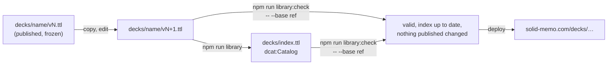
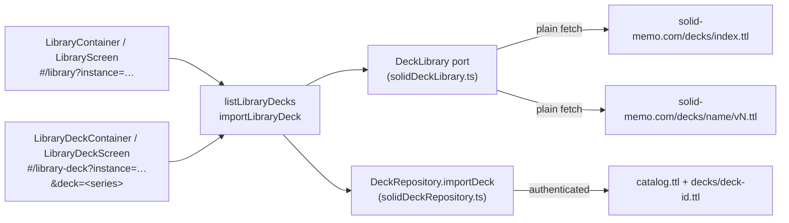

# Deck library

Ready-made decks that any user can copy into their own instance. The
library lives in this repository's [`decks/`](../decks/) folder and is
published with the site, next to the app
([deployment.md](deployment.md)), at `https://solid-memo.com/decks/`.
It is described with [DCAT](https://www.w3.org/TR/vocab-dcat-3/) and
conforms to [DCAT-AP](validation.md#profiles-dcat-ap-and-skos): the
library is a `dcat:Catalog`, each deck a `dcat:DatasetSeries` of its
versions, each version a `dcat:Dataset` with its cards and a Turtle
`dcat:Distribution`.

| Path under `decks/` | IRI | What |
|---|---|---|
| `index.ttl` | `https://solid-memo.com/decks/index.ttl` | The catalogue the app lists, generated from the versions and committed: each deck a series (`index.ttl#<name>`), its current version described in full but for its cards and how it was made, the publisher `index.ttl#solid-memo`. |
| `<name>/v<N>.ttl` | `https://solid-memo.com/decks/<name>/v<N>.ttl` | Version `N` of a deck, frozen once published; its cards are fragments of it (`…/v1.ttl#sweden`). |

Nothing else is in `decks/`: no lock file, no sources, no scripts. A
deck's name is lower-case letters, digits and dashes; its versions run
`v1.ttl`, `v2.ttl`, … without gaps. Every IRI ends in `.ttl`, as the
vocabulary's and the shapes' do: GitHub Pages serves a `.ttl` file as
`text/turtle` but negotiates no content, so an address without the
extension would be a 404. Each file states its own address as its
`@base`.



## A version

A version is one `sm:Deck` (also a `dcat:Dataset`), the document
itself (`<>`), in library deck format 5 (`LibraryDeckV5`,
[shapes.md](shapes.md)), with its cards as hash-fragment subjects in
card format 4:

- **Title and description** are language-tagged, one per language, one
  of them English (the library's curation policy, so that anyone who
  reads English can read every deck). **Keywords** are tagged too,
  several per language, in English and Swedish; the app shows the
  reader's. **Topics** are `dcat:theme`s from
  [`ns/vocab/topics.ttl`](../ns/vocab/topics.ttl), next to the EU data
  theme `EDUC`; **languages** are EU authority-table IRIs described in
  [`ns/vocab/external.ttl`](../ns/vocab/external.ttl).
- **Creators** are `foaf:Agent` nodes of the document; **licences**
  are IRIs typed `dcterms:LicenseDocument`; the **sources** it was
  compiled from are `prov:wasDerivedFrom` IRIs, each a subject of its
  own with its title, creator and licence.
- **The release**: `dcat:version "N"`, `dcterms:issued`, one
  `adms:versionNotes` (a plain string: the shape allows one, untagged),
  `dcat:inSeries` and `dcat:isVersionOf` `<…/decks/index.ttl#<name>>`,
  `dcterms:publisher <…/decks/index.ttl#solid-memo>`, a
  `dcat:distribution <#turtle>` pointing at the file itself, and from
  version 2 `dcat:prev` and `dcat:previousVersion` `<…/<name>/v<N-1>.ttl>`.
- **A published card is never removed, but retired**: keep it and add
  `owl:deprecated true` (card format 3 and later). Copies of the deck
  keep it and its review history, but no longer study it; a later
  version can bring it back by leaving the flag out. `sm:cardCount` in
  the index counts the cards in use.

[`decks/greek-alphabet/v1.ttl`](../decks/greek-alphabet/v1.ttl) is a
small, complete example.

## Provenance

Each authored deck says how it was made, in
[PROV-O](https://www.w3.org/TR/prov-o/), inside its version file:

- The deck is `prov:wasGeneratedBy <#compilation>`, a `prov:Activity`
  with when it ended, the sources it `prov:used` and
  `prov:wasAssociatedWith <#anton-wiklund>`. Its first comments are the
  attribution, "Compiled by Anton Wiklund with the help of AI."@en and
  "Sammanställd av Anton Wiklund med hjälp av AI."@sv; the others say how
  the cards were selected, researched and checked, and on what grounds
  the deck may carry its licence.
- The compilation `prov:wasInformedBy` its quality-control rounds,
  `<#review-0>`, `<#review-1>`, …: each a `prov:Activity` whose label
  names what it looked at (sources and licences, facts, language, …)
  and whose comments give its scope and its outcome. Machine checks (the
  SHACL and DCAT-AP validators, checks against live Wikidata) are named
  as such.
- Each source has an `rdfs:comment` quoting the evidence for its
  licence, and says whether the deck took content from it or used it to
  verify facts only.

The record is condensed from the working notes kept while a deck was
compiled; those notes' per-card evidence and queries are not part of
the library. The few decks that were not researched card by card
(generated from one source, such as the Swedish word decks and network
ports, or written directly, such as the capitals) describe their sources
and licences, some the command that generated them, but have no review
rounds. The index leaves the
record out (every `rdfs:comment`, and the activities but for the
compilation's type, which DCAT-AP asks for); the app shows the deck's
sources and licence on its page, and the version file has the rest.

## Publishing a new version

A published version is never edited or removed, only followed by the
next. To change a deck `<name>` whose latest version is `N`:

1. Copy `decks/<name>/v<N>.ttl` to `decks/<name>/v<N+1>.ttl` and edit
   the copy: cards (retire, never delete), texts, sources, provenance.
2. In the copy, change its `@base` to its own address
   (`…/<name>/v<N+1>.ttl`) and set
   - `dcat:version "<N+1>"`,
   - `dcat:prev` and `dcat:previousVersion` `<https://solid-memo.com/decks/<name>/v<N>.ttl>`,
   - `dcterms:issued` to the release time, and `dcterms:modified` if the
     deck has it,
   - `adms:versionNotes` to what changed, in one string.
3. `npm run format:turtle`, then `npm run library`, which validates the
   library and writes `decks/index.ttl` (the new version becomes the
   series' `dcat:last` and current version).
4. Look at it: `npm run dev` serves the working tree's `decks/`, so the
   library screen lists the new version and offers it to copies of the
   old one ([migrations.md](migrations.md#catching-up-with-the-library)).
5. Commit the new version and the index together. The deploy publishes
   them.

A new deck is the same with `decks/<name>/v1.ttl`, without `dcat:prev`
and `dcat:previousVersion`, its notes "First release.".

## Checks

[`packages/shacl/node/deckLibrary.ts`](../packages/shacl/node/deckLibrary.ts)
is both commands. `npm run library` writes the index;
`npm run library:check` writes nothing and fails when the index is not
what the versions make. Both check:

- the layout: nothing but `index.ttl` and `<name>/v<N>.ttl`, the names
  plain, the versions running from 1 without gaps;
- each version's metadata against its path: `@base`, the one deck being
  the document itself, `dcat:version`, series, publisher, and
  `dcat:prev` / `dcat:previousVersion` naming the version before (none
  for version 1);
- that no version drops a card of the one before it;
- every version and the index against Solid Memo's shapes, DCAT-AP (a
  version with the index beside it) and SKOS, with the reference data.

With `-- --base <git ref>` they also compare with the library at that
commit: a version published there that is gone or differs by a byte
fails. `npm run check` runs `library:check` without a base, and so
does CI; the [ns workflow](../.github/workflows/ns.yml) passes the pull
request's base branch, the commit a push to the default branch moved it
from, or, on a push to any other branch, the commit where that branch
left the default branch, so an edit to a published version cannot be
merged while a version not merged yet can still be fixed. To check a change locally before pushing:

```sh
npm run library:check -- --base origin/main
```

pySHACL checks the index and every version against DCAT-AP once more
([validation.md](validation.md#the-ci-cross-check)).

## Reading it

It is public, so the app reads it with a plain `fetch`, without logging
in. [main.tsx](../apps/web/src/main.tsx) names the index; during `npm
run dev` and `npm run preview` the site's own addresses are read from
the local server (`siteFetch`), so the working tree's library is what
the app shows. `VITE_LIBRARY_INDEX_URL` names another index at build
time:

```sh
VITE_LIBRARY_INDEX_URL=https://example.org/decks/index.ttl npm run dev
```

The library conforms to the same shapes the app reads it with
([shapes.md](shapes.md): `CatalogV1`, `LibraryDeckSeriesV3`,
`LibraryDeckV5`, older formats migrated in memory).

## In the app



- `toLibraryDecks` ([libraryMapper.ts](../packages/solid/src/mappers/libraryMapper.ts))
  reads the catalogue's datasets, each series' current release (through
  the `LibraryDeckSeriesV3` and `LibraryDeckV5` shapes, older formats
  migrated in memory) and its releases, showing the English title and
  description and keeping the other languages, which an import copies
  as they are (every tag, nothing guessed or added), and names creators
  from the agents in the index. An import writes the user's copy at the
  latest formats (deck format 6, card format 5), whatever format the
  release was frozen at: a release's keywords keep their tags, and a
  format-4 release's untagged keywords stay untagged, their language
  unknown. A series or release
  that does not fit its shape is left out.
- The library screen lists each deck's name and card count with a
  checkbox, filtered by **topic** (checkboxes of the topics the decks
  name, a broader topic finding the narrower: "Languages" finds the
  Swedish decks) and by a **search** of names, descriptions and keywords,
  in every language (`filterLibraryDecks` in [domain/library.ts](../packages/domain/src/library.ts)).
  Clicking a row opens the deck's page: description, topics, keywords
  in the reader's language,
  the release (version, date, notes), authors, licence, dates and
  sources, an import button and "Browse cards" (a read-only, paged list
  fetched from the release document).
- A deck's page is addressed by its **series** (`&deck=…/index.ttl#name`),
  which outlives releases; an address of one of its releases still finds
  it. A deck the library does not have falls back to the library
  ([routing.md](routing.md)).
- `importDeck` copies the current release into the instance with **one
  write of the cards document** (all 243 cards of the capitals deck in a
  single PUT), then one write of the catalog, and carries over the
  description, authors (as agents), licence, topics, keywords and
  direction. The copy says which release it came from with
  `prov:wasDerivedFrom <…/decks/name/vN.ttl>` (`Deck.sourceUrl`). Cards
  keep their library fragment ids (`#sweden`).
- A pod deck is a copy of a library deck when its source is any version
  of the deck's series (`isCopyOf`); the library marks such decks
  "Already imported". A second copy is still allowed.
- The copy is written in this app's own format, whatever the release
  said. A release or card in a *newer* format than the app writes is
  refused at import rather than silently stripped.
- Several decks can be ticked and imported at once, one at a time; a
  failure part-way leaves the earlier ones imported and reports the error.
- When the library publishes a newer release of an imported deck, the
  deck's page offers to update the copy card by card, keeping what the
  user changed and their review history
  ([migrations.md](migrations.md#catching-up-with-the-library)).
