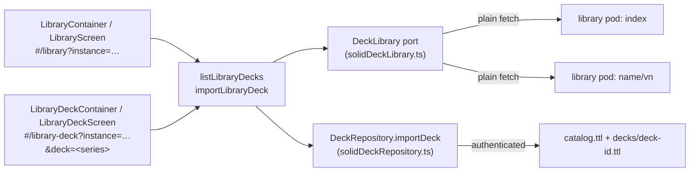

# Deck library

Ready-made decks that any user can copy into their own instance. The app
only reads the library: the decks are written, released, checked and
published in their own repository,
[solid-memo/decks](https://github.com/solid-memo/decks) (its
[docs/deck-library.md](https://github.com/solid-memo/decks/blob/main/docs/deck-library.md)
says how), whose sync workflow publishes them in the library pod:

| Path under `https://pod.solid-memo.com/library/decks/` | What |
|---|---|
| `index` | The catalogue the app lists: a `dcat:Catalog`, each deck a `dcat:DatasetSeries` (`index#<name>`) of its releases, the current release described in full but for its cards. |
| `<name>/v<n>` | Each release of a deck, frozen: a `dcat:Dataset` with its cards. |
| `deck-releases.lock` | Every release with its sha256. |

The documents have no extension, like the vocabulary's and the shapes'.
A deck copied from a release named the old way (`<name>/<n>.ttl`, in
`index.ttl#<name>`) is still recognised as a copy of its series.

It is public, so the app reads it with a plain `fetch`, without logging
in. [main.tsx](../apps/web/src/main.tsx) names the index;
`VITE_LIBRARY_INDEX_URL` names another at build time, such as the decks
repository's local server, which previews decks not released yet:

```sh
npm run serve                                                        # in the decks repository
VITE_LIBRARY_INDEX_URL=http://localhost:5180/index.ttl npm run dev   # here
```

The library conforms to the same shapes the app reads it with
([shapes.md](shapes.md): `CatalogV1`, `LibraryDeckSeriesV3`,
`LibraryDeckV3` to `LibraryDeckV5`) and to
[DCAT-AP](validation.md#profiles-dcat-ap-and-skos); the decks repository
checks every release and the index against them before it publishes.

## In the app



- `toLibraryDecks` ([libraryMapper.ts](../packages/solid/src/mappers/libraryMapper.ts))
  reads the catalogue's datasets, each series' current release (through
  the `LibraryDeckSeriesV3` and `LibraryDeckV5` shapes, older formats
  migrated in memory) and its releases, showing the English title and
  description and keeping the other languages, which an import copies
  as they are (every tag, nothing guessed or added), and names creators
  from the agents in the index. An import writes the user's copy at the
  latest formats (deck format 6, card format 5), whatever format the
  release was frozen at: a release's keywords keep their tags, and a
  format-4 release's untagged keywords stay untagged, their language
  unknown. A series or release
  that does not fit its shape is left out.
- The library screen lists each deck's name and card count with a
  checkbox, filtered by **topic** (checkboxes of the topics the decks
  name, a broader topic finding the narrower: "Languages" finds the
  Swedish decks) and by a **search** of names, descriptions and keywords,
  in every language (`filterLibraryDecks` in [domain/library.ts](../packages/domain/src/library.ts)).
  Clicking a row opens the deck's page: description, topics, keywords
  in the reader's language,
  the release (version, date, notes), authors, licence, dates and
  sources, an import button and "Browse cards" (a read-only, paged list
  fetched from the release document).
- A deck's page is addressed by its **series** (`&deck=…/index#name`),
  which outlives releases; an address of one of its releases still finds
  it. A deck the library does not have falls back to the library
  ([routing.md](routing.md)).
- `importDeck` copies the current release into the instance with **one
  write of the cards document** (all 243 cards of the capitals deck in a
  single PUT), then one write of the catalog, and carries over the
  description, authors (as agents), licence, topics, keywords and
  direction. The copy says which release it came from with
  `prov:wasDerivedFrom <…/decks/name/vn>` (`Deck.sourceUrl`). Cards
  keep their library fragment ids (`#sweden`).
- A pod deck is a copy of a library deck when its source is any release
  of the deck's series — or, for a deck imported before releases, the
  deck's old address (`isCopyOf`); the library marks such decks
  "Already imported". A second copy is still allowed.
- The copy is written in this app's own format, whatever the release
  said. A release or card in a *newer* format than the app writes is
  refused at import rather than silently stripped.
- Several decks can be ticked and imported at once, one at a time; a
  failure part-way leaves the earlier ones imported and reports the error.
- When the library publishes a newer release of an imported deck, the
  deck's page offers to update the copy card by card, keeping what the
  user changed and their review history
  ([migrations.md](migrations.md#catching-up-with-the-library)).
