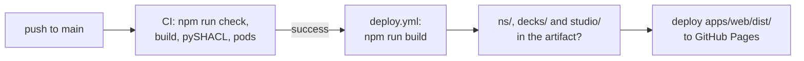

# Deployment

Solid Memo builds to plain static files — no server-side code — so it
publishes to any static host. The primary path is GitHub Pages,
deployed automatically by CI.

## GitHub Pages (automatic)

The site is live at **https://solid-memo.com/**. `.github/workflows/deploy.yml`
runs when the CI workflow has finished on `main`
(`workflow_run`), and deploys only if CI passed:



A red CI run never deploys; `workflow_dispatch` deploys by hand. The
workflow builds the commit CI checked, enables Pages for the repository
on its first run, and stops before deploying if the vocabulary, the
deck library or the Studio is missing from the build. Pushes that touch `ns/` or
`decks/` also run the [ns workflow](../.github/workflows/ns.yml)
([deck-library.md](deck-library.md#checks)).

### What the artifact contains

`apps/web/dist/` is the whole site, one origin for the app and the
data it reads:

| Path | From | What |
|---|---|---|
| `/` (`index.html`, `assets/`) | `apps/web/` | The app. |
| `/studio/` (`index.html`, `assets/`) | `apps/studio/` | [Solid Memo Studio](studio.md), built first and copied in by Solid Memo's build (`builtAppPlugin` in [publishApp.ts](../packages/vocab/tooling/publishApp.ts)). |
| `/ns/vocab/*.ttl`, `/ns/shapes/<class>/v<N>.ttl` | [`ns/`](../ns/) | The vocabulary and the shapes ([vocab.md](vocab.md), [shapes.md](shapes.md)). |
| `/decks/index.ttl`, `/decks/<name>/v<N>.ttl` | [`decks/`](../decks/) | The deck library ([deck-library.md](deck-library.md)). |
| `/vendor/…` | [`packages/vocab/vendor/`](../packages/vocab/vendor/) | The vendored DCAT-AP and SKOS shapes. |
| `/journeys/` | the CI run's `journeys-report` artifact | The user journeys' report ([testing.md](testing.md#user-journeys)), with each journey's trace. Not there after a deploy by hand. |

Vite copies `ns/`, `decks/` and `vendor/` as they are
(`turtleDirectoryPlugin` in
[publishTurtle.ts](../packages/vocab/tooling/publishTurtle.ts)), and
serves them the same way in `npm run dev` and `npm run preview`.

Pages serves a `.ttl` file as `text/turtle` with
`Access-Control-Allow-Origin: *`, so any app or tool can read it, but
it negotiates no content and lists no folders: an address without the
extension, or a folder such as `/decks/`, is a 404. That is why every
IRI of the vocabulary, the shapes and the library ends in `.ttl`.

One-time setup on a new machine or fork:

```sh
gh auth login
gh repo create <user>/solid-memo --public --source . --push
```

(GitHub Pages on the free plan requires a public repository.) A fork
deploys to `https://<user>.github.io/solid-memo/`; its app works there,
but the IRIs it reads still name `https://solid-memo.com/`, which
`siteFetch` ([appUseCases.ts](../packages/composition/src/appUseCases.ts)) maps to wherever the
site is served.

## Why any static host works, unconfigured

- Asset URLs are relative (`base: "./"` in `vite.config.ts`), so the
  build works at a domain root or any subfolder — including the
  `/solid-memo/` project path on GitHub Pages.
- Routing is hash-based (`docs/routing.md`), so deep links resolve to
  `index.html` without rewrite rules.
- The Solid OIDC redirect URL derives from `window.location` at
  runtime; no per-origin auth configuration. HTTPS is required, which
  GitHub Pages provides.
- The Content Security Policy is a meta tag in `index.html`, not a
  header, for GitHub Pages sets none: it travels with the page to any
  host ([markdown.md](markdown.md#safety)). A host that can set headers
  may add the directives a meta tag cannot carry, such as
  `frame-ancestors`.

## Custom domain (solid-memo.com via one.com DNS)

The domain is live: one.com's DNS points `solid-memo.com` at GitHub
Pages, the custom domain is set in the repository (Settings → Pages →
Custom domain, recorded in [CNAME](../CNAME)), and GitHub provisions
the certificate. Nothing in the app depends on it: the same build
serves from any origin. The vocabulary, shape and library IRIs do name
it, so they resolve only once it serves this site.

## Manual publish (any static web space)

`npm run build`, then upload the **contents** of `apps/web/dist/` to the web
root (or any subfolder) via SFTP or a file manager, `ns/`, `decks/`,
`vendor/` and `studio/` included. Verify a build
locally with `npm start` (builds, then serves `dist/` at
http://localhost:4173), or `npm run preview -w @solid-memo/web` to serve
the last build.
