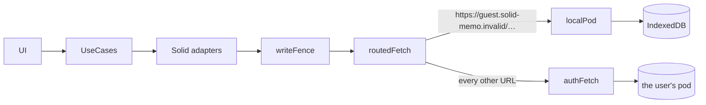
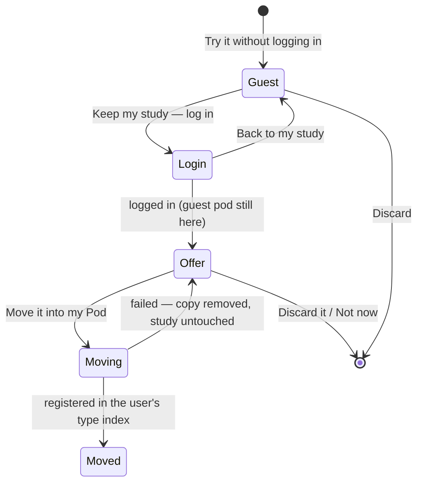

# Guest mode

Trying Solid Memo before logging in. A guest studies in a pod kept in
their browser. Once they log in with a real WebID they can move what they
studied into their own Pod. Everything else in the app works the same
for a guest: the deck library, studying, statistics, preferences and the
data check.

## A pod in the browser

A guest gets a small Solid pod of their own, served by
[localPod.ts](../packages/solid/src/localPod.ts) as a `fetch`, so the
app's Solid adapters read and write it exactly as they do a server. A
router ([routedFetch.ts](../packages/solid/src/routedFetch.ts)) sends
each request to the guest's pod or to the network, by URL.

- **Origin:** `https://guest.solid-memo.invalid/` (`GUEST_ORIGIN` in
  [domain/guest.ts](../packages/domain/src/guest.ts)). The `.invalid`
  domain is reserved and never resolves, so a guest URL that slips past
  the router fails instead of reaching anyone.
- **WebID:** `…/profile/card#me`. Its profile names the pod's root as its
  `pim:storage`, and is written when the guest starts (`GuestPod.start`).
  The instance and its private type index are created the way they are
  on any pod, by `createInstance`.
- **What the pod speaks:** GET, HEAD, PUT, DELETE, and PATCH with SPARQL
  `INSERT DATA` / `DELETE DATA`. It gives ETags, honours `If-Match`,
  `If-None-Match: *` and `If-None-Match: <etag>`, keeps `ldp:contains`
  listings, and marks the root as a `pim:Storage`. It has no access
  control. Each request runs exclusively on the store, under a Web Lock
  shared by every tab.
- **Storage:** the `ResourceStore` port. In the browser this is
  [indexedDbResourceStore.ts](../packages/browser/src/indexedDbResourceStore.ts),
  which is needed because the login redirect leaves the page and the
  guest's study must survive it. Where IndexedDB is missing, an
  in-memory store keeps the study for the current page only. This is the
  one place pod data lives in browser storage, and only a guest's.

`restoreSession` prefers a real session. Without one, it returns a
guest's session (`{ webId: GUEST_WEBID, guest: true }`) whenever a
guest pod exists in this browser.

## Keeping the study

The guest pod itself marks that there is something to keep, so nothing
has to survive the redirect. After any login, or any restored session,
`GuestStudyOffer` asks `findGuestStudy` and makes the offer while a
guest pod exists.

`transferGuestStudy` copies the guest's instance into a container the
user chooses (by default `<storage>solid-memo/main/`, or
`solid-memo/guest-<day>/` when an instance is already there). It runs
these steps:

1. **stage:** list the guest's instance. The digest stays behind,
   because its versions are this browser's. Make sure the target is
   free, then create it. Any answers still waiting to be logged go to
   the guest's log first.
2. **copy:** copy each resource with every IRI under the guest's
   instance moved under the target, and the guest's WebID renamed to the
   user's (`ContainerMove.renames`).
3. **adopt:** name the catalogue's publisher as the user's profile names
   them. No document of the copy may still mention `GUEST_ORIGIN`, as an
   IRI or in text (`guestUrlsLeft`).
4. **validate:** the copy must fully conform to the shapes
   (`movedCopyInvalid`).
5. **verify:** the guest's instance must be unchanged since it was
   copied. The write fence keeps it read-only meanwhile.
6. **register:** `attachInstance` in the type index the user chose.
   From here on the study is theirs.
7. **tidy:** register each class of the instance's data (its
   catalogue, decks, cards, review states and answers,
   [data-model.md](data-model.md#discovery-chain)), then delete the guest's instance
   as any instance is deleted ([data-model.md](data-model.md#discovery-chain)),
   and the whole guest pod once no instance is left. A registration
   that fails is left for **Register what is missing** in Preferences,
   and the guest's instance is deleted all the same. A failure to
   delete it only means `tidied: false`.

A failure before **register** deletes the copy, whole, and leaves the
guest's study exactly as it was: Solid Memo created the target's
container where nothing was, and nothing names it before **register**,
so all it holds is Solid Memo's copies. As with the [format update](migrations.md#the-pod-migration),
the update journal notes the run, so a copy left behind by a closed tab
is offered for removal on the next opening of the guest's instance. A guest's
instance has no access control of its own, so the copy inherits the
user's pod's defaults, the same as a newly created instance.

The study always moves as a new instance; merging it into an existing
instance is not supported. Logging in does not discard the guest pod:
the guest can choose to keep it for later.
