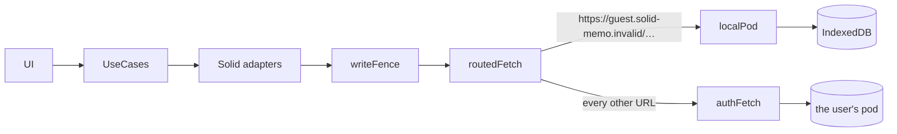

# Guest mode

Trying Solid Memo before logging in. A guest studies in a pod kept in
their browser. Once they log in with a real WebID they can move what they
studied into their own Pod. Everything else in the app works the same
for a guest: the deck library, studying, statistics, preferences and the
data check.

## A pod in the browser

A guest gets a small Solid pod of their own, served by
[localPod.ts](../packages/solid/src/localPod.ts) as a `fetch`, so the
app's Solid adapters read and write it exactly as they do a server. A
router ([routedFetch.ts](../packages/solid/src/routedFetch.ts)) sends
each request to the guest's pod or to the network, by URL.

- **Origin:** `https://guest.solid-memo.invalid/` (`GUEST_ORIGIN` in
  [domain/guest.ts](../packages/domain/src/guest.ts)). The `.invalid`
  domain is reserved and never resolves, so a guest URL that slips past
  the router fails instead of reaching anyone.
- **WebID:** `…/profile/card#me`. Its profile names the pod's root as its
  `pim:storage`, and is written when the guest starts (`GuestPod.start`).
  The instance and its private type index are created the way they are
  on any pod, by `createInstance`.
- **What the pod speaks:** GET, HEAD, PUT, DELETE, and PATCH with SPARQL
  `INSERT DATA` / `DELETE DATA`. It gives ETags, honours `If-Match`,
  `If-None-Match: *` and `If-None-Match: <etag>`, keeps `ldp:contains`
  listings, and marks the root as a `pim:Storage`. It has no access
  control. Each request runs exclusively on the store, under a Web Lock
  shared by every tab.
- **Storage:** the `ResourceStore` port. In the browser this is
  [indexedDbResourceStore.ts](../packages/browser/src/indexedDbResourceStore.ts),
  which is needed because the login redirect leaves the page and the
  guest's study must survive it. Where IndexedDB is missing, an
  in-memory store keeps the study for the current page only. This is the
  one place pod data lives in browser storage, and only a guest's.

`restoreSession` prefers a real session. Without one, it returns a
guest's session (`{ webId: GUEST_WEBID, guest: true }`) whenever a
guest pod exists in this browser.

## Keeping the study

```mermaid
stateDiagram-v2
    [*] --> Guest: Try it without logging in
    Guest --> Login: Keep my study — log in
    Login --> Guest: Back to my study
    Login --> Offer: logged in (guest pod still here)
    Offer --> Adding: Move it into my Pod (the user has an instance)
    Offer --> Moving: Move it into my Pod (the user has none)
    Offer --> [*]: Discard it / Not now
    Adding --> Added: every deck in, the guest's study unchanged meanwhile
    Adding --> Offer: failed — the decks added stay, whole; study untouched
    Moving --> Moved: registered in the user's type index
    Moving --> Offer: failed — copy removed, study untouched
    Guest --> [*]: Discard
```

The guest pod itself marks that there is something to keep, so nothing
has to survive the redirect. After any login, or any restored session,
`GuestStudyOffer` asks `findGuestStudy` and makes the offer while a
guest pod exists. **Move it into my Pod** first lists the user's
instances. When there is one, or several, the study is added to the one
they choose ([below](#adding-to-an-instance)); when there is none (or
the instances cannot be listed), it moves into a new instance
([below](#as-a-new-instance)). Logging in does not discard the guest
pod: the guest can choose to keep it for later.

### Adding to an instance

`mergeGuestStudy` adds the guest's decks to the instance the user chose
(the first listed, unless they pick another), deck by deck. The form
lists the guest's decks (`planGuestMerge`), each ticked; one the user
unticks is left out, and goes with the rest of the guest's study (at
least one must stay ticked, unless the study has none). A guest's deck
copied from the same [library](deck-library.md) release as one of the
instance's (the same `prov:wasDerivedFrom`) says so: it is added beside
that deck, as a deck of its own with its own progress, never merged
into it card by card, and the user may untick it. The form also says
that the instance keeps its own preferences: the guest's are not
carried over. Nor is the guest's digest, which is this browser's, nor
are the drafts of releases a guest wrote in the [Studio](studio.md#drafts):
they are deleted with the guest's instance. When the guest wrote any,
the form says how many, and that they go: to keep them, the user goes
back and leaves the study in the browser for now. Only moving the
guest's study in, offered when the user has no instance yet (below), keeps its drafts,
as it copies the instance whole.

It runs these steps:

1. **read:** list the guest's instance, and note the version of each of
   its documents, before anything of it is read. Any answers still
   waiting to be logged go to the guest's log first, and the write fence
   keeps the guest's instance read-only meanwhile. Then the guest's
   whole instance, its answer log included, is checked against the
   shapes: one that does not fully conform adds nothing
   (`guestStudyInvalid`), nor does one with a subject a newer version
   of the app wrote, which this one could not write without losing what
   it says (`guestStudyTooNew`). Nor does a study with deck groups when
   the instance's [arrangement](data-model.md#deck-groups) was written
   by a newer version, which this one cannot edit (`deckTreeTooNew`):
   it is refused here, before any deck is written, rather than at
   **arrange**, where every retry would fail again.
2. **decks:** each deck the user kept, in the guest's order, becomes a
   new deck of the instance ([data-model.md](data-model.md#decks-and-cards)):
   - a new id (`deck-<uuid>`), with its cards and reviews documents
     named after it in the instance's `decks/` and `reviews/`;
     everything else its entry says is the guest's: its title,
     description, authors, licence, topics and keywords, its direction
     and pace, when it was made, the release it came from
     (`prov:wasDerivedFrom`) and a course's chapters completed
     (`sm:completedChapter`);
   - its cards keep their fragment ids (a deck's documents are its
     own, so no id can clash), their distractors and when they were
     made, written in this app's format, the document saying it is part
     of the deck; its review states keep their SM-2 fields and
     snapshots, each naming its card, direction and scheduler;
   - the cards document is created first (one PUT, only where nothing
     is), then the reviews document (likewise), and only then the
     deck's catalog entry, with `If-Match` (the catalog read and the
     entry added again on 412, a few times at most): until that last write,
     nothing names the documents, and a failure before it deletes the
     ones it wrote (and one whose write's answer was lost, which may
     have been made), never one the pod refused to create; unless the
     entry was written after all, its answer lost on the way: then the
     deck is whole. A deck with no cards, or no review
     states, has no such document yet, as any deck;
   - then its answers: each answer of the guest's log given to that
     deck, its deck, card and wrong option chosen named in the new
     deck's documents by the same fragment ids, and its own id the
     guest's followed by the new deck's (`answer-<time>-<random>-deck-<uuid>`),
     is added to the instance's log for its month, insert-only, unread
     (`appendAll`, one PATCH per month, more where one would pass 64
     KiB). Answers of a deck the guest removed, or left out, are not
     added.

   Nothing written may name the guest's pod (`guestUrlsLeft`). Nothing
   is registered: the instance's registrations name its catalogue and
   its folders, and the decks added are in them.
3. **arrange:** when the guest made deck groups, they are made around
   the decks added, each a new group (`#group-<uuid>`) with the guest's
   name, holding what the guest's held: the decks added and the guest's
   groups, in the guest's order, go after the instance's own decks and
   groups, at the top level (a `graft` edit of the
   [arrangement](data-model.md#deck-groups), written as any edit: one
   PATCH with `If-Match`, applied again on 412, which numbers the top
   level anew). An empty group the guest made comes along empty. With
   no group, nothing is written, and the decks added are listed after
   the instance's, as new decks are.
4. **verify:** the guest's instance must still list the same
   resources, each at the version noted in **read**
   (`guestStudyChanged`).
5. **tidy:** delete the guest's instance as any instance is deleted
   ([data-model.md](data-model.md#discovery-chain)), and the whole
   guest pod once no instance is left. A failure to delete it only
   means `tidied: false`: the study is in the instance, and the notes
   below are kept while the guest's study is still in the browser.

A failure at any step leaves the instance valid: every deck it reports
added (`added`) is whole, its documents, its entry and, unless the
failure was in adding them, its answers; nothing else of the guest's was
written but the groups, when it failed after **arrange**, and a deck's
document whose deletion failed, which nothing names. The guest's study
is as it was, and the user is told which decks are in the instance now.
Trying again adds what is not there yet: as each deck is added, and
each group about to be, the update journal of this browser notes it
(`GuestMergeNote`: the new deck or group, and what it was made from:
for a deck, the guest's catalog entry and the versions of the guest's
documents it was read at; for a group, the whole arrangement of the
guest's groups around the decks added). The next run finds a deck
whose entry and documents are as noted in the instance and adds only
its answers again, which changes nothing that is there (the same
entries, the same triples), and makes each group, when the arrangement
is as noted, under the URL it had, so a graft already made is left as
it was. A deck the guest changed since, in its entry or its documents,
is added anew, beside the one added before (which the user may
remove), and so are a deck the instance no longer has and every deck
where the browser kept no note (the journal is best effort); its
answers are then entries of their own, their ids naming the new deck,
so no entry of the log names two decks. Groups arranged otherwise than
noted (a deck added anew among them) are made anew, holding the decks
added, and the ones made before stay, without them. The notes are
forgotten once a merge has deleted the guest's study; a study
discarded instead leaves them in the browser, where they do no harm: a
later guest's decks have new URLs, which no note names.

### As a new instance

`transferGuestStudy` copies the guest's instance into a container the
user chooses (by default `<storage>solid-memo/main/`, where a first
instance goes). It runs these steps:

1. **stage:** list the guest's instance. The digest stays behind,
   because its versions are this browser's. Make sure the target is
   free, then create it. Any answers still waiting to be logged go to
   the guest's log first.
2. **copy:** copy each resource with every IRI under the guest's
   instance moved under the target, and the guest's WebID renamed to the
   user's (`ContainerMove.renames`).
3. **adopt:** name the catalogue's publisher as the user's profile names
   them. No document of the copy may still mention `GUEST_ORIGIN`, as an
   IRI or in text (`guestUrlsLeft`).
4. **validate:** the copy must fully conform to the shapes
   (`movedCopyInvalid`).
5. **verify:** the guest's instance must be unchanged since it was
   copied. The write fence keeps it read-only meanwhile, in the site's
   other open tabs too.
6. **register:** `attachInstance` in the type index the user chose.
   From here on the study is theirs.
7. **tidy:** register each class of the instance's data (its
   catalogue, decks, cards, review states, answers and drafts,
   [data-model.md](data-model.md#discovery-chain)), then delete the guest's instance
   as any instance is deleted ([data-model.md](data-model.md#discovery-chain)),
   and the whole guest pod once no instance is left. A registration
   that fails is left for **Register what is missing** in Preferences,
   and the guest's instance is deleted all the same. A failure to
   delete it only means `tidied: false`.

A failure before **register** deletes the copy, whole, and leaves the
guest's study exactly as it was: Solid Memo created the target's
container where nothing was, and nothing names it before **register**,
so all it holds is Solid Memo's copies. The update journal of this
browser notes the run, so a copy left behind by a closed tab is offered
for removal on the next opening of the guest's instance
(`InterruptedMoveContainer`), and removed whole. A copy another tab's
move is still writing is not offered, nor removed. A guest's
instance has no access control of its own, so the copy inherits the
user's pod's defaults, the same as a newly created instance.

The other open tabs of the site (the web app's and the Studio's, which
share one origin) hold the guest's instance and its copy while a move
runs, so a write there fails with the same message as in the tab moving it. The
tab running the move holds a Web Lock named after its journal entry
until the move is over, failed or not; the browser lets the lock go when
the tab closes or crashes. Each other tab reads the entries when it
opens, then follows them through the browser's `storage` events, and
holds what an entry names only while its lock is held. An entry a
failed move keeps, one a closed tab left, or one noting a deck added to
an instance fences nothing. A browser without Web Locks fences no other
tab; the verify step catches what it misses.

