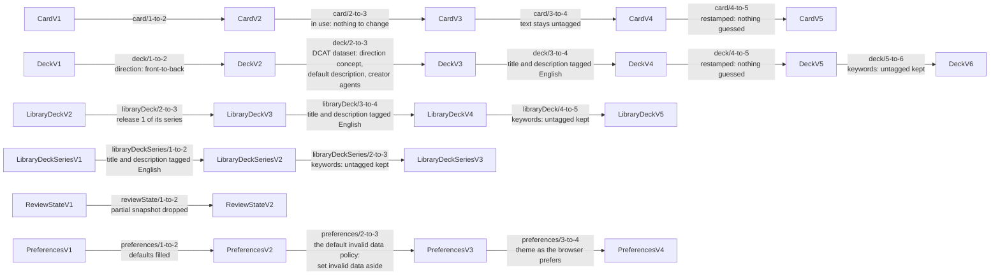
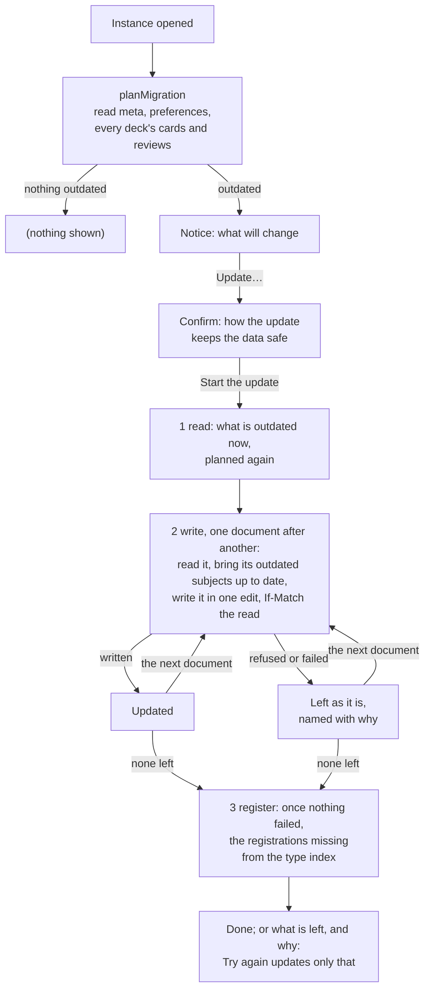
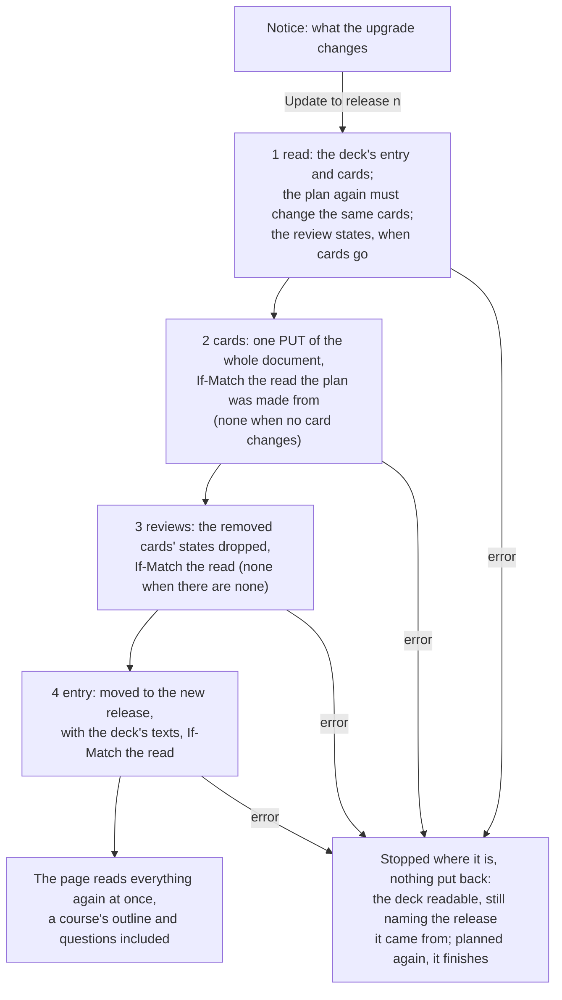

# Format versions and migrations

How Solid Memo tells old data from new, and how it brings a pod up to
the format the current app writes. The formats are the
[shapes](shapes.md); the steps between them are the migration modules
in [domain/shapes/migrations](../packages/domain/src/shapes/migrations/); the
plan is in [domain/migration.ts](../packages/domain/src/migration.ts); the notice
the user sees in [MigrationContainer.tsx](../packages/ui/src/ui/MigrationContainer.tsx).

## Versions

Every subject Solid Memo writes carries `sm:formatVersion` (a missing one
means 1, the format that predates the field). `LATEST_VERSION` in the
generated [shapes module](../packages/vocab/src/types.generated.ts) is what the
app writes today; `DECK_FORMAT_VERSION` and friends are aliases of it.

| Class | 1 | 2 | Why the version moved |
|---|---|---|---|
| Instance | title, created | `dcterms:replaces` (the instance it is an updated copy of) and `dcterms:modified` (when it replaced it), both optional | The format update of that time wrote a copy and kept the original as a backup; the copy records which one. The update now writes each document where it is and states neither; an instance an earlier update made keeps them, and the app ignores them ([The backup](#the-backup)). |
| Deck | title, document links, provenance | `sm:direction`, stated | A format-1 reader would study a bidirectional deck one way only and count the other way's review subjects against the day's budgets without matching them to any card. |
| Card | `sm:front` and `sm:back`, both required | a side may be a picture (`sm:frontImage` / `sm:backImage`, an IRI), text, or both | A format-1 reader treats a card without `sm:front` as malformed and drops it, so picture-only cards must not be mistaken for format 1. |
| Review state | the SM-2 fields; a snapshot and per-direction subjects were added without a bump, so format 1 admits them | the same fields; the snapshot is all five triples or none; the subject naming (`#<cardId>`, `#<cardId>@back-to-front`) is part of the contract | Stamping begins: a format-1 reader meeting a format-2 state would silently ignore the snapshot and the other direction, which is what a version is meant to flag. |
| Preferences | whatever the unversioned era wrote: every field optional, a missing one meaning its default | every field stated | The document is rewritten on every save, so stamping costs nothing; format 2 is the complete record. |

Deck format 4 (and library deck series format 2, its summary in the
library index) states a deck's title and description as language-tagged
text: one value per language, exactly one of them English, which the
app shows and edits while keeping the other languages. The version moved
because a format-3 reader knows only untagged strings: it would read a
format-4 deck as having no title and drop it. The step to format 4 tags a
format-3 deck's title and description as English.

Card format 3 adds a note under each side (`sm:frontNote`,
`sm:backNote`, shown once the answer is revealed) and a label above the
back (`sm:backLabel`, how the answer relates to the front), all three
language-tagged text like a deck's title, and lets a card be retired
(`owl:deprecated true`): a library deck keeps a card it no longer uses
instead of removing it, so a copy keeps the card and its review state
but no longer studies it. The version moved because a format-2 reader
would go on studying a retired card. A format-2 card is in use, so the
step to format 3 changes nothing.

Card format 4 lets a side's text be language-tagged, one text per
language ("Mona Lisa"@en), or stay untagged when its language is not
known, never both. English is not required, since card text is often
not English. The app shows the reader's language, else the English,
else the untagged text, and edits one text while keeping the others;
text typed in the app is untagged. The version moved because a format-3
reader knows only untagged text: it would read a tagged side as empty
and drop the card. The step to format 4 changes nothing in the data, as
a format-3 side's text is untagged and stays so: no language is guessed.

Deck format 5 and card format 5 let a deck's title and description, and
a card's notes and label, be language-tagged text in any language, one
value per language: English is no longer required. A deck titled only
in Swedish, or a note only in Finnish, is whole. `zxx` tags text in no
language (codes, numbers, symbols). Library releases stay at deck format
4: English first is the library's curation policy, not a rule of the
data, so no release is rebuilt; an imported release is written in
format 5. The version moved because a format-4 validator flags a title
or note with no English, and a format-4 app drops such a note when the
card is edited. The steps to format 5 change nothing but the version
(restamped: nothing guessed): every format-4 deck and card is valid
format 5 already. Text the step to deck format 4 tagged English and
text saved the same in English and another language stay as they are:
a pure step cannot tell an identical English copy from a real
translation ("Stockholm"@en and "Stockholm"@sv), and the app accepts
the same words in several languages as text in each of them, so the
format-4 era's identical English copies are left in the data untouched.
An untagged card side stays untagged.

Deck format 6, with library deck format 5 and library deck series
format 3, lets a deck's keywords (`dcat:keyword`) be language-tagged,
several per language ("capitals"@en, "huvudstäder"@sv), so the app can
show a deck's keywords in the reader's language. The version moved
because a format-5 reader knows only untagged keywords: it would read a
tagged keyword as absent and drop it on its next save of the deck. The
steps to deck 6, library deck 5 and series 3 keep untagged keywords
untagged, their language unknown (`""` in the model): no language is
guessed. Untagged keywords are valid only as kept from older formats:
the app writes every new keyword under the language the user states.
Library releases from library deck format 5 on tag every keyword (each
deck has keywords in English and Swedish); older releases stay frozen
with untagged keywords, and an import of one writes them untagged into
the format-6 copy.

[Deck groups](data-model.md#deck-groups) (deck group format 1) need no
migration: groups are new subjects, and a deck's `sm:position` and the
catalogue's `dcat:catalog` belong to no shape, so the deck and catalogue
formats are unchanged.

[Courses](courses.md) (vocabulary 1.14) need no migration and moved no
format version:

- Chapter, step and distractor format 1 are new classes, so nothing old
  is in their format.
- `sm:distractor` joined card format 5, and `sm:answerMode` and
  `sm:chosenDistractor` answer format 1, each optional. A reader that
  ignores them loses nothing: an older app studies a course's card front
  to back as any card, and reads a multiple-choice answer as an answer.
  Absent, they mean what every card and answer before meant: no wrong
  options, and recalled.
- `sm:completedChapter` on a deck belongs to no shape, as `sm:position`
  does, so `DeckV6` is unchanged and every writer of the deck keeps it.

An older app that edits a course's card keeps its `sm:distractor`
links, as it keeps any triple its shape does not own. One that removes
the card leaves its `sm:Distractor` subjects behind, which this app
ignores, since no card names them. An older app's
[check](validation.md) lists an `sm:Distractor` as `untyped`, a
subject of no class it knows: visible, never a violation.

[Text formats](vocab.md#text-formats) (vocabulary 1.15) need no
migration and moved no format version. `sm:textFormat` joined card
format 5, step format 1 and chapter format 1, optional. This is a
judgment call, recorded here with its reasoning:

- **What a reader that ignores it loses** is the rendering only: it
  shows the Markdown source, which is readable by design, and keeps the
  triple through an edit, since the shapes are not closed and the
  writer keeps every predicate it does not own. Absent, the marker
  means what every text before meant: plain. A bump would instead have
  older apps restamp the subject at the old version and every user run
  a pod migration, for a meaning an older app would lose anyway.
- **Who runs an older app.** The app has no service worker, and the
  library index comes from the same deployment, so an older app is a tab
  opened before the deploy, or a fork. Such a tab has one real loss: an
  edit of a multi-line text in a single-line field drops its line feeds,
  which is content, not just the ignored term. (Since vocabulary 1.15,
  the app edits any card text saved with a line break in a textarea;
  see [i18n.md](i18n.md).)
- **An older app's import drops the marker**, as it writes the card
  through its own card record. The
  [library upgrade](#catching-up-with-the-library) counts a copy that
  differs from its release only by lacking the release's text format as
  left alone by the user, so the next release brings the marker back,
  with any change of the card's text; until then the card stays the
  library's, its languages too. A copy that states `sm:plainText`
  against a Markdown release was switched off on purpose and is kept.
  There is no repair within one release.
- **A new concept of `sm:TextFormats` needs no bump either**: the shape
  lists none, so an unknown one is read as plain text and kept.
- **One full re-check.** The property shapes changed the shape files,
  so the rules' hash (`__SHAPES_RULESET__`, see
  [validation.md](validation.md)) changed: every instance is checked in
  full once on its next opening, and its documents get new receipts.
  Outside validators of `card/v5.ttl`, `step/v1.ttl` and `chapter/v1.ttl`
  see one new constraint, which data without the marker meets.

What a review state is of, and the other links of vocabulary 1.16 (see
[vocab.md](vocab.md#review-states)), need no migration and moved no
format version:

- **`sm:reviewOf`, `sm:reviewDirection` and `sm:scheduler` joined
  review-state format 2**, optional. The app writes them on every state
  it writes (a review, a reset of the day, a course's answer, the format
  update's step of an outdated state). A state it has already read is
  written back at its own subject, whatever that is called; a new one
  goes to the subject the old rule names, so an older reader finds it as
  before, or, where that subject is another's, to `#review-<uuid>`. An
  older reader takes a state at any subject but the old rule's (another
  app's `#state-7f3a`, or `#review-<uuid>`) for a state of a card the
  deck does not have: it ignores it, studies the card as new and writes
  `#<cardId>`, which this app then reads instead, one state counting per
  card and direction. States written before stay as they are until they
  are next written: without the links, they are read by their subject,
  as ever.
- **Review-state formats 1 and 2 accept any subject for a state that
  names its card**, a relaxation: what conformed still conforms. A tab
  opened before the deploy fetches its shapes from the site, so it
  checks with these, but reads such a state by its subject, which names
  no card of the deck: it ignores it.
- **A state of another scheduler** has no SM-2 fields to read. It is
  another app's to the [check](validation.md#data-another-app-wrote),
  so it sets no deck aside, and this app never reads, writes over or
  removes it. Any value of `sm:scheduler` but the `sm:sm2` IRI counts,
  a literal too. An older app takes it for SM-2's: it cannot read it either
  (no ease factor), and would write over it only at the subject the old
  rule names for a card.
- **`schema:suggestedAnswer` on a card and `dcterms:isPartOf` on a cards
  document belong to no shape**, so no format moved, every writer keeps
  them, and the app reads neither. An older app that changes a card's
  distractors keeps its suggested answers as they were, naming
  distractors it removed; this app cannot tell those from another app's,
  and keeps them.
- **A link to a card outlives an upgrade by an earlier version.** Until
  stable addresses, a library [upgrade](#how-an-upgrade-is-applied)
  moved the cards to a new document (`decks/<deckId>-<uuid>.ttl`) and,
  unless a removed card had states, kept the reviews document, whose
  links still named the old one. The app reads a link into any cards
  document the deck has had (`decks/<deckId>.ttl` or
  `decks/<deckId>-<uuid>.ttl`) by its fragment, so such a deck loses no
  state. This app's upgrade writes in place: the links it writes name
  the document the cards are in, and it moves none.
- **One full re-check.** The shape files changed, so the rules' hash
  changed: every instance is checked in full once on its next opening.

Rules that hold across versions:

- **Readers never refuse older data.** A subject is read with the shape
  of its stored version, then brought up to the latest record in memory
  by the migration chain. Nothing is written until the user asks.
- **Every write is in the current format.** `recordThing` stamps the
  descriptor's version on every subject it writes: adding or editing a
  card, saving a deck, a review, the preferences, an import.
- **Newer data passes through, and is never written over.** A stored
  version above the latest is read with the latest shape this app has;
  the model keeps the stored version, and the migration plan never
  counts it. Writing it would lose what the newer format says, so
  `recordThing`, through which every subject is written
  ([records.ts](../packages/solid/src/records.ts)), refuses one whose
  stored version is above the version it writes for that kind
  (`writtenByNewerApp`: "A newer version of Solid Memo has updated this
  data, so this version does not save over it. Reload the page…"),
  before anything is sent; and `unlessNewer` refuses the same for the
  writes that change or remove a subject without recording it (a deck's
  position or completed chapter, a deck group's removal, the catalogue's
  links, a repair, and the removal of a card, a distractor, a review
  state, a deck entry or a day's answers): a subject stamped above every
  version this app writes for its class. This is what keeps a tab opened before a
  deploy from writing older formats over what the update wrote in
  place; a tab of a version from before this rule has no such guard.
  The library import refuses newer data too, with a clear message.

## The chain

One module per step (`<class>/<n>-to-<n+1>.ts`), each a pure, total
function from the record of one version to the record of the next,
never mutating its input. Besides the record a step is given the IRI of
the subject being migrated (`MigrationContext`), for a step that names
new resources beside it. `migrate(shape, record, { subject })` walks the
chain to the latest version; a gap is a programming error and throws. Tests
assert that the chain is contiguous for every kind, that every step is
pure, that the latest record passes through untouched, and — with the
real shapes — that every step's output conforms to the shape it moves to.

## The pod migration

The format update brings each outdated document up to this app's
formats on its own, where it is, in one write the pod makes whole or not
at all. No document, subject or folder changes its address, no
registration in the type index changes (only those missing are added),
and nothing is kept beside the documents: no copy, no backup. A document
that cannot be updated now is left as it is, readable, and the update
goes on with the others; run again, it updates what is still outdated
([instanceUpdate.ts](../packages/domain/src/instanceUpdate.ts),
`updateInstance` in [useCases.ts](../packages/application/src/useCases.ts)).

- **Why one document at a time is enough.** No fact of the update
  spans documents, so none needs the others written with it:
  - a migration step is a pure function of one subject
    (`up(data, { subject })`, [The chain](#the-chain)), so a document
    is brought up to date alone, whatever the others hold;
  - a reader reads each subject with the shape of its stored version and
    brings it up to date in memory, so an instance with any mix of
    updated and outdated documents reads and conforms as one;
  - every ordinary write already stamps the latest format
    (`recordThing`), so study goes on in an instance whose update
    stopped part-way, updating what it writes as it goes;
  - the pod applies one PATCH or one PUT whole or not at all, so a
    document whose write fails is as it was, and readable.

  The one constraint between subjects of the update, the catalogue's
  DCAT-AP listing its decks as datasets, which outdated entries are
  not, holds within one document: a deck's entry and the catalogue are
  subjects of the catalog document, written in one edit. No order
  between documents is needed, and nothing ever needs putting back.
- **Plan first, write nothing.** Opening an instance reads the meta
  document, the preferences, and every deck's entry, cards and review
  states, and counts what is below the latest version; a document still
  at a version the instance's [digest](data-model.md#the-digest) says
  has nothing outdated in it is not read again. The result is cached for
  the session per instance.
- **The user decides.** The notice names what is outdated and which
  formats this app now writes; its button opens a confirmation that
  explains that the documents are updated one by one, each where it is,
  in one write the pod makes whole or not at all and, where the pod
  checks this, only if nothing else changed it since it was read; that
  every document can be read throughout, updated or not; and that one
  that cannot be updated now is left as it is, to try again, when only
  what is still outdated is updated. Until **Start the update** is
  pressed the app keeps working on the old format. A progress bar shows
  the step and, while it writes, "n of N documents".
- **What is outdated is read afresh.** The update plans again rather
  than trusting the plan shown (another tab may have updated part of it
  meanwhile) and writes, in this order: `meta.ttl` (when its format is
  outdated), `preferences.ttl` (likewise), each deck's cards document
  and reviews document (when a card, or a state, is outdated), and last
  `catalog.ttl` (when a deck entry is outdated or the catalogue is
  missing: a catalogue is written then, named as the instance's record
  names it and published by the signed-in user,
  [data-model.md](data-model.md#the-catalogue)). The order is the
  reader's convenience, not a need. A document two decks share (another
  app may point two decks at one) is one document of the update, written
  for each deck in turn.
- **Each document in one conditional write.** Each write reads the
  document, brings each of its subjects stored in an older format up to
  date from that very read, each from the model the chain brought up to
  date, so content does not change, only its version, and writes it in
  place as an edit: a PATCH of what changed, or one PUT of the whole
  document when the PATCH would be larger than 64 KiB
  ([data-model.md](data-model.md#write-discipline)). Unknown triples
  survive. The write carries `If-Match` the version read, so a change
  made elsewhere since is never written over (412). It passes the write
  check, every subject it touches against its shape
  ([validation.md](validation.md)), and the guard against writing over
  what a newer version wrote (`writtenByNewerApp`, [Versions](#versions)),
  as every save does. A document brought up to date meanwhile, elsewhere,
  is not written.
- **One that cannot be updated now is left as it is.** Refused by the pod
  (412, changed elsewhere since it was read) or by the write check, a
  newer version's subject in it, the network or the server failing: the
  document's one write was not made, or was made whole, so it is either
  as it was or updated, and readable either way. It is named with why,
  and the update goes on with the next document. Nothing is put back:
  each document is in a format the app reads, whichever it is in.
- **What it says.** When every document was updated, the app reads
  everything again and says the data is up to date. Otherwise it lists
  each document left — the instance record, the preferences, the
  catalogue of the decks, or a deck's cards or review states — with why,
  and how many it did update; **Try again** runs the update again,
  which plans afresh and writes only what is still outdated. Closed, the
  notice shows what is left.
- **Then the registrations.** Once nothing failed, each registration of
  the instance's data by class that belongs in a type index and is
  missing there is added ([data-model.md](data-model.md#discovery-chain)),
  one write per index with `If-Match`, so an instance made before there
  were such registrations gains them with its update; one already there
  is left as it is. This is the one write outside the instance: a
  failure there leaves the update done, and **Register what is missing**
  in Preferences adds them later. An update that left a document adds
  none: a catalogue it could not write would be registered where there
  is none.
- **A closed tab.** Each document is updated or as it was at every
  moment, so a tab closed part-way leaves an instance that works as it
  is; its next opening offers the update of what is still outdated.
  Nothing is noted in the browser.
- **Other tabs, other devices.** Nothing in this tab is held while the
  update runs: every write, the update's and any other, is conditional,
  so neither writes over the other, and a document another tab or device
  changed meanwhile is left to the next run.
- **An older app.** A tab or device running an older version cannot
  read a format newer than it knows: it reads a subject stamped above it
  with the latest shape it has and, if it has the guard, refuses to write
  over it. This is so of a document the update wrote as of one any save
  wrote, both stamping the formats they write, and is why updating is
  the user's choice.
- **The address does not change.** Bookmarks, the type index
  registrations and other apps' links to the instance's documents and
  subjects all still hold after an update.

On a server that ignores `If-Match` (node-solid-server), a write cannot
be held to the version read: a change another device makes between the
update's read of a document and its write is kept by a PATCH, which
changes only the update's triples (and fails when a triple it deletes is
gone), but undone by the PUT of a whole large document, as by any such
save there ([data-model.md](data-model.md#write-discipline)).

What a server cannot apply leaves that document as it was, as any
failure does: node-solid-server's parser knows no SPARQL-style `PREFIX`
directive, so it cannot patch a document another app wrote with one, nor
delete by a PATCH a value the update rewrites spelled otherwise than
Solid Memo spells it (`2.50` for 2.5).

### Proof on a real server

`npm run test:pod` runs the update — the app's own use cases and Solid
adapters, wired as in `createAppUseCases` — against real Solid servers (each the
[tests start](testing.md#commands): two majors each of the Community Solid
Server and node-solid-server), recording every HTTP request as the app
attempts it and as it reaches the server
([instanceUpdate.integration.test.ts](../e2e/pod/src/instanceUpdate.integration.test.ts)).
It seeds an old-format instance with another app's triple, an unknown
file and shared access, and checks that:

- each outdated document is written once, in order, held to the version
  it was read at: `If-Match` the ETag the server gave its last read,
  where the server enforces it, else right after a read of it; the last
  write is one edit of the type index (with `If-Match` where the server
  enforces it), which keeps every triple it had and adds the
  registrations of the instance's catalogue, decks, cards, review states
  and answers; no access control is written, and no resource comes or
  goes: no copy, no backup;
- the instance is updated, conforms and has nothing left to update, its
  decks and documents at the addresses they had; the other app's triple,
  the unknown file and the access rules are as they were;
- on an instance written by hand (prefixes of its own, comments,
  statements in no order Solid Memo writes, relative IRIs, a blank node,
  another app's decimal with a trailing zero), which a server's rewrite
  would not keep as it is: a document whose write fails is served byte
  for byte as before, every other one updated, the type index as it was,
  and the instance reads, studies and conforms with the mix; a second
  run updates what is left, and writes nothing else;
- a document another device changed just before its write is refused
  (412) and left as that device left it, the others updated; a second
  run updates it, the change kept (where the server enforces
  `If-Match`);
- a large deck is updated in one PUT, held to the version read;
- a subject a newer version of the app wrote is not written over;
- a save of a document changed elsewhere since it was read fails (412)
  and keeps the change; read again, it goes through.

On Community Solid Server 6, whose ETags are to the second, the
update's test of a change made "elsewhere" waits for the next second
before it makes it; on node-solid-server, which ignores `If-Match`, the
tests of such a change are skipped ([testing.md](testing.md#commands)).
The tests start a Community Solid Server in memory themselves; set
`SOLID_SERVER_URL` to use another server that lets anyone read and
write. `npm test` does not run them.

### The backup

The format update keeps no backup: what it writes never needs putting
back, as each document is in a format the app reads, updated or not.
What a backup would still guard against is a step that runs but loses
meaning; the chain's tests guard against that ([The chain](#the-chain):
each step pure, its output conforming to the shape it moves to), as for
every save, which applies the same steps with no backup.

Until stable addresses, the format update copied the whole instance
into a sibling folder (`<name>-<uuid>/`), updated the copy, and kept the
original as a backup, which the copy's `meta.ttl` names
(`dcterms:replaces`). Such a backup, or a partial copy such an update's
closed tab left, is now an ordinary folder that the app no longer lists
or offers to restore, which the user may delete by hand; `meta.ttl`
keeps `dcterms:replaces` and `dcterms:modified`, which the app ignores.

Repairs edit in place, as the update does.

## Catching up with the library

A deck imported from the [deck library](deck-library.md) says which
release it came from (`prov:wasDerivedFrom <…/decks/name/vN.ttl>`). When the
library publishes a newer release, the deck page (and a course's page)
offers to bring the copy up to it (`planLibraryUpgrade` in
[domain/libraryUpgrade.ts](../packages/domain/src/libraryUpgrade.ts), shown by
[LibraryUpgradeContainer.tsx](../packages/ui/src/ui/LibraryUpgradeContainer.tsx)).

The plan compares three sets of cards by fragment id — the release the
copy came from, the current release, and the copy — so the library's
changes reach only what the user left as the library had it:

| In the releases | In the copy | The upgrade |
|---|---|---|
| Added in the new release | Not there | Adds it (retired, if the release has it retired) |
| Changed | As the old release had it | Changes it |
| Added, changed or removed | Changed by the user | Keeps the user's card, and says so |
| Retired | Anything | Retires it: kept, with its review states, but no longer studied |
| Retired before, in use again | Retired | Brings it back, with the review states it had |
| Removed | As the old release had it | Removes it, and its review states |
| Anything | Removed by the user | Leaves it removed |
| Removed | Not there any more | Nothing to write but dropping the review states left of it; the deck still moves to the release |
| Added, changed, retired or in use again | Already as the new release has it: content and retirement, or, changed by the user, retirement | Nothing to write, but the deck still moves to the release |

Retiring is not a change of the card's content, so it applies to cards
the user changed too: nothing of theirs is lost. A library release never
removes a card any more (the build refuses one that drops a card of the
release before it); the removal rows are for releases made before cards
could be retired.

A copy more than one release behind is compared with the releases in
between too: a card as one of them has it is the library's, as though
the copy came from that release (an upgrade to it, cut off before it
moved the deck's entry, wrote it), so the newer release changes it, and
its retirement follows the newer release's.

A card's distractors are part of its content: a release that changes a
wrong option, its note or their order changes the card. A
[course](courses.md)'s deck (either release is a course) holds only the
cards the learner has answered, so its upgrade adds none; the learner
reaches them through the course. It changes, retires and restores the
cards it holds as above. A card the release removed that it lacks is
no offer there: it lacks every card the learner has not reached. The
course's outline (its chapters, steps and theory) is never copied, but
read from the release the deck names, so a release that changes only
the outline is an offer of its own (`LibraryUpgradePlan.outline`,
compared by `sameOutline` in
[domain/course.ts](../packages/domain/src/course.ts)): the upgrade
writes no card, and moving the deck to the release brings it. So is a
release that changes only questions the learner has not reached
(`LibraryUpgradePlan.unreached`): their content, wrong options or
retirement, which the deck meets as the release it names has them. The
course's page offers the upgrade too, as the deck's page does.

A card's [text format](vocab.md#text-formats) is part of its content
too: a release that only marks a card as Markdown changes it. No text
format and `sm:plainText` compare the same, as the vocabulary defines
them, so a card switched to Markdown and back is still the library's.
One exception tells an older app's doing from the user's: a copy that
is as the old release had it but for lacking the release's text format,
as an app before vocabulary 1.15 imports or writes it, counts as left
alone, both here and when the user settles the deck's languages. The
newer release then brings the marker back, whether or not it changes
the card otherwise. A copy that states a format other than the
release's, `sm:plainText` against `sm:markdown` included, was changed
by the user and is kept.

A new study direction is taken up when the copy is still studied the old
release's way. So are the deck's title, description, keywords and
themes, each when the copy still has the old release's; a title or
description the user changed is kept, given the languages the release
adds only when it says the same as the release in every language both
have, sharing at least one (so a copy whose English the user retagged
to the language it is really in still agrees in the languages left).
Keywords compare language by language, in any order: a copy whose
keywords are the old release's in every language takes the new
release's, all languages at once (untagged keywords imported from a
format-4 release give way to the new release's tagged ones), and a copy
whose keywords the user changed in any language keeps them all. The default
description the app gave a deck that had none ("Flashcards: <title>.")
is not the user's: it gives way to the release's description. A copy upgraded
before upgrades brought these texts along is given its own release's
languages, the same way, once a session when its page opens
(`addReleaseLanguages`): nothing the user wrote changes. The notice lists the notes of every release in between.
Nothing is offered for a release that is not newer, uses a card format
this app does not know, or would change nothing. A copy with cards
already as the newer release has them — content and retirement, or, for
a card the user changed, retirement (`applied`: an upgrade cut off after
writing them, or the user's own edits alike) — is still offered the
release, which moves its entry and writes nothing to those cards: a deck
left naming the older release would have a later upgrade take the newer
release's changes for the user's. So is a copy whose direction, title,
description, keywords or themes are already the newer release's where
the release changed them (`appliedAbout`), and one that no longer has a
card the release removed (`gone`: removed by an upgrade cut off after
writing the cards, or by the user; not a course's deck, as above),
whose upgrade drops any review states left of it, with those of the
cards it removes. Planned on a copy an upgrade cut off half-way left,
the plan thus finishes that upgrade, or takes the copy on to a release
out since ([How an upgrade is applied](#how-an-upgrade-is-applied)).
Review history of every card but the removed ones is kept.

### How an upgrade is applied

An upgrade writes the deck's documents where they are, each in one
write made only if it is still as it was read, in an order that leaves
the deck readable after each: its cards, then the review states of the
cards it removes, then its catalog entry, which says which release the
deck is. A failure stops it where it is, nothing put back; planned
again, the upgrade is offered and finishes
([domain/deckUpgrade.ts](../packages/domain/src/deckUpgrade.ts),
`applyLibraryUpgrade` in
[useCases.ts](../packages/application/src/useCases.ts)). The deck keeps
its URL, its documents theirs and its cards their ids, so the answer
log still names them (statistics count a card by its deck and id, not
by its document), and so does any link another app made.

- **Planned on the deck as read.** The upgrade reads the deck's entry
  and cards again, and plans again: a plan that no longer changes the
  same cards as the one the user agreed to (another device edited one)
  stops it before it writes anything (`deckChangedSinceOffer`). The
  cards' write is then held to the very read the plan was made from: a
  cards document changed since is not written (`changedElsewhere`), as
  changes planned on an earlier read of it could undo what changed.
- **The cards first.** Written whole, in one PUT with `If-Match` (a
  PATCH of much text can be cut short, [testing.md](testing.md)), they
  make the deck the new release's in what is studied. A card the release
  adds is made at the time it is written.
- **Review states change only when they must.** When no removed card
  has review states the deck's reviews document is not touched, and
  reviews saved meanwhile on another device land where they always did.
  When one does, the reviews document is written in place without the
  removed cards' states, after the cards: a state of a card the deck no
  longer has is read as no card's, and harmless, where a card left
  without its state would lose what was studied.
- **The entry is the last write.** The catalog entry says which release
  the deck is (`prov:wasDerivedFrom`), so its single conditional write,
  made only while it says what was read (`sameDeckState`), moves the
  deck to the new release once its documents are written, together with
  the direction, title, description, keywords and themes the release
  changes. One whose answer was lost is settled by reading the entry:
  when it names the new release, the upgrade is done.
- **A failure stops it where it is.** A write refused (a 412, the write
  check), failed or cut off (a closed tab) leaves what was written so:
  each document is in a format the app reads, so the deck can be studied
  as it is. The failure says at which step, and whether the deck may
  have changed (a write was made, or one whose answer was lost may have
  been: the entry's, when the entry cannot be read again to tell);
  **Try again** plans again, with the deck as it now is.
- **Planned again, it finishes.** The plan takes what is already as the
  newer release has it for the release's, not the user's
  ([above](#catching-up-with-the-library)): the cards it wrote are
  `applied`, the cards it removed `gone` (any states left of them
  dropped), and the deck's texts, not yet written, still to take up. So
  the upgrade is offered again, writes what is left, and moves the
  entry; no card it wrote is taken for one the user changed. Should a
  newer release be out by then, the deck is offered that one, planned
  with the release the cut-off upgrade was to: the cards it wrote are
  that release's, which the newer one changes as it would its own.
- **Nothing is kept beside the deck.** No copy, no backup, no note in
  the browser. The app offers no undoing of an upgrade (a later release,
  or the user's own edits, change the deck as any edit does).
- **Sharing is untouched.** The documents keep their access control; no
  access control is written.
- **Decks an earlier version moved** to `decks/<deckId>-<uuid>.ttl` and
  `reviews/<deckId>-<uuid>.ttl` are upgraded where they are: the catalog
  entry is where a deck's documents are found. Documents such an upgrade,
  cut off, left beside the ones the entry names are not read, and stay
  until the user deletes them.
- **Progress.** The deck page shows every step, with a progress bar, in
  place of the offer; a failure says at which step, and whether the deck
  may have changed.

On a server that ignores `If-Match` (node-solid-server), the cards' PUT
cannot be held to the read the plan was made from: a card another device
edited in between is written over, as by any whole write of a document
there.

#### Proof of the upgrade on a real server

`npm run test:pod` runs the upgrade against the same servers as the
format update, through the app's own use cases and Solid adapters, with
every request recorded as it reaches the server
([deckUpgrade.integration.test.ts](../e2e/pod/src/deckUpgrade.integration.test.ts)).
It seeds an instance holding a copy of a release, studied, its cards
shared with a friend, and checks that:

- the deck is upgraded where it is: its addresses, review states and
  sharing, and another app's triple and subject in its cards document,
  kept; its cards document, its reviews document and its entry written
  once each, in that order, each held to the version it was read at
  (`If-Match` the ETag of its last read where the server enforces it,
  else right after a read of it), the cards in one PUT; no access
  control written and nothing kept beside the deck; the instance
  conforming, and nothing more offered;
- on a deck whose cards and review states were written by hand
  (prefixes of their own, a comment, statements in an order the server
  would not write, relative IRIs, another app's blank node): the entry's
  write failing leaves the deck readable and conforming with the new
  release's cards, still naming the old release; planned again, every
  card it wrote is the release's, none the user's, and the upgrade
  finishes with the entry alone; with a newer release out by then, it is
  offered that one, which changes the cards it wrote, none taken for the
  user's, and finishes; a release that only removes a card, cut off the
  same way, is offered again and moves the deck; the review states'
  write failing leaves them served byte for byte as before, and planned
  again, the upgrade drops the removed card's state and finishes; the
  cards' write failing leaves both documents byte for byte as they were
  and the entry as it was; the cards' write refused for a change another
  device made after the plan read them (412) leaves them as that device
  left them (where the server enforces `If-Match`); an entry's write made
  but its answer lost is told done by the entry;
- the keywords the user changed are kept, and a deck an earlier version
  moved to documents of its own is upgraded where they are.

## Adding a format version

1. Write `ns/shapes/<class>/v<N+1>.ttl` (copy `v<N>.ttl`, change the
   `@base` to its own address and the version assertion to
   `sh:hasValue N+1`, add or change the properties). Add any new terms
   to the [vocabulary](vocab.md). A shape's `sh:name` version must match
   its file's, with no gaps, so a class whose shape shares a file with
   another's moves to a folder of its own when only one of them gets a
   new version: library deck 5 is `ns/shapes/library-deck/v5.ttl`, a
   self-contained copy of `LibraryDeckV4` from `ns/shapes/deck/v4.ttl`.
2. `npm run generate`: the new record type, descriptor and
   `LATEST_VERSION` appear.
3. Add `packages/domain/src/shapes/migrations/<class>/<N>-to-<N+1>.ts` and register
   it in `migrations/index.ts`.
4. Adjust `<class>FromRecord` / `<class>ToRecord` in `packages/domain/src/` if the
   model changed, and the writers that build the record.
5. Add fixtures under `packages/vocab/fixtures/<class>/v<N+1>/` and the
   conformance fixture; document the version in the table above.

The chain test, the conformance test, the drift check and the plan and
notice tests fail until all of that agrees; nothing else needs touching.
