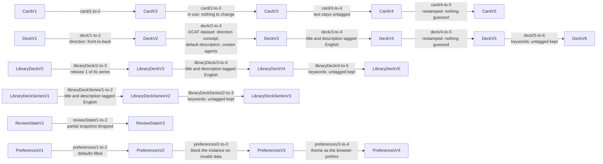
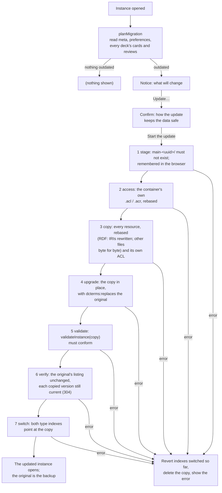
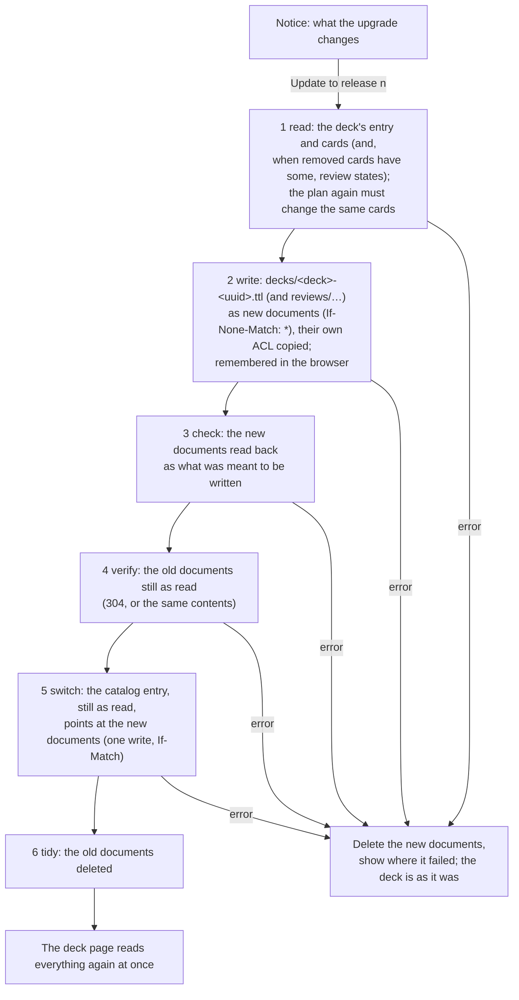

# Format versions and migrations

How Solid Memo tells old data from new, and how it brings a pod up to
the format the current app writes. The formats are the
[shapes](shapes.md); the steps between them are the migration modules
in [domain/shapes/migrations](../packages/domain/src/shapes/migrations/); the
plan is in [domain/migration.ts](../packages/domain/src/migration.ts); the notice
the user sees in [ui/MigrationContainer.tsx](../apps/web/src/ui/MigrationContainer.tsx).

## Versions

Every subject Solid Memo writes carries `sm:formatVersion` (a missing one
means 1, the format that predates the field). `LATEST_VERSION` in the
generated [shapes module](../packages/vocab/src/types.generated.ts) is what the
app writes today; `DECK_FORMAT_VERSION` and friends are aliases of it.

| Class | 1 | 2 | Why the version moved |
|---|---|---|---|
| Instance | title, created | `dcterms:replaces` (the instance it is an updated copy of) and `dcterms:modified` (when it replaced it), both optional | The format update writes a copy and keeps the original as a backup; the copy records which one, so the backup can be found, restored or deleted. |
| Deck | title, document links, provenance | `sm:direction`, stated | A format-1 reader would study a bidirectional deck one way only and count the other way's review subjects against the day's budgets without matching them to any card. |
| Card | `sm:front` and `sm:back`, both required | a side may be a picture (`sm:frontImage` / `sm:backImage`, an IRI), text, or both | A format-1 reader treats a card without `sm:front` as malformed and drops it, so picture-only cards must not be mistaken for format 1. |
| Review state | the SM-2 fields; a snapshot and per-direction subjects were added without a bump, so format 1 admits them | the same fields; the snapshot is all five triples or none; the subject naming (`#<cardId>`, `#<cardId>@back-to-front`) is part of the contract | Stamping begins: a format-1 reader meeting a format-2 state would silently ignore the snapshot and the other direction, which is what a version is meant to flag. |
| Preferences | whatever the unversioned era wrote: every field optional, a missing one meaning its default | every field stated | The document is rewritten on every save, so stamping costs nothing; format 2 is the complete record. |

Deck format 4 (and library deck series format 2, its summary in the
library index) states a deck's title and description as language-tagged
text: one value per language, exactly one of them English, which the
app shows and edits while keeping the other languages. The version moved
because a format-3 reader knows only untagged strings: it would read a
format-4 deck as having no title and drop it. The step to format 4 tags a
format-3 deck's title and description as English.

Card format 3 adds a note under each side (`sm:frontNote`,
`sm:backNote`, shown once the answer is revealed) and a label above the
back (`sm:backLabel`, how the answer relates to the front), all three
language-tagged text like a deck's title, and lets a card be retired
(`owl:deprecated true`): a library deck keeps a card it no longer uses
instead of removing it, so a copy keeps the card and its review state
but no longer studies it. The version moved because a format-2 reader
would go on studying a retired card. A format-2 card is in use, so the
step to format 3 changes nothing.

Card format 4 lets a side's text be language-tagged, one text per
language ("Mona Lisa"@en), or stay untagged when its language is not
known, never both. English is not required, since card text is often
not English. The app shows the reader's language, else the English,
else the untagged text, and edits one text while keeping the others;
text typed in the app is untagged. The version moved because a format-3
reader knows only untagged text: it would read a tagged side as empty
and drop the card. The step to format 4 changes nothing in the data, as
a format-3 side's text is untagged and stays so: no language is guessed.

Deck format 5 and card format 5 let a deck's title and description, and
a card's notes and label, be language-tagged text in any language, one
value per language: English is no longer required. A deck titled only
in Swedish, or a note only in Finnish, is whole. `zxx` tags text in no
language (codes, numbers, symbols). Library releases stay at deck format
4: English first is the library's curation policy, not a rule of the
data, so no release is rebuilt; an imported release is written in
format 5. The version moved because a format-4 validator flags a title
or note with no English, and a format-4 app drops such a note when the
card is edited. The steps to format 5 change nothing but the version
(restamped: nothing guessed): every format-4 deck and card is valid
format 5 already. Text the step to deck format 4 tagged English and
text saved the same in English and another language stay as they are:
a pure step cannot tell an identical English copy from a real
translation ("Stockholm"@en and "Stockholm"@sv), and the app accepts
the same words in several languages as text in each of them, so the
format-4 era's identical English copies are left in the data untouched.
An untagged card side stays untagged.

Deck format 6, with library deck format 5 and library deck series
format 3, lets a deck's keywords (`dcat:keyword`) be language-tagged,
several per language ("capitals"@en, "huvudstäder"@sv), so the app can
show a deck's keywords in the reader's language. The version moved
because a format-5 reader knows only untagged keywords: it would read a
tagged keyword as absent and drop it on its next save of the deck. The
steps to deck 6, library deck 5 and series 3 keep untagged keywords
untagged, their language unknown (`""` in the model): no language is
guessed. Untagged keywords are valid only as kept from older formats:
the app writes every new keyword under the language the user states.
Library releases from library deck format 5 on tag every keyword (each
deck has keywords in English and Swedish); older releases stay frozen
with untagged keywords, and an import of one writes them untagged into
the format-6 copy.

[Deck groups](data-model.md#deck-groups) (deck group format 1) need no
migration: groups are new subjects, and a deck's `sm:position` and the
catalogue's `dcat:catalog` belong to no shape, so the deck and catalogue
formats are unchanged.

[Courses](courses.md) (vocabulary 1.14) need no migration and moved no
format version:

- Chapter, step and distractor format 1 are new classes, so nothing old
  is in their format.
- `sm:distractor` joined card format 5, and `sm:answerMode` and
  `sm:chosenDistractor` answer format 1, each optional. A reader that
  ignores them loses nothing: an older app studies a course's card front
  to back as any card, and reads a multiple-choice answer as an answer.
  Absent, they mean what every card and answer before meant: no wrong
  options, and recalled.
- `sm:completedChapter` on a deck belongs to no shape, as `sm:position`
  does, so `DeckV6` is unchanged and every writer of the deck keeps it.

An older app that edits a course's card keeps its `sm:distractor`
links, as it keeps any triple its shape does not own. One that removes
the card leaves its `sm:Distractor` subjects behind, which this app
ignores, since no card names them. An older app's
[check](validation.md) lists an `sm:Distractor` as `untyped`, a
subject of no class it knows: visible, never a violation.

[Text formats](vocab.md#text-formats) (vocabulary 1.15) need no
migration and moved no format version. `sm:textFormat` joined card
format 5, step format 1 and chapter format 1, optional. This is a
judgment call, recorded here with its reasoning:

- **What a reader that ignores it loses** is the rendering only: it
  shows the Markdown source, which is readable by design, and keeps the
  triple through an edit, since the shapes are not closed and the
  writer keeps every predicate it does not own. Absent, the marker
  means what every text before meant: plain. A bump would instead have
  older apps restamp the subject at the old version and every user run
  a pod migration, for a meaning an older app would lose anyway.
- **Who runs an older app.** The app has no service worker, and the
  library index comes from the same deployment, so an older app is a tab
  opened before the deploy, or a fork. Such a tab has one real loss: an
  edit of a multi-line text in a single-line field drops its line feeds,
  which is content, not just the ignored term. (Since vocabulary 1.15,
  the app edits any card text saved with a line break in a textarea;
  see [i18n.md](i18n.md).)
- **An older app's import drops the marker**, as it writes the card
  through its own card record. The
  [library upgrade](#catching-up-with-the-library) counts a copy that
  differs from its release only by lacking the release's text format as
  left alone by the user, so the next release brings the marker back,
  with any change of the card's text; until then the card stays the
  library's, its languages too. A copy that states `sm:plainText`
  against a Markdown release was switched off on purpose and is kept.
  There is no repair within one release.
- **A new concept of `sm:TextFormats` needs no bump either**: the shape
  lists none, so an unknown one is read as plain text and kept.
- **One full re-check.** The property shapes changed the shape files,
  so the rules' hash (`__SHAPES_RULESET__`, see
  [validation.md](validation.md)) changed: every instance is checked in
  full once on its next opening, and its documents get new receipts.
  Outside validators of `card/v5.ttl`, `step/v1.ttl` and `chapter/v1.ttl`
  see one new constraint, which data without the marker meets.

Rules that hold across versions:

- **Readers never refuse older data.** A subject is read with the shape
  of its stored version, then brought up to the latest record in memory
  by the migration chain. Nothing is written until the user asks.
- **Every write is in the current format.** `recordThing` stamps the
  descriptor's version on every subject it writes: adding or editing a
  card, saving a deck, a review, the preferences, an import.
- **Newer data passes through.** A stored version above the latest is
  read with the latest shape this app has; the model keeps the stored
  version, and the migration plan never counts it. The library import
  refuses newer data instead, with a clear message.

## The chain

One module per step (`<class>/<n>-to-<n+1>.ts`), each a pure, total
function from the record of one version to the record of the next,
never mutating its input. Besides the record a step is given the IRI of
the subject being migrated (`MigrationContext`), for a step that names
new resources beside it. `migrate(shape, record, { subject })` walks the
chain to the latest version; a gap is a programming error and throws. Tests
assert that the chain is contiguous for every kind, that every step is
pure, that the latest record passes through untouched, and — with the
real shapes — that every step's output conforms to the shape it moves to.

## The pod migration

The format update never writes the user's instance. It copies the
instance into a new sibling container, updates and checks the copy,
and only then points the type index at it; the original stays in the
pod as a backup.

- **Plan first, write nothing.** Opening an instance reads the meta
  document, the preferences, and every deck's entry, cards and review
  states, and counts what is below the latest version. The result is
  cached for the session per instance.
- **The user decides.** The notice names what is outdated and which
  formats this app now writes; its button opens a confirmation that
  explains the copy, the backup, the copied access and the new address.
  Until **Start the update** is pressed the app keeps working on the old
  format. Once started the run cannot be cancelled (a half-cancelled run
  is the risky state); a progress bar shows the step and, while copying,
  the document count.
- **The original is read-only while the update runs.** Every adapter
  talks to the pod through one fetch wrapped by the write fence
  ([writeFence.ts](../packages/solid/src/writeFence.ts)).
  `updateInstance` holds the original's container from its first step
  until it returns, and while it is held any request under it other than
  GET, HEAD or OPTIONS is refused before it leaves the browser — whether
  it comes from the update (a link it failed to rebase, say) or from
  anything else in the tab. Other tabs and apps cannot be fenced; the
  verify step catches them.
- **A copy, named with a UUID.** `…/solid-memo/main/` is copied to
  `…/solid-memo/main-<uuid>/` (`stagingUrlOf`). The target must not
  exist (`ensureAbsent`), and every document of the copy is created with
  `If-None-Match: *`, so nothing is ever overwritten: had something
  appeared there meanwhile, the pod answers 412 and the run stops.
- **Access control first.** The instance container's own ACL document
  (WAC `.acl` or ACP `.acr`, found through `Link: rel="acl"`) is copied
  with its IRIs rebased before any data, so the copy is never more open
  than the original; so is the ACL of every copied resource that has
  one. An ACL that cannot be read or placed stops the run.
- **Rebased, not reinterpreted.** Turtle documents are read, every IRI
  under the old container is rewritten to the new one (`mapIris`, in the
  lazy SHACL chunk), and the result is saved; literals, blank nodes and
  foreign IRIs are left as they are. Other files are copied byte for
  byte with their content type, so files Solid Memo does not know survive.
- **The copy is updated in place**, exactly as the old in-place update
  did: meta → preferences → per deck (entry, cards, review states) →
  catalogue (last, since it lists the decks as DCAT datasets, which
  older entries are not), each an in-place edit so unknown triples survive. Each subject
  is written from the model the chain brought up to date, so content does
  not change, only its version. An instance without a catalogue gets one,
  published by the signed-in user ([data-model.md](data-model.md#the-catalogue)).
  The copy's `meta.ttl` gains `dcterms:replaces <original>` and
  `dcterms:modified`.
- **Validation is the gate.** The whole copy is checked with
  `validateInstance` ([validation.md](validation.md)); a single violation
  stops the run. The invalid-data policy does not apply here: an update
  never produces data that needs a repair.
- **Nothing changed meanwhile.** Each resource's version is taken from
  the very response it was copied from: its ETag (with the request's
  `Accept`, since an ETag belongs to one representation), else its
  Last-Modified, else a SHA-256 of the body. The original is listed
  again, and the pod is asked of each resource whether it is still that
  version — a HEAD with `If-None-Match: <ETag>` (or `If-Modified-Since`),
  which answers 304 when it is. A review saved in another tab during the
  copy stops the run, so no study is lost.
- **One commit point.** `switchInstance` points the `sm:Instance`
  registration (and the `dcat:Catalog` one, adding it if missing) at
  the copy, changing only their links to the original, in
  each type index that registers the original, one save per index, each
  with `If-Match`: an index another app changed since it was read is
  not overwritten (412), and the switch is undone. If a
  later index fails, the ones already switched are switched back. Until
  this step nothing is visible to the user or to other apps.
- **Failure leaves nothing behind.** Any error deletes the copy, whole
  (a recursive delete, as of every copy Solid Memo made whole: it
  created the copy's container where nothing was, and nothing names it
  yet; see [Write discipline](data-model.md#write-discipline)), and
  reports the step, the error and "No changes were made to your data".
  If the delete fails too, the copy's address is shown with **Try
  removing it again**.
- **A closed tab.** Step 1 remembers the copy in `localStorage`
  (`solid-memo:update:<instance>`), cleared on success or cleanup. On
  the next opening of the instance, a copy still there is offered for
  removal ("An update … was cut off"). Another browser does not know of
  it; the copy's `meta.ttl` names its original (`dcterms:replaces`), so
  it can be recognised by hand.
- **The address changes.** The updated instance lives at the new URL;
  the app opens it, and old bookmarks lead to the instance picker.

### Proof on a real server

`npm run test:pod` runs the update — the app's own use cases and Solid
adapters, wired as in `main.tsx` — against real Solid servers (each the
[tests start](testing.md#commands): two majors each of the Community Solid
Server and node-solid-server), recording every HTTP request ([instanceUpdate.integration.test.ts](../e2e/pod/src/instanceUpdate.integration.test.ts)).
It seeds an old-format instance with an unknown file and shared access,
and checks that:

- not one write is attempted on the original, which is byte for byte
  (ACLs included) what it was, after the update and after a restore;
- every write goes to the copy, but for the type index, which is
  written last, after the whole copy was read back and validated;
- every write is conditional (each PUT `If-None-Match: *`, each PATCH
  `If-Match`), and the check that nothing changed got a 304 for every
  version it asked about;
- a document that appears where the copy is about to create one stops
  the update (412), leaving no trace;
- a save of a document changed in another tab since it was read fails
  (412) and keeps the other tab's change; read again, it goes through;
- the copy is updated and conforms, keeps the unknown file byte for
  byte, and has its ACLs rebased;
- restoring the backup, or deleting it, deletes what the folder holds
  of Solid Memo's and keeps the unknown file, and the folder with it;
- a write to the original from the same tab during the update is
  refused by the fence;
- a failure while copying a document, copying access control, updating
  the copy, or switching the type index leaves the original and the
  type index as they were, and no copy;
- a change made to an already copied document by another tab makes the
  update give up at the verify step, leaving no trace.

The tests start a Community Solid Server in memory themselves; set
`SOLID_SERVER_URL` to use another server that lets anyone read and
write. `npm test` does not run them.

### The backup

The original is left untouched and unregistered. Preferences show it
under **Previous version** while the instance's meta names it:

- **Restore previous version** switches the type indexes back, then
  deletes what the updated instance holds of Solid Memo's; what was
  studied since the update is lost with it (the confirmation says so).
- **Delete backup** clears `dcterms:replaces`, then deletes what the
  original holds of Solid Memo's. Forgetting comes first, so a deletion
  cut off half-way never leaves a backup that can still be restored;
  what it did not get to stays in the folder.

Both delete as deleting an instance does
([data-model.md](data-model.md#discovery-chain)): document by document,
the folder only once empty. A folder that holds what Solid Memo did not
write is kept, and the user is told so, with a link to it. The original
is where other apps may have put files, and may still; the updated
instance has been in use since the update, and holds the copies of
those files besides, which stay with it.

A backup whose `meta.ttl` is gone (deleted by another app, or by a
deletion that cut off after it) is forgotten quietly, even when its
folder is still there: `meta.ttl` is the last document a deletion
removes, so without it the folder is no longer a whole instance. Restore
checks this again before it switches, and refuses a backup that is no
longer there, leaving the updated instance as it was.
Repairs still edit in place. Library upgrades copy the deck's own
documents and switch the deck over to them
([below](#how-an-upgrade-is-applied)).

## Catching up with the library

A deck imported from the [deck library](deck-library.md) says which
release it came from (`prov:wasDerivedFrom <…/decks/name/vN.ttl>`). When the
library publishes a newer release, the deck page offers to bring the
copy up to it (`planLibraryUpgrade` in
[domain/libraryUpgrade.ts](../packages/domain/src/libraryUpgrade.ts), shown by
[ui/LibraryUpgradeContainer.tsx](../apps/web/src/ui/LibraryUpgradeContainer.tsx)).

The plan compares three sets of cards by fragment id — the release the
copy came from, the current release, and the copy — so the library's
changes reach only what the user left as the library had it:

| In the releases | In the copy | The upgrade |
|---|---|---|
| Added in the new release | Not there | Adds it (retired, if the release has it retired) |
| Changed | As the old release had it | Changes it |
| Changed or removed | Changed by the user | Keeps the user's card, and says so |
| Retired | Anything | Retires it: kept, with its review states, but no longer studied |
| Retired before, in use again | Retired | Brings it back, with the review states it had |
| Removed | As the old release had it | Removes it, and its review states |
| Anything | Removed by the user | Leaves it removed |

Retiring is not a change of the card's content, so it applies to cards
the user changed too: nothing of theirs is lost. A library release never
removes a card any more (the build refuses one that drops a card of the
release before it); the removal rows are for releases made before cards
could be retired.

A card's distractors are part of its content: a release that changes a
wrong option, its note or their order changes the card. A
[course](courses.md)'s deck (either release is a course) holds only the
cards the learner has answered, so its upgrade adds none; the learner
reaches them through the course. It changes, retires and restores the
cards it holds as above.

A card's [text format](vocab.md#text-formats) is part of its content
too: a release that only marks a card as Markdown changes it. No text
format and `sm:plainText` compare the same, as the vocabulary defines
them, so a card switched to Markdown and back is still the library's.
One exception tells an older app's doing from the user's: a copy that
is as the old release had it but for lacking the release's text format,
as an app before vocabulary 1.15 imports or writes it, counts as left
alone, both here and when the user settles the deck's languages. The
newer release then brings the marker back, whether or not it changes
the card otherwise. A copy that states a format other than the
release's, `sm:plainText` against `sm:markdown` included, was changed
by the user and is kept.

A new study direction is taken up when the copy is still studied the old
release's way. So are the deck's title, description, keywords and
themes, each when the copy still has the old release's; a title or
description the user changed is kept, given the languages the release
adds only when it says the same as the release in every language both
have, sharing at least one (so a copy whose English the user retagged
to the language it is really in still agrees in the languages left).
Keywords compare language by language, in any order: a copy whose
keywords are the old release's in every language takes the new
release's, all languages at once (untagged keywords imported from a
format-4 release give way to the new release's tagged ones), and a copy
whose keywords the user changed in any language keeps them all. The default
description the app gave a deck that had none ("Flashcards: <title>.")
is not the user's: it gives way to the release's description. A copy upgraded
before upgrades brought these texts along is given its own release's
languages, the same way, once a session when its page opens
(`addReleaseLanguages`): nothing the user wrote changes. The notice lists the notes of every release in between.
Nothing is offered for a release that is not newer, uses a card format
this app does not know, or would change nothing. Review history of every
card but the removed ones is kept.

### How an upgrade is applied

Like the format update, an upgrade never writes the deck's documents
([domain/deckUpgrade.ts](../packages/domain/src/deckUpgrade.ts),
`applyLibraryUpgrade` in
[useCases.ts](../packages/application/src/useCases.ts)). It writes the
upgraded deck into new documents beside the old ones, and points the
deck's catalog entry at them only once everything checks out. The deck
keeps its URL and its cards keep their ids, so the answer log still
names them (statistics count a card by its deck and id, not by its
document).

- **One commit.** The catalog entry is the only thing that says where
  the deck's cards and review states are, so its single conditional
  write is the switch: before it the deck is the old one, after it the
  new one. A switch whose answer was lost is settled by reading the
  entry: whichever documents it points at stay, the others are deleted.
- **Review states move only when they must.** When no removed card has
  review states the deck keeps its reviews document, and reviews saved
  meanwhile on another device land where they always did.
- **Nothing written meanwhile is lost.** While it runs, the write fence
  refuses this tab's writes to the documents being replaced; the verify
  step catches another device's. On a server whose ETag outlives an edit
  made in the same second (Community Solid Server 6), a change made in
  that second can look unchanged — as for the format update.
- **Shared documents are kept.** Solid Memo gives every deck its own
  documents, but another app may point two decks at one. The tidy, like
  removing a deck, deletes no document any deck of the catalog still
  uses.
- **Sharing.** A document with its own ACL gets a copy of it, rebased;
  between its creation and that copy the new document inherits its
  container's access.
- **Interrupted upgrades.** The browser notes what an upgrade moves
  before it writes; a note left by a closed tab is settled the same way
  (by the entry) on a later visit to the deck, once it is ten minutes
  old, so another tab's upgrade under way is left alone.
- **Progress.** The deck page shows every step, with a progress bar, in
  place of the offer; a failure says at which step, and that the deck
  was not changed.

## Adding a format version

1. Write `ns/shapes/<class>/v<N+1>.ttl` (copy `v<N>.ttl`, change the
   `@base` to its own address and the version assertion to
   `sh:hasValue N+1`, add or change the properties). Add any new terms
   to the [vocabulary](vocab.md). A shape's `sh:name` version must match
   its file's, with no gaps, so a class whose shape shares a file with
   another's moves to a folder of its own when only one of them gets a
   new version: library deck 5 is `ns/shapes/library-deck/v5.ttl`, a
   self-contained copy of `LibraryDeckV4` from `ns/shapes/deck/v4.ttl`.
2. `npm run generate`: the new record type, descriptor and
   `LATEST_VERSION` appear.
3. Add `packages/domain/src/shapes/migrations/<class>/<N>-to-<N+1>.ts` and register
   it in `migrations/index.ts`.
4. Adjust `<class>FromRecord` / `<class>ToRecord` in `packages/domain/src/` if the
   model changed, and the writers that build the record.
5. Add fixtures under `packages/vocab/fixtures/<class>/v<N+1>/` and the
   conformance fixture; document the version in the table above.

The chain test, the conformance test, the drift check and the plan and
notice tests fail until all of that agrees; nothing else needs touching.
