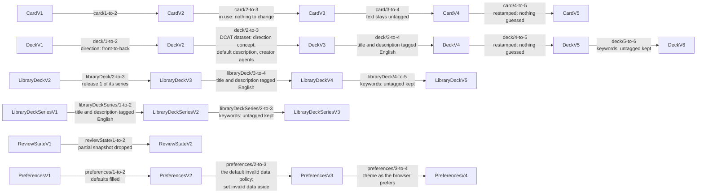
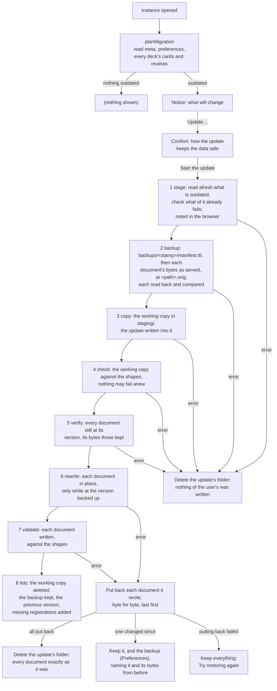
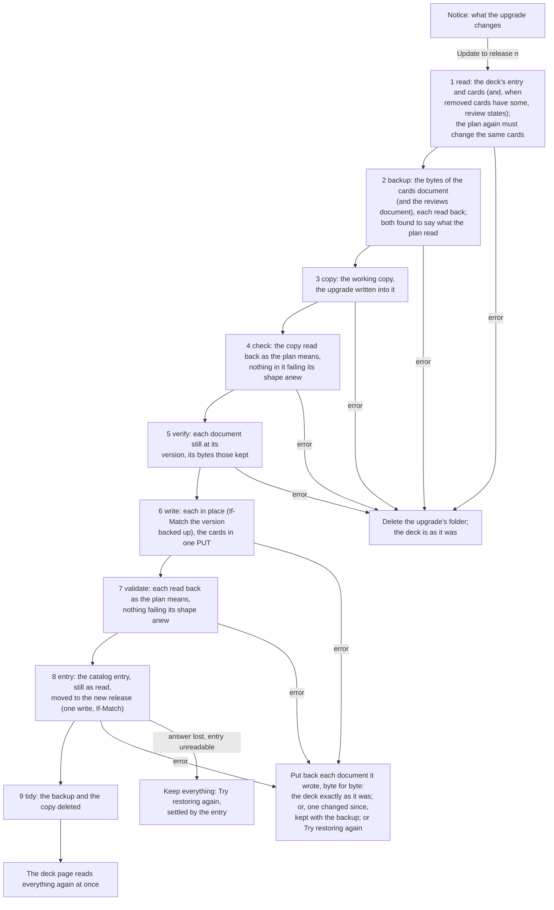

# Format versions and migrations

How Solid Memo tells old data from new, and how it brings a pod up to
the format the current app writes. The formats are the
[shapes](shapes.md); the steps between them are the migration modules
in [domain/shapes/migrations](../packages/domain/src/shapes/migrations/); the
plan is in [domain/migration.ts](../packages/domain/src/migration.ts); the notice
the user sees in [ui/MigrationContainer.tsx](../apps/web/src/ui/MigrationContainer.tsx).

## Versions

Every subject Solid Memo writes carries `sm:formatVersion` (a missing one
means 1, the format that predates the field). `LATEST_VERSION` in the
generated [shapes module](../packages/vocab/src/types.generated.ts) is what the
app writes today; `DECK_FORMAT_VERSION` and friends are aliases of it.

| Class | 1 | 2 | Why the version moved |
|---|---|---|---|
| Instance | title, created | `dcterms:replaces` (the instance it is an updated copy of) and `dcterms:modified` (when it replaced it), both optional | The format update of that time wrote a copy and kept the original as a backup; the copy records which one, so the backup can be found, restored or deleted. Since vocabulary 1.17 the update writes in place and no longer states either ([backups](#the-backup)). |
| Deck | title, document links, provenance | `sm:direction`, stated | A format-1 reader would study a bidirectional deck one way only and count the other way's review subjects against the day's budgets without matching them to any card. |
| Card | `sm:front` and `sm:back`, both required | a side may be a picture (`sm:frontImage` / `sm:backImage`, an IRI), text, or both | A format-1 reader treats a card without `sm:front` as malformed and drops it, so picture-only cards must not be mistaken for format 1. |
| Review state | the SM-2 fields; a snapshot and per-direction subjects were added without a bump, so format 1 admits them | the same fields; the snapshot is all five triples or none; the subject naming (`#<cardId>`, `#<cardId>@back-to-front`) is part of the contract | Stamping begins: a format-1 reader meeting a format-2 state would silently ignore the snapshot and the other direction, which is what a version is meant to flag. |
| Preferences | whatever the unversioned era wrote: every field optional, a missing one meaning its default | every field stated | The document is rewritten on every save, so stamping costs nothing; format 2 is the complete record. |

Deck format 4 (and library deck series format 2, its summary in the
library index) states a deck's title and description as language-tagged
text: one value per language, exactly one of them English, which the
app shows and edits while keeping the other languages. The version moved
because a format-3 reader knows only untagged strings: it would read a
format-4 deck as having no title and drop it. The step to format 4 tags a
format-3 deck's title and description as English.

Card format 3 adds a note under each side (`sm:frontNote`,
`sm:backNote`, shown once the answer is revealed) and a label above the
back (`sm:backLabel`, how the answer relates to the front), all three
language-tagged text like a deck's title, and lets a card be retired
(`owl:deprecated true`): a library deck keeps a card it no longer uses
instead of removing it, so a copy keeps the card and its review state
but no longer studies it. The version moved because a format-2 reader
would go on studying a retired card. A format-2 card is in use, so the
step to format 3 changes nothing.

Card format 4 lets a side's text be language-tagged, one text per
language ("Mona Lisa"@en), or stay untagged when its language is not
known, never both. English is not required, since card text is often
not English. The app shows the reader's language, else the English,
else the untagged text, and edits one text while keeping the others;
text typed in the app is untagged. The version moved because a format-3
reader knows only untagged text: it would read a tagged side as empty
and drop the card. The step to format 4 changes nothing in the data, as
a format-3 side's text is untagged and stays so: no language is guessed.

Deck format 5 and card format 5 let a deck's title and description, and
a card's notes and label, be language-tagged text in any language, one
value per language: English is no longer required. A deck titled only
in Swedish, or a note only in Finnish, is whole. `zxx` tags text in no
language (codes, numbers, symbols). Library releases stay at deck format
4: English first is the library's curation policy, not a rule of the
data, so no release is rebuilt; an imported release is written in
format 5. The version moved because a format-4 validator flags a title
or note with no English, and a format-4 app drops such a note when the
card is edited. The steps to format 5 change nothing but the version
(restamped: nothing guessed): every format-4 deck and card is valid
format 5 already. Text the step to deck format 4 tagged English and
text saved the same in English and another language stay as they are:
a pure step cannot tell an identical English copy from a real
translation ("Stockholm"@en and "Stockholm"@sv), and the app accepts
the same words in several languages as text in each of them, so the
format-4 era's identical English copies are left in the data untouched.
An untagged card side stays untagged.

Deck format 6, with library deck format 5 and library deck series
format 3, lets a deck's keywords (`dcat:keyword`) be language-tagged,
several per language ("capitals"@en, "huvudstäder"@sv), so the app can
show a deck's keywords in the reader's language. The version moved
because a format-5 reader knows only untagged keywords: it would read a
tagged keyword as absent and drop it on its next save of the deck. The
steps to deck 6, library deck 5 and series 3 keep untagged keywords
untagged, their language unknown (`""` in the model): no language is
guessed. Untagged keywords are valid only as kept from older formats:
the app writes every new keyword under the language the user states.
Library releases from library deck format 5 on tag every keyword (each
deck has keywords in English and Swedish); older releases stay frozen
with untagged keywords, and an import of one writes them untagged into
the format-6 copy.

[Deck groups](data-model.md#deck-groups) (deck group format 1) need no
migration: groups are new subjects, and a deck's `sm:position` and the
catalogue's `dcat:catalog` belong to no shape, so the deck and catalogue
formats are unchanged.

[Courses](courses.md) (vocabulary 1.14) need no migration and moved no
format version:

- Chapter, step and distractor format 1 are new classes, so nothing old
  is in their format.
- `sm:distractor` joined card format 5, and `sm:answerMode` and
  `sm:chosenDistractor` answer format 1, each optional. A reader that
  ignores them loses nothing: an older app studies a course's card front
  to back as any card, and reads a multiple-choice answer as an answer.
  Absent, they mean what every card and answer before meant: no wrong
  options, and recalled.
- `sm:completedChapter` on a deck belongs to no shape, as `sm:position`
  does, so `DeckV6` is unchanged and every writer of the deck keeps it.

An older app that edits a course's card keeps its `sm:distractor`
links, as it keeps any triple its shape does not own. One that removes
the card leaves its `sm:Distractor` subjects behind, which this app
ignores, since no card names them. An older app's
[check](validation.md) lists an `sm:Distractor` as `untyped`, a
subject of no class it knows: visible, never a violation.

[Text formats](vocab.md#text-formats) (vocabulary 1.15) need no
migration and moved no format version. `sm:textFormat` joined card
format 5, step format 1 and chapter format 1, optional. This is a
judgment call, recorded here with its reasoning:

- **What a reader that ignores it loses** is the rendering only: it
  shows the Markdown source, which is readable by design, and keeps the
  triple through an edit, since the shapes are not closed and the
  writer keeps every predicate it does not own. Absent, the marker
  means what every text before meant: plain. A bump would instead have
  older apps restamp the subject at the old version and every user run
  a pod migration, for a meaning an older app would lose anyway.
- **Who runs an older app.** The app has no service worker, and the
  library index comes from the same deployment, so an older app is a tab
  opened before the deploy, or a fork. Such a tab has one real loss: an
  edit of a multi-line text in a single-line field drops its line feeds,
  which is content, not just the ignored term. (Since vocabulary 1.15,
  the app edits any card text saved with a line break in a textarea;
  see [i18n.md](i18n.md).)
- **An older app's import drops the marker**, as it writes the card
  through its own card record. The
  [library upgrade](#catching-up-with-the-library) counts a copy that
  differs from its release only by lacking the release's text format as
  left alone by the user, so the next release brings the marker back,
  with any change of the card's text; until then the card stays the
  library's, its languages too. A copy that states `sm:plainText`
  against a Markdown release was switched off on purpose and is kept.
  There is no repair within one release.
- **A new concept of `sm:TextFormats` needs no bump either**: the shape
  lists none, so an unknown one is read as plain text and kept.
- **One full re-check.** The property shapes changed the shape files,
  so the rules' hash (`__SHAPES_RULESET__`, see
  [validation.md](validation.md)) changed: every instance is checked in
  full once on its next opening, and its documents get new receipts.
  Outside validators of `card/v5.ttl`, `step/v1.ttl` and `chapter/v1.ttl`
  see one new constraint, which data without the marker meets.

What a review state is of, and the other links of vocabulary 1.16 (see
[vocab.md](vocab.md#review-states)), need no migration and moved no
format version:

- **`sm:reviewOf`, `sm:reviewDirection` and `sm:scheduler` joined
  review-state format 2**, optional. The app writes them on every state
  it writes (a review, a reset of the day, a course's answer, the format
  update's step of an outdated state). A state it has already read is
  written back at its own subject, whatever that is called; a new one
  goes to the subject the old rule names, so an older reader finds it as
  before, or, where that subject is another's, to `#review-<uuid>`. An
  older reader takes a state at any subject but the old rule's (another
  app's `#state-7f3a`, or `#review-<uuid>`) for a state of a card the
  deck does not have: it ignores it, studies the card as new and writes
  `#<cardId>`, which this app then reads instead, one state counting per
  card and direction. States written before stay as they are until they
  are next written: without the links, they are read by their subject,
  as ever.
- **Review-state formats 1 and 2 accept any subject for a state that
  names its card**, a relaxation: what conformed still conforms. A tab
  opened before the deploy fetches its shapes from the site, so it
  checks with these, but reads such a state by its subject, which names
  no card of the deck: it ignores it.
- **A state of another scheduler** has no SM-2 fields to read. It is
  another app's to the [check](validation.md#data-another-app-wrote),
  so it sets no deck aside, and this app never reads, writes over or
  removes it. Any value of `sm:scheduler` but the `sm:sm2` IRI counts,
  a literal too. An older app takes it for SM-2's: it cannot read it either
  (no ease factor), and would write over it only at the subject the old
  rule names for a card.
- **`schema:suggestedAnswer` on a card and `dcterms:isPartOf` on a cards
  document belong to no shape**, so no format moved, every writer keeps
  them, and the app reads neither. An older app that changes a card's
  distractors keeps its suggested answers as they were, naming
  distractors it removed; this app cannot tell those from another app's,
  and keeps them.
- **A link to a card outlives an upgrade by an earlier version.** Until
  stable addresses, a library [upgrade](#how-an-upgrade-is-applied)
  moved the cards to a new document (`decks/<deckId>-<uuid>.ttl`) and,
  unless a removed card had states, kept the reviews document, whose
  links still named the old one. The app reads a link into any cards
  document the deck has had (`decks/<deckId>.ttl` or
  `decks/<deckId>-<uuid>.ttl`) by its fragment, so such a deck loses no
  state. This app's upgrade writes in place: the links it writes name
  the document the cards are in, and it moves none.
- **One full re-check.** The shape files changed, so the rules' hash
  changed: every instance is checked in full once on its next opening.

[Backups](#the-backup) (vocabulary 1.17) need no migration and moved no
format version:

- **A backup is new data in a place of its own.** `sm:Backup` and
  `sm:BackupEntry` are new classes (backup and backup entry format 1),
  the subjects of a manifest in the instance's `backups/` folder, which
  no older format describes; beside the manifest are the documents'
  bytes, in files no server takes for RDF (`.orig`), and, while an
  update runs, its working copy (`staging/`). An older app takes the
  folder for another app's files: it reads nothing in it, and keeps it
  (and the instance's folder with it) when it deletes the instance; this
  app deletes it with the instance.
- **The instance's record says nothing of it.** The backups are found
  by listing `backups/`, not through `meta.ttl`: the update writes
  `meta.ttl` only when its own format is outdated, like any document, so
  a restore that puts `meta.ttl` back cannot lose track of a backup, and
  a second run does not write over the first run's record. Instance
  format 2 is unchanged: an update no longer states `dcterms:replaces`
  or `dcterms:modified`, both optional, and an instance an earlier
  version's update made keeps them, naming the copy it replaced, which
  stays restorable ([Backups an earlier version made](#backups-an-earlier-version-made)).
- **One full re-check.** Two shape files were added, so the rules'
  hash changed: every instance is checked in full once on its next
  opening.

Rules that hold across versions:

- **Readers never refuse older data.** A subject is read with the shape
  of its stored version, then brought up to the latest record in memory
  by the migration chain. Nothing is written until the user asks.
- **Every write is in the current format.** `recordThing` stamps the
  descriptor's version on every subject it writes: adding or editing a
  card, saving a deck, a review, the preferences, an import.
- **Newer data passes through, and is never written over.** A stored
  version above the latest is read with the latest shape this app has;
  the model keeps the stored version, and the migration plan never
  counts it. Writing it would lose what the newer format says, so
  `recordThing`, through which every subject is written
  ([records.ts](../packages/solid/src/records.ts)), refuses one whose
  stored version is above the version it writes for that kind
  (`writtenByNewerApp`: "A newer version of Solid Memo has updated this
  data, so this version does not save over it. Reload the page…"),
  before anything is sent; and `unlessNewer` refuses the same for the
  writes that change or remove a subject without recording it (a deck's
  position or completed chapter, a deck group's removal, the catalogue's
  links, a repair, and the removal of a card, a distractor, a review
  state, a deck entry or a day's answers): a subject stamped above every
  version this app writes for its class. This is what keeps a tab opened before a
  deploy from writing older formats over what the update wrote in
  place; a tab of a version from before this rule has no such guard.
  The library import refuses newer data too, with a clear message.

## The chain



One module per step (`<class>/<n>-to-<n+1>.ts`), each a pure, total
function from the record of one version to the record of the next,
never mutating its input. Besides the record a step is given the IRI of
the subject being migrated (`MigrationContext`), for a step that names
new resources beside it. `migrate(shape, record, { subject })` walks the
chain to the latest version; a gap is a programming error and throws. Tests
assert that the chain is contiguous for every kind, that every step is
pure, that the latest record passes through untouched, and — with the
real shapes — that every step's output conforms to the shape it moves to.

## The pod migration

The format update changes the user's documents where they are, and
changes none of them until it has shown, on the pod, that it can: it
first keeps each document's bytes exactly as the server serves them,
then writes the updated documents into a working copy and checks it,
and only then, every document still as it was, writes each in place and
checks it again. A failure before that last part leaves every document
untouched; one during it puts every document it wrote back, byte for
byte. No document, subject or folder changes its address, and no
registration in the type index changes: once it succeeded, only those
missing of the instance's data are added
([instanceUpdate.ts](../packages/domain/src/instanceUpdate.ts),
`updateInstance` in [useCases.ts](../packages/application/src/useCases.ts)).



- **Plan first, write nothing.** Opening an instance reads the meta
  document, the preferences, and every deck's entry, cards and review
  states, and counts what is below the latest version. The result is
  cached for the session per instance.
- **The user decides.** The notice names what is outdated and which
  formats this app now writes; its button opens a confirmation that
  explains the exact copy, the working copy checked before anything of
  theirs is written, the in-place writes and their putting back when
  anything fails, the unchanged addresses and sharing. Until **Start the
  update** is pressed the app keeps working on the old format. Once
  started the run cannot be cancelled; a progress bar shows the step
  and, for a step of several documents, the count, and says so when the
  update puts back what it changed.
- **What changes is read afresh.** The update reads the instance again
  rather than trusting the plan, and lists the documents it will write,
  in the order it writes them: `meta.ttl` (when its format is
  outdated), `preferences.ttl` (likewise), each deck's cards document
  and reviews document (when a card, or a state, is outdated), and last
  `catalog.ttl` (when a deck entry is outdated or the catalogue is
  missing), which lists the decks as DCAT datasets, which older entries
  are not. A document two decks share (another app may point two decks
  at one) is backed up once, and each deck's part of it written in turn.
  When nothing is outdated any more (another tab updated it), nothing is
  backed up or written. It checks those documents against the shapes
  and notes each subject that already fails: the checks after count
  only what fails anew.
- **The bytes first.** The update makes a folder in `backups/`
  (`backupFolderOf`: the time to the second, UTC, and the first
  characters of a fresh id). It asks the server for each document as the
  app reads it (`Accept: text/turtle`; never the browser's cache,
  `cache: "no-store"`), noting the bytes the server serves, their
  Content-Type and the version of that very response (its ETag, else
  its modification time, else a hash of the bytes). What the app read of
  the document before is forgotten, so its next read fetches it whole: a
  read asked with an earlier ETag may be told "unchanged" by a server
  whose ETag outlives an edit made in the same second. It writes the
  manifest, `manifest.ttl`, naming every document, its file, the
  Content-Type and that version; then each document's bytes, unchanged,
  at its own path below the folder with `.orig` added
  (`decks/deck-1.ttl` at `backups/<stamp>/decks/deck-1.ttl.orig`; a
  document outside the instance, which a deck's catalog entry may name,
  or at a path the folder uses itself, `staging/…` or `elsewhere/…`, at
  `elsewhere/<n>.orig`, numbered in the order of the manifest, so that
  deleting the working copy never deletes a document's bytes), as
  `application/octet-stream`, so that no server parses or rewrites it:
  its prefixes, comments, statement order, blank node labels and
  relative IRIs are kept as they were. Each file is read back, and must
  be the very bytes written (`backupNotExact` stops the update, nothing
  of the user's written). Each file is given the access its document
  has, as an access control of its own: the document's own, rebased,
  or, when it inherits, the rules of the nearest folder above it with an
  access control of its own that its contents inherit (`acl:default`),
  each now of the file alone (`copyEffectiveAccessControl`); a file is
  thus exactly as open as its document, but for the moment between its
  creation and its access control's, when it has the backup folder's
  (the instance's). A document's own access control needs no backup: an
  update writes no access control but its own files'. Every one of these
  is created only where nothing is (`If-None-Match: *`). The manifest
  is written first so that whatever is written after it, it names, and
  so deleted with it.
- **The working copy.** In the folder's `staging/`, each document is
  written as the backup holds it: its bytes read at the document's own
  address, so its relative IRIs mean what they mean there, and every
  IRI below the instance moved to the same path below `staging/` (a
  document outside the instance, with its fragments, to
  `staging/elsewhere/<n>.ttl`; `stagingMapOf` in
  [backup.ts](../packages/domain/src/backup.ts)), so that the copy's
  documents stand to each other as the instance's do; each created where
  nothing is and given its document's access. The update then makes
  there the very writes it will make in place, by the same code from the
  same statements (an in-place PATCH of what changed, or one PUT of the
  whole document for a large edit; a catalogue it adds is made once,
  the same in both). Nothing of the user's is written.
- **The working copy is checked.** Each of its documents against the
  shapes (`validateDocument`, [validation.md](validation.md)), its
  subjects read as the instance's: one that fails and did not before
  the update (what already failed, a deck the
  [policy](validation.md) sets aside, say, is not its doing) stops it
  (`updatedCopyInvalid`), and nothing of the user's is written. What
  another app wrote has only warnings
  ([validation.md](validation.md#data-another-app-wrote)), so it never
  stops an update.
- **Nothing changed meanwhile.** Each document is read again: it must
  be at the version backed up, its bytes those kept; else another tab or
  device changed it since (`changedDuringUpdate`), and nothing of the
  user's is written. Comparing the bytes sees a change that keeps the
  version, as an edit made within a second of a read does on Community
  Solid Server 6. What the app read of the document is forgotten again,
  so each write in place is made from a read of the whole document as
  it then is, not from a read made before the check.
- **Each document in place, once, only as it was backed up.** Each
  document is then written with the same edits as its working copy, so
  unknown triples survive and content does not change, only its
  version. The write is made only if the document is still at the
  version backed up: the write fence lets it through with `If-Match:
  <that ETag>` (whatever version the writer read), and on a server
  without ETags checks the document's version just before the write and
  answers 412 itself when it moved. The catalog document's entries and
  its catalogue, when it has none (published by the signed-in user,
  [data-model.md](data-model.md#the-catalogue)), go in one write
  (`saveDecks`), last. The version each write left the document at is
  noted in the manifest (`sm:versionUpdated`) and in the browser's note,
  for a restore to tell a document changed since: after each write, so
  that a document two decks share, written for one of them only, is
  still told the update's.
- **Then each is checked again.** Each document written, against the
  shapes: a subject failing anew (which the working copy's check makes
  unlikely) is a fault of the update (`updatedInstanceInvalid`), and
  puts everything back.
- **A failure from the first write in place puts every document back,
  byte for byte.** A 412 (another device wrote the document after the
  update found it as it was), an error, a write whose answer was lost,
  or a failed check: each document the update wrote, or may have (its
  answer lost), is put back, last written first, while the instance is
  still held. Put back is the document's bytes, sent whole (`PUT`) with
  the Content-Type they were served with, held to the version the
  update left it at (`If-Match`, or checked just before where the server
  gives no ETag), then read again, which must give those very bytes
  (`restoredNotExact`). A document whose version was never noted (its
  write's answer lost) is told the update's by what it says: just what
  its working copy says, statement for statement, whatever the server's
  spelling (`sameAsStaged`). A write the pod refused (412) was never
  made: that document is another device's doing, left as it is, and not
  named. A document changed elsewhere after the update wrote it is kept
  as it is now, and so is its backup (in Preferences): the user is told
  which document, and is given its bytes from before. When putting back
  fails (the pod unreachable), everything stays — the backup, the
  working copy, the browser's note — and the failure offers **Try
  restoring again**. Else the update's folder is deleted, and the user
  is told every document is back exactly as it was.
- **Then the tidying.** The working copy is deleted; the backup stays,
  as the instance's previous version (Preferences). Each registration of
  the instance's data by class that belongs in a type index and is
  missing there is added ([data-model.md](data-model.md#discovery-chain)),
  one write per index with `If-Match`, so an instance made before there
  were such registrations gains them with its update; one already there
  is left as it is. This is the one write outside the instance, and the
  only one not backed up: it changes no registration, and the instance
  works without it, so a failure there leaves the update done, and
  **Register what is missing** in Preferences adds them later. An update
  that failed adds none.
- **The instance is read-only to the rest of the tab while it runs.**
  Every adapter talks to the pod through one fetch wrapped by the write
  fence ([writeFence.ts](../packages/solid/src/writeFence.ts)).
  `updateInstance` holds the instance's container from its first step
  until the documents are back or updated: any request under it other
  than GET, HEAD or OPTIONS is refused before it leaves the browser, but
  those the update passes: its folder, for the whole run, and each
  document while it writes it (held to the version backed up) or puts it
  back. Other tabs and apps cannot be fenced; the version each write is
  held to catches them.
- **A closed tab.** The browser notes the run while it goes
  (`solid-memo:update:<instance>` in `localStorage`: its folder, when it
  began, the versions it left documents at, and how it ended; `RunNote`
  in [backup.ts](../packages/domain/src/backup.ts)). On the next opening
  of the instance, a run that did not finish is offered: one cut off (a
  note still under way, begun ten minutes ago or more, which no update
  takes; until then it may be another tab's, still running) or one that
  ended without putting back everything it wrote. **Try restoring
  again** restores its backup as Preferences does (below), with the
  versions the browser noted and, while it is there, the working copy:
  every document back as it was. A run that wrote and checked
  everything, cut off while tidying, has its working copy deleted
  quietly; one whose manifest is gone (deleted from another browser, or
  never written) is forgotten, its folder left alone: the manifest is
  written first, so nothing else in it is the update's. Another browser
  does not know of the run, but finds its backup in Preferences. An earlier version's
  update, which copied the whole instance, left a note naming its
  partial copy: that is offered for removal, whole, as before.
- **The address does not change.** Bookmarks, the type index
  registrations and other apps' links to the instance's documents and
  subjects all still hold after an update.

On a server that ignores `If-Match` (node-solid-server), the check just
before a write and the write are two requests: a change another device
makes between them is not seen, and the update writes over it (a PATCH
keeps it, as it changes only the update's triples; a PUT of a whole
large document does not), and putting a document back is held the same
way. Such a server gives neither an ETag nor a modification time on a
read, so the version is a hash of the bytes served: a change made a
moment before the check is seen.

On every server, the version an update notes for a document it wrote
(`sm:versionUpdated`) is read with a GET just after the write, not
taken from the write's answer: a change another device makes between
the two is taken for the update's own, and putting back would put the
earlier version over it. On a server whose ETag outlives an edit made
in the same second (Community Solid Server 6), a change made within the
second after the update's write and before putting back can look like
the update's own too, and so can one made in the second between the
read a write in place is made from and the write: the write is held to
an ETag that has not moved.

What a server cannot apply stops the update where it is, as any
failure does: node-solid-server's parser knows no SPARQL-style `PREFIX`
directive, so it cannot patch a document another app wrote with one
(the update fails at that document's write in place, and puts back
what it wrote before it), nor delete by a PATCH a value the update
rewrites spelled otherwise than Solid Memo spells it (`2.50` for 2.5;
the update fails at its working copy, and writes nothing of the
user's).

### Proof on a real server

`npm run test:pod` runs the update — the app's own use cases and Solid
adapters, wired as in `main.tsx` — against real Solid servers (each the
[tests start](testing.md#commands): two majors each of the Community Solid
Server and node-solid-server), recording every HTTP request as the app
attempts it and as it reaches the server
([instanceUpdate.integration.test.ts](../e2e/pod/src/instanceUpdate.integration.test.ts)).
It seeds an old-format instance with another app's triple, an unknown
file and shared access, and checks that:

- every write goes to a document the backup's manifest names, or into
  the update's folder, but the last: one edit of the type index (with
  `If-Match` where the server enforces it), which keeps every triple it
  had and adds the registrations of the instance's catalogue, decks,
  cards, review states and answers; no access control is written but
  the update's own files';
- each document is written once, after its bytes were kept and its
  working copy written and read for the check, with `If-Match` the
  version backed up where the server enforces it, else right after a
  read of it (the fence's check); everything in the update's folder is
  first written with `If-None-Match: *`; the backup's files hold the
  documents' bytes as they were served, and the working copy is gone;
- the backup's file of a document shared on its own is shared alike,
  and the file of one that inherits its access is given that access as
  its own;
- the instance is updated, conforms and has nothing left to update, its
  decks and documents at the addresses they had; the other app's triple,
  the unknown file and the access rules are as they were;
- a restore puts back, byte for byte, every document still as the
  update left it, with the Content-Type it was served with, `If-Match`
  the version the update left it at where the server enforces it, else
  right after a read of it, and keeps one changed since, unwritten, its
  bytes from before kept in the backup; the backup's deletion deletes its
  manifest and files and keeps another app's file in its folder, and the
  folder with it, and once that file is gone leaves no folder;
- byte for byte, on an instance written by hand (prefixes of its own,
  comments, statements in no order Solid Memo writes, relative IRIs, a
  blank node, another app's decimal with a trailing zero), which a
  server's rewrite would not keep as it is: a failure writing the
  working copy, one backing a document up, a document changed elsewhere
  after it was backed up, one changed elsewhere just before its write in
  place (a 412: what was written is put back, the other device's change
  kept, and a second run finishes), a write failing after others were
  written, a write made whose answer is lost (put back as its working
  copy tells it the update's), and a check failing once written each
  leave every document served byte for byte as before (but the one
  another device changed), nothing of the update in the instance, the
  type index as it was, and every write to a document conditional; a
  successful update, restored, gives every document back byte for byte;
  each document put back is sent whole with the Content-Type it was
  served with;
- a write to the instance from the same tab during the update is
  refused by the fence;
- a large deck is updated in one PUT, held to the version backed up;
- a subject a newer version of the app wrote is not written over;
- a copy an earlier version's update left is still restored (the type
  index switched back) and deleted as before.

That each server serves a document PUT as Turtle byte for byte as it
was written, which putting one back relies on, is pinned with the rest
of what the servers do ([testing.md](testing.md#commands),
`keepsWrittenTurtle`). On node-solid-server and Community Solid Server
6, whose versions are to the second, a change the test makes
"elsewhere" waits for the next second first. The tests start a
Community Solid Server in memory themselves; set `SOLID_SERVER_URL` to
use another server that lets anyone read and write. `npm test` does not
run them.

### The backup

A backup is a folder of the instance's `backups/`, holding the bytes of
each document an update (the format update, or a
[library upgrade](#how-an-upgrade-is-applied) that could not put back
everything it wrote) was to change, as the server served them, and its
manifest; while the update runs, its working copy too
([backupData.ts](../packages/solid/src/backupData.ts),
[solidDocumentBackups.ts](../packages/solid/src/solidDocumentBackups.ts)):

```
backups/20261009T100000Z-0f3a1b2c/
├── manifest.ttl              what the backup is of, and an entry per document
├── meta.ttl.orig             the bytes of meta.ttl, as served (application/octet-stream)
├── decks/deck-1.ttl.orig     …each at its document's path, .orig added
├── elsewhere/4.orig          a document outside the instance, or at staging/… or elsewhere/…
└── staging/                  the update's working copy, while it runs
```

```turtle
# backups/20261009T100000Z-0f3a1b2c/manifest.ttl
<#it> a sm:Backup ; sm:formatVersion 1 ;
    sm:backupOf <https://pod.example/solid-memo/main/> ;
    dcterms:created "2026-10-09T10:00:00Z"^^xsd:dateTime .
<#entry-1> a sm:BackupEntry ; sm:formatVersion 1 ;
    sm:backedUpDocument <https://pod.example/solid-memo/main/decks/deck-1.ttl> ;
    sm:backupCopy <https://pod.example/solid-memo/main/backups/20261009T100000Z-0f3a1b2c/decks/deck-1.ttl.orig> ;
    sm:contentTypeBackedUp "text/turtle" ;
    sm:versionBackedUp "\"a1\"" ; sm:versionUpdated "\"a2\"" .
<#entry-2> a sm:BackupEntry ; sm:formatVersion 1 ;
    sm:backedUpDocument <https://pod.example/solid-memo/main/catalog.ttl> .
```

A library upgrade's backup is of the deck's catalog entry, and names
the release the deck came from when it was made:

```turtle
<#it> a sm:Backup ; sm:formatVersion 1 ;
    sm:backupOf <https://pod.example/solid-memo/main/catalog.ttl#deck-1> ;
    sm:releaseBackedUp <https://solid-memo.com/decks/capitals/v1.ttl> ;
    dcterms:created "2026-10-09T10:00:00Z"^^xsd:dateTime .
```

An entry without a file is of a document that was not there (the
update was to create it, as a missing catalogue); `sm:versionUpdated`
is noted once the update wrote the document. `sm:backupOf` says what
the backup was made for: the instance (the format update) or a deck's
entry (a library upgrade). A successful format update keeps its backup,
the instance's previous version; a library upgrade keeps one only when
it could not put the deck back (see
[How an upgrade is applied](#how-an-upgrade-is-applied)). Preferences
lists every backup, newest first, under **Previous versions**: when it
was made, for what, and a link to its folder.

- **Restore this version** first makes sure the backup is the
  instance's own as an update made it, since anyone who may write in
  the instance could leave a manifest naming any document: its folder
  one of the instance's `backups/`, every document in the instance's
  own folder (not in `backups/`, and no access control or description
  resource, `.acl` or `.meta`), and made for the instance or, naming its
  release, for a deck. A document outside the instance is refused too,
  though a deck's catalog entry may name one: anyone who may write in
  the instance could name any document there, the user's profile say,
  and have a restore write over it; a failed update puts such a
  document back itself, from what it knows. Else nothing is read or
  written (`backupNotOurs`); the backup can still be deleted, which
  touches only its folder. A manifest that names any URL with a `.` or
  `..` segment, in any spelling (which a request resolves, stepping out
  of the folder the URL seems to be in), a backslash or a control
  character (which a request reads as `/` or drops), a query or a
  fragment, or a document's bytes in any file but the one an update
  keeps them in, is no backup at all (`isAsWritten` in
  [backup.ts](../packages/domain/src/backup.ts)): it is not listed, and
  nothing it names is read, written or deleted. A backup whose update
  this browser notes as still under way (in another tab, say) is
  neither restored nor deleted (`backupInUse`): that would take from
  the update what it puts its documents back with; another browser
  cannot know. A deck's backup holds its release's cards, so it is
  restored only while the deck's entry still names
  `sm:releaseBackedUp`; once the deck is gone or has moved to another
  release, restoring it would not put the deck back as it was, and is
  refused (`deckBackupOutdated`). It then puts back,
  last written first, each document still at the version the update
  left it at (the manifest's `sm:versionUpdated`, else the version this
  browser noted): its bytes, sent whole with the Content-Type they were
  served with, `If-Match` that version (or checked just before where
  the server gives no ETag), and read again, which must give those very
  bytes (`restoredNotExact`, the backup kept); or, for a document the
  update created, its deletion. While the update's working copy is
  there (an update that did not finish), a document whose version was
  never noted is put back when it says just what its copy says. A
  document at another version was changed since (studied since, say)
  and is kept as it is now; so is one that cannot be told from another
  app's change; one still as backed up needs nothing. The user is told
  how many documents were put back exactly as they were and which were
  kept, each with a link to its bytes from before (the confirmation
  says so first), above the list, as the backup may leave it. The
  backup, and the working copy, are deleted once nothing of it was kept;
  else it stays, holding the bytes of what was kept, and the working
  copy goes. Once nothing is left to put back, this browser's note of
  the update is forgotten.
- **Delete this backup** deletes the update's working copy, whole (the
  update made it, and nothing names it), then each file the manifest
  names below the folder (a file's access control goes with it), then
  the manifest, then each folder below it and the folder itself, each
  only once empty, and `backups/` once it holds no other backup. A
  folder holding what another app put there is kept, and the user is
  told so, with a link to it. Deleting the instance deletes its backups
  the same way ([data-model.md](data-model.md#discovery-chain)).

#### Backups an earlier version made

Until stable addresses, the format update copied the whole instance
into a sibling folder (`<name>-<uuid>/`), updated the copy, and pointed
the type index registrations at it; the original stayed as the backup,
which the copy's `meta.ttl` names (`dcterms:replaces`, and
`dcterms:modified` when it replaced it). Such a backup is listed under
**Previous version at another address** while the instance's meta names
it, and handled as then:

- **Restore previous version** switches the type indexes back to it
  (`switchInstance`: only the registrations' links to the instance's
  data change, each to the same resource of the backup, in each index
  that holds any of them, so the review states' and answers' in the
  private index of an instance registered publicly move too; one save
  per index with `If-Match`, the ones switched undone when a later one
  fails), then
  deletes what the updated instance holds of Solid Memo's; what was
  studied since that update is lost with it (the confirmation says
  so). This is the one way an instance's address still changes.
- **Delete backup** clears `dcterms:replaces`, then deletes what the
  original holds of Solid Memo's. Forgetting comes first, so a deletion
  cut off half-way never leaves a backup that can still be restored.

Both delete as deleting an instance does
([data-model.md](data-model.md#discovery-chain)): document by document,
the folder only once empty, kept and named when it holds what another
app put there. A backup whose `meta.ttl` is gone is forgotten quietly,
and restore checks this again before it switches. A partial copy that
such an update's closed tab left, which this browser still remembers,
is offered for removal on the next opening, whole, as before.

Repairs edit in place, as the update does.

## Catching up with the library

A deck imported from the [deck library](deck-library.md) says which
release it came from (`prov:wasDerivedFrom <…/decks/name/vN.ttl>`). When the
library publishes a newer release, the deck page offers to bring the
copy up to it (`planLibraryUpgrade` in
[domain/libraryUpgrade.ts](../packages/domain/src/libraryUpgrade.ts), shown by
[ui/LibraryUpgradeContainer.tsx](../apps/web/src/ui/LibraryUpgradeContainer.tsx)).

The plan compares three sets of cards by fragment id — the release the
copy came from, the current release, and the copy — so the library's
changes reach only what the user left as the library had it:

| In the releases | In the copy | The upgrade |
|---|---|---|
| Added in the new release | Not there | Adds it (retired, if the release has it retired) |
| Changed | As the old release had it | Changes it |
| Changed or removed | Changed by the user | Keeps the user's card, and says so |
| Retired | Anything | Retires it: kept, with its review states, but no longer studied |
| Retired before, in use again | Retired | Brings it back, with the review states it had |
| Removed | As the old release had it | Removes it, and its review states |
| Anything | Removed by the user | Leaves it removed |
| Added, changed, retired or in use again | Already as the new release has it | Nothing to write, but the deck still moves to the release |

Retiring is not a change of the card's content, so it applies to cards
the user changed too: nothing of theirs is lost. A library release never
removes a card any more (the build refuses one that drops a card of the
release before it); the removal rows are for releases made before cards
could be retired.

A card's distractors are part of its content: a release that changes a
wrong option, its note or their order changes the card. A
[course](courses.md)'s deck (either release is a course) holds only the
cards the learner has answered, so its upgrade adds none; the learner
reaches them through the course. It changes, retires and restores the
cards it holds as above.

A card's [text format](vocab.md#text-formats) is part of its content
too: a release that only marks a card as Markdown changes it. No text
format and `sm:plainText` compare the same, as the vocabulary defines
them, so a card switched to Markdown and back is still the library's.
One exception tells an older app's doing from the user's: a copy that
is as the old release had it but for lacking the release's text format,
as an app before vocabulary 1.15 imports or writes it, counts as left
alone, both here and when the user settles the deck's languages. The
newer release then brings the marker back, whether or not it changes
the card otherwise. A copy that states a format other than the
release's, `sm:plainText` against `sm:markdown` included, was changed
by the user and is kept.

A new study direction is taken up when the copy is still studied the old
release's way. So are the deck's title, description, keywords and
themes, each when the copy still has the old release's; a title or
description the user changed is kept, given the languages the release
adds only when it says the same as the release in every language both
have, sharing at least one (so a copy whose English the user retagged
to the language it is really in still agrees in the languages left).
Keywords compare language by language, in any order: a copy whose
keywords are the old release's in every language takes the new
release's, all languages at once (untagged keywords imported from a
format-4 release give way to the new release's tagged ones), and a copy
whose keywords the user changed in any language keeps them all. The default
description the app gave a deck that had none ("Flashcards: <title>.")
is not the user's: it gives way to the release's description. A copy upgraded
before upgrades brought these texts along is given its own release's
languages, the same way, once a session when its page opens
(`addReleaseLanguages`): nothing the user wrote changes. The notice lists the notes of every release in between.
Nothing is offered for a release that is not newer, uses a card format
this app does not know, or would change nothing. A copy with cards
already as the newer release has them (`applied`: an upgrade cut off
after writing them, or the user's own edits alike) is still offered the
release, which moves its entry and writes nothing to those cards: a deck
left naming the older release would have a later upgrade take the
newer release's changes for the user's. Review history of every card
but the removed ones is kept.

### How an upgrade is applied

Like the format update, an upgrade changes none of the deck's documents
until a working copy of them, upgraded, has been checked on the pod;
then it writes them where they are, and puts back, byte for byte, what
it wrote when anything fails after
([domain/deckUpgrade.ts](../packages/domain/src/deckUpgrade.ts),
`applyLibraryUpgrade` in
[useCases.ts](../packages/application/src/useCases.ts)). The deck keeps
its URL, its documents theirs and its cards their ids, so the answer
log still names them (statistics count a card by its deck and id, not
by its document), and so does any link another app made.



- **Planned on the deck as read.** The backup's bytes are read after
  the read the plan was made from, so the documents are read again once
  backed up, whole, not asked whether they changed (a server whose ETag
  outlives an edit made in the same second would say they did not): one
  that says otherwise than the plan read (another device studied
  meanwhile) stops the upgrade before it writes anything of the deck's,
  and its folder is deleted. Everything after is held to the version
  backed up.
- **The working copy is checked, as the deck's documents will be.** The
  upgraded cards are written into the working copy (and, when removed
  cards had review states, the reviews document without them), by the
  same code the deck's documents are then written with; a card the
  release adds is made at the time the upgrade began, in both. The copy
  is read back and must hold just the cards the plan means, each saying
  what the release says and retired as it is (`sameCards`; pictures in
  the instance read at the deck's addresses), and the review states but
  those dropped; and nothing in it may fail its shape and not have
  before. A copy that does not (`upgradedCardsDiffer`,
  `upgradedReviewsDiffer`, `updatedCopyInvalid`) stops the upgrade, the
  deck as it was. The deck's documents, once written, are checked the
  same way (`updatedInstanceInvalid`).
- **Review states change only when they must.** When no removed card
  has review states the deck's reviews document is not touched, and
  reviews saved meanwhile on another device land where they always did.
  When one does, the reviews document is written in place without the
  removed cards' states.
- **The entry is the last write.** The catalog entry says which release
  the deck is, so its single conditional write moves the deck to the
  new release once its documents check out: before it, the deck is the
  old release's (its documents put back when anything fails), after it
  the new one's. An entry's write the pod refused was not made, and the
  deck is put back. One whose answer was lost is settled by reading the
  entry: when it names the new release, the upgrade is done; when it
  names the old one, the deck is put back. When the entry cannot be read
  either, nothing is put back, which could leave the entry naming the
  new release over the old one's cards: everything stays, and **Try
  restoring again**, or a later visit to the deck, settles it by the
  entry (the deck put back while the entry names the old release, the
  backup deleted once it names the new one).
- **A failure after a write puts the deck back, byte for byte.** Each
  document the upgrade wrote, or may have (its write's answer lost), is
  put back as the format update puts its documents back: its bytes, with
  the Content-Type they were served with, while it is still as the
  upgrade left it, then read again. A write the pod refused was never
  made, and is not undone: the deck is then exactly as it was, but for
  what the other device wrote. A document changed elsewhere after the
  upgrade wrote it is kept as it is: the user is told the deck is not as
  it was, and which document, with a link to its bytes from before; the
  backup stays, in Preferences, to restore or delete. When putting back
  fails, everything stays, and the failure offers **Try restoring
  again**.
- **A successful upgrade keeps no backup.** The app offers no undoing
  of an upgrade (a later release, or the user's own edits, change the
  deck as any edit does), so once the entry has moved, the backup and
  the working copy are deleted. A deck whose folder could not be
  deleted lists it in Preferences, where it can be deleted but not
  restored (its entry names another release, below).
- **Nothing written meanwhile in this tab is lost.** While it runs, the
  write fence refuses this tab's other writes to the documents being
  changed. On a server whose ETag outlives an edit made in the same
  second (Community Solid Server 6), a change made in that second
  between the read a write in place is made from (after the check, of
  the whole document) and the write can look unchanged, as for the
  format update; one made before the check is seen by its bytes.
- **Sharing is untouched.** The documents keep their access control;
  the backup's files and the working copy are given the access the
  document has, as their own (see [The pod migration](#the-pod-migration)).
- **Interrupted upgrades.** The browser notes the upgrade while it runs,
  under the deck. On a later visit to the deck, one that did not finish
  (cut off, or ended without putting back everything it wrote) is
  offered in place of the release's offer, **Try restoring again**,
  while the deck's entry still names the release the backup was made at
  (`sm:releaseBackedUp`); restored, the deck is as it was, and the offer
  comes again. One that went through, its entry moved (cut off while
  tidying), has its backup and working copy deleted quietly. Another
  browser finds its backup in Preferences, restorable on the same terms;
  once the entry names another release (the upgrade finished and only
  deleting its backup failed, or it was offered again and done),
  restoring it would mix two releases, so it is refused and the backup
  can only be deleted. A note an upgrade by an earlier version left in
  the browser, which moved decks to new documents, is still settled by
  the entry on a later visit to the deck, once it is ten minutes old:
  whichever documents the entry points at stay, the others are deleted,
  never one a deck of the catalog uses.
- **Decks an earlier version moved** to `decks/<deckId>-<uuid>.ttl` and
  `reviews/<deckId>-<uuid>.ttl` are upgraded where they are: the catalog
  entry is where a deck's documents are found.
- **Progress.** The deck page shows every step, with a progress bar, in
  place of the offer; it says so while it puts the deck back; a failure
  says at which step, and whether the deck is exactly as it was.

#### Proof of the upgrade on a real server

`npm run test:pod` runs the upgrade against the same servers as the
format update, through the app's own use cases and Solid adapters, with
every request recorded as it reaches the server
([deckUpgrade.integration.test.ts](../e2e/pod/src/deckUpgrade.integration.test.ts)).
It seeds an instance holding a copy of a release, studied, its cards
shared with a friend, and checks that:

- the deck is upgraded where it is: its addresses, review states and
  sharing, and another app's triple and subject in its cards document,
  kept; each document written once, after its bytes were kept and its
  working copy upgraded, with `If-Match` the version backed up where the
  server enforces it, else right after a read of it; the entry written
  once, last, `If-Match` where enforced; everything in the upgrade's
  folder first written with `If-None-Match: *`; no access control
  written but the upgrade's own files'; its backup and working copy gone;
- byte for byte, on a deck whose cards and review states were written by
  hand (prefixes of their own, a comment, statements in an order the
  server would not write, relative IRIs, another app's blank node): a
  failure writing the working copy, a document changed elsewhere after
  it was backed up, the review states changed elsewhere just before
  their write (a 412: the cards put back, the other device's state
  kept), the review states' write failing or made with its answer lost
  (told the upgrade's by its working copy), the cards failing their
  check once written, and the entry's write failing each leave both
  documents served byte for byte as before (but what the other device
  wrote), the entry as it was and nothing of the upgrade in the
  instance; each document put back is sent whole with the Content-Type
  it was served with, held to the version the upgrade left it at; a
  successful upgrade of such a deck keeps the other app's blank node and
  deletes what it backed up;
- the keywords the user changed are kept, and a deck an earlier version
  moved to documents of its own is upgraded where they are.

## Adding a format version

1. Write `ns/shapes/<class>/v<N+1>.ttl` (copy `v<N>.ttl`, change the
   `@base` to its own address and the version assertion to
   `sh:hasValue N+1`, add or change the properties). Add any new terms
   to the [vocabulary](vocab.md). A shape's `sh:name` version must match
   its file's, with no gaps, so a class whose shape shares a file with
   another's moves to a folder of its own when only one of them gets a
   new version: library deck 5 is `ns/shapes/library-deck/v5.ttl`, a
   self-contained copy of `LibraryDeckV4` from `ns/shapes/deck/v4.ttl`.
2. `npm run generate`: the new record type, descriptor and
   `LATEST_VERSION` appear.
3. Add `packages/domain/src/shapes/migrations/<class>/<N>-to-<N+1>.ts` and register
   it in `migrations/index.ts`.
4. Adjust `<class>FromRecord` / `<class>ToRecord` in `packages/domain/src/` if the
   model changed, and the writers that build the record.
5. Add fixtures under `packages/vocab/fixtures/<class>/v<N+1>/` and the
   conformance fixture; document the version in the table above.

The chain test, the conformance test, the drift check and the plan and
notice tests fail until all of that agrees; nothing else needs touching.
