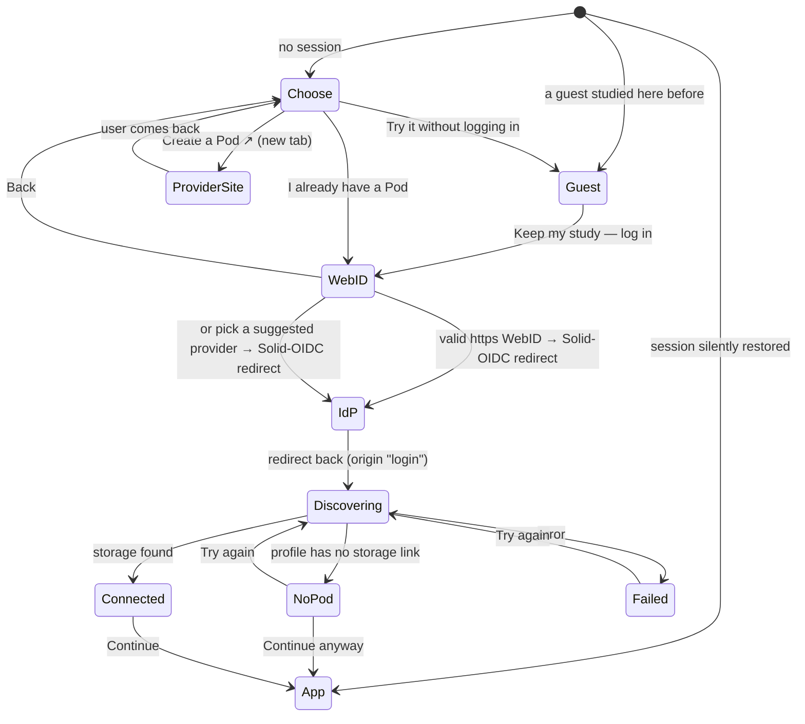

# Onboarding

How a signed-out visitor ends up with a connected Pod. The UI lives in
[packages/ui/src/ui/onboarding/](../packages/ui/src/ui/onboarding/); everything Solid-specific
stays behind use cases (see [boundaries.md](boundaries.md)).

## Flow

| Step | Component |
|---|---|
| Choose, WebID | `OnboardingFlow` + `WebIdForm` |
| Discovering, Connected, NoPod, Failed | `PodConnectionScreen` |
| Orchestration (session, account query) | `AppShell` (in `App.tsx`), which Solid Memo's `App` and the [Studio](studio.md)'s `StudioApp` both are |

A user who logged out or whose session expired starts at **WebID**, not
**Choose**. A guest studies in a pod kept in the browser until they log in
and keep their study in their Pod, added to an instance they have or as a
new one ([guest-mode.md](guest-mode.md)). A silently restored session skips onboarding entirely:
`SessionGateway.restore()` reports `origin: "login"` only when a login
redirect just completed.

Onboarding ends on an instance's deck list. A new instance has no decks
yet, so the list offers the deck library's course for newcomers under
its heading, started in one click
([courses.md](courses.md#the-course-for-newcomers)).

## Pod providers

[packages/domain/src/podProvider.ts](../packages/domain/src/podProvider.ts) lists the
providers suggested (`POD_PROVIDERS`). A provider is data, nothing more —
a name, its Solid-OIDC issuer, and optionally a sign-up link — so adding a
provider is adding a list entry:

- providers **with a `signUpUrl`** are offered on the first step for
  creating a Pod (currently iGrant.io Data Pod);
- **every** provider is suggested on the WebID step under "Or pick your
  provider", for users who do not want to type their WebID. Picking one
  calls `loginWithProvider(oidcIssuer)`, which starts the same Solid-OIDC
  redirect directly at that issuer; the WebID then arrives with the session,
  and Pod discovery proceeds exactly as after a WebID login.

Issuers are the exact values each provider advertises in its
`/.well-known/openid-configuration`.

## WebID validation

A chosen provider's issuer passes `isSecureUrl` in the use case, like every
other URL that steers authentication.

`validateWebId` ([packages/domain/src/webId.ts](../packages/domain/src/webId.ts)) accepts
only absolute `https:` URLs without embedded credentials. It runs in the
form (for the message) and again in the `loginWithWebId` use case (so no
caller can skip it). The discovered OIDC issuer passes the same
`isSecureUrl` check before the browser is sent there.

## Pod discovery

`discoverAccount(session)` returns a
[SolidAccount](../packages/domain/src/account.ts) `{ webId, name?, podUrl?, oidcIssuer? }`:

- `podUrl` — first result of `StorageGateway.discoverStorages`: the
  profile's `pim:storage` (`http://www.w3.org/ns/pim/space#storage`)
  links, falling back to the Solid Protocol's storage `Link`-header
  walk-up. Never typed by the user, never assumed from the provider or
  the WebID's origin.
- `oidcIssuer` — the profile's `solid:oidcIssuer`; informational, so a
  failed lookup does not fail discovery.
- `name` — the profile's `foaf:name` (`profileNameOf` in
  [domain/account.ts](../packages/domain/src/account.ts)), read from the WebID
  document; also informational. When present, the masthead's "Logged in
  as" and the connection screen show it instead of the WebID, as a link
  to the WebID.

The account is held in the react-query cache (`["account", webId]`) and,
like all Pod data, is cleared on logout. Nothing is persisted by the app;
the session itself is persisted by the authn library.
