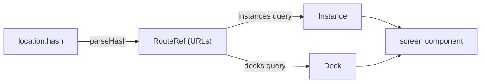

# Routing

The URL always represents the view the user is looking at, so every
screen can be bookmarked, shared, reloaded, and walked with
Back/Forward.

## Where it lives

Routing is a UI concern: [`packages/ui/src/ui/router.ts`](../packages/ui/src/ui/router.ts)
defines the serializable `RouteRef` union, the `routeToHash` /
`parseHash` pair, and the `useHashRoute` hook. `Workspace` owns the
mapping from a `RouteRef` to a rendered screen.

The hook itself is `useHashRouter` in
[`routerCore.ts`](../packages/ui/src/ui/routerCore.ts), over any app's
routes and its pair of functions. The [Studio](studio.md) has routes of
its own and keeps them with the same core; this page is about Solid
Memo's.

Solid Memo links to the Studio with `studioHref`: the instance's Home
there, `studio/#/?instance=…`, a folder down on the same origin. The
instance bar, each deck's actions menu and the deck page have this
"Open in Studio" link. Solid Memo cannot import the Studio's router, so
`studioHref` spells that route itself, and a Studio test checks that
the two agree.

## Hash routing, not pathname routing

The route is kept in `location.hash`:

- Deep links work on any static host — no server rewrite rules.
- The Solid OIDC redirect uses the query string (`?code=&state=`);
  the hash stays clear of it.

## Route scheme

Instances and decks are Solid resources, so their identifiers are
full URLs, carried URL-encoded in hash query parameters.

| Hash | Screen |
| --- | --- |
| `#/storages` | storage picker |
| `#/instances` | instance picker |
| `#/new-instance?storage=…&source=…` | instance creator |
| `#/decks?instance=…` | deck list (home) |
| `#/new-deck?instance=…` | deck creator |
| `#/library?instance=…` | [deck library](deck-library.md): ready-made decks to import into the instance |
| `#/library-deck?instance=…&deck=…` | one library deck's page — its description, topics, keywords in the reader's language, release, authors, licence, dates and sources, with an import button for that deck alone. `deck` is the deck's series (`…/decks/index.ttl#name`); a release's URL finds it too, and an unknown deck falls back to the library |
| `#/library-browse?instance=…&deck=…[&page=n]` | a library deck's cards, read-only, paged like the Browser (paging *replaces* the history entry) |
| `#/deck?instance=…&deck=…` | deck detail |
| `#/deck-preferences?instance=…&deck=…[&section=languages]` | a deck's own preferences: its name, daily limits and the languages of its text. `section=languages` opens it at the Languages section, whose heading takes the focus (marked `data-arrival` for `useScreenFocus`): where the deck page's notice of text that does not say its language links; an unknown `section` opens the screen at its start |
| `#/browse?instance=…&deck=…[&languages=unstated][&page=n]` | Browser — the one place a deck and its cards are edited. Cards are paged; `page` (1-based) is omitted for the first page. `languages` lists only the cards whose language is the user's to settle: a side that does not say it (`unstated`); an unknown value lists all. Paging and a change of filter *replace* the history entry (a change of filter starts at the first page), so Back leaves the Browser rather than walking every page, while opening a card *pushes*, so Back from a card returns to the same filter and page. |
| `#/new-card?instance=…&deck=…` | card creator (opened from, and returning to, the Browser) |
| `#/card?instance=…&deck=…&card=…` | one card's own page: the card, its editor, remove (opened by clicking a Browser row; an unknown card falls back to the Browser) |
| `#/study?instance=…&deck=…` | study session: the deck's due and new prompts for today, interleaved |
| `#/course?instance=…&deck=…` | the [course](courses.md) `deck` is the learner's copy of: its chapters, each locked, open or done, with its steps done, a button to go on where the learner left off, and the offer of a newer release, as on the deck's page; once every chapter is done, a link back to the deck list. Where a passed final review takes the learner, and then it cheers the chapter just completed, which `Workspace` keeps in memory, not in the URL, and drops at the next route: a reload, Back to it or a later visit cheers nothing. A deck that is no library copy falls back to its page |
| `#/course-chapter?instance=…&deck=…&chapter=…` | one chapter of the course (`chapter` is its subject in the release), a step at a time: the theory, then its questions without it. The step to take is derived from the learner's progress (the first not done), not carried in the URL; a chapter the course does not have, or one still locked, falls back to the course |
| `#/course-review?instance=…&deck=…&chapter=…` | a chapter's final review, which completes it. It opens on a word before the review, with a link back to the course; once the chapter is completed it navigates (*pushes*) to the course, unless the learner has left the review meanwhile. Falls back as `course-chapter` does, and to `course-chapter` (*replaces*) for a chapter with steps not done, once the course has been read afresh: going on from the last step reaches it before that step's answer is read back |
| `#/preferences?instance=…` | preferences |
| `#/validate?instance=…` | developer tool: the instance's documents checked against the shapes ([validation.md](validation.md)); shows how to turn developer mode on when it is off |

## Resolution and fallbacks

The hash carries identifiers only; `Workspace` resolves them to domain
objects before rendering:

- The deck lookup shares the `["decks", instanceUrl]` query cache with
  the home screen, so in-app navigation resolves without a refetch. The
  deck list itself reads the decks as arranged into groups, under
  `["decks", instanceUrl, "tree"]`, so whatever refreshes the decks
  refreshes their arrangement too; on the home screen, the decks in that
  arrangement fill `["decks", instanceUrl]`, so the catalog is read once. A
  library deck is resolved the same way from the `["library"]` cache the
  library screen reads.
- The header logotype links to `#/` — deliberately not a route — so it
  lands on the default route: the deck list, or a picker when the
  instance is ambiguous.
- Invalid or unknown routes never strand the user: an unparsable hash
  falls back to the default route (home / instance picker / storage
  picker, by instance count), an unknown instance falls back to the
  instance picker, an unknown deck to that instance's deck list, an
  unknown library deck to the library. All
  fallbacks use `history.replaceState`, so they are not Back stops;
  in-app navigation uses `pushState`, so Back walks the screens.

## Breadcrumbs

`breadcrumbsFor(route, names)` in
[packages/ui/src/ui/Breadcrumbs.tsx](../packages/ui/src/ui/Breadcrumbs.tsx) derives a trail from
the current route alone — Decks › *deck* › Browser › *card* — and
`Workspace` renders it above every screen. Every crumb — the current page
included, marked `aria-current="page"` — is a plain `<a href="#/…">` link
built with `routeToHash`, so following one is an
ordinary hash navigation: Back/Forward, new-tab and keyboard use all work
without extra code. The trail is the way back up: screens have no
"Back to …" buttons, save where going back is one of the choices a
screen puts to the user, as a course's final review does before it
starts and a finished course does; those are plain links too. Top-level screens (deck list, instance picker) show a
single crumb, so "Decks" is on hand everywhere inside an instance. The
masthead's logo and "Solid Memo" title both link to `#/`, the root.
