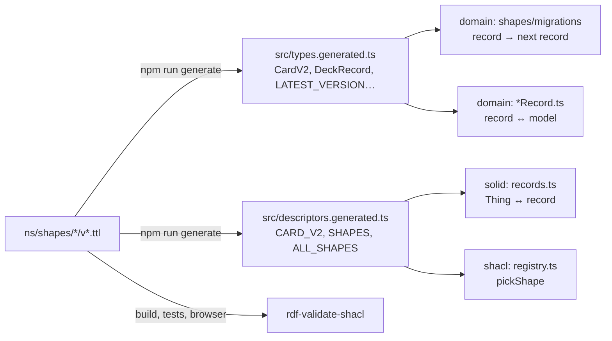

# Shapes

What a valid Solid Memo subject looks like, version by version, as
SHACL; and how those shapes drive the code. One shape file per class
per format version under [`ns/shapes/`](../ns/shapes/), published with
the site at `https://solid-memo.com/ns/shapes/`
([ns.ts](../packages/vocab/src/ns.ts), [deployment.md](deployment.md)).

## Files and IRIs

```
instance/v1.ttl, v2.ttl       https://solid-memo.com/ns/shapes/instance/v1.ttl#shape
deck/v1.ttl … v6.ttl          …/deck/v2.ttl#inPod  and  …/deck/v2.ttl#inLibrary
library-deck/v5.ttl           …/library-deck/v5.ttl#inLibrary  (library deck 5 on)
deck-series/v1.ttl … v3.ttl
card/v1.ttl … v5.ttl
review-state/v1.ttl, v2.ttl
preferences/v1.ttl … v4.ttl
document-receipt/v1.ttl, deck-schedule/v1.ttl   (the digest)
deck-group/v1.ttl             …/deck-group/v1.ttl#inPod  (the arranged deck list)
chapter/v1.ttl, step/v1.ttl   …/chapter/v1.ttl#inLibrary  (a course's outline)
distractor/v1.ttl             …/distractor/v1.ttl#shape  (a wrong option, in a pod or the library)
```

Each file's address is its IRI and its `@base`. The IRIs keep `.ttl` on
purpose: GitHub Pages serves the file as `text/turtle` but negotiates
no content, so an address without the extension would be a 404. `npm
run generate` finds every version by reading the folders
([sources.ts](../packages/vocab/tooling/sources.ts)). A deck is shaped two ways
because it lives in two places: `<#inPod>` (a catalog entry, with the
links to its two documents) and `<#inLibrary>` (a [deck
library](deck-library.md) document, which has no pod documents and may
list its sources). Up to format 4 both share one document and its named
property shapes; library deck 5, a version the pod's deck does not
share, has a self-contained file of its own (`library-deck/v5.ttl`),
since a shape's `sh:name` version must match its file's.

## Conventions

- **No `sh:targetClass`.** Format 1 and format 2 of a class target the
  same class, so targeting would make every subject fail one of them.
  The shape is chosen by `(rdf:type, sm:formatVersion)` — absent = 1 —
  and the context (pod or library) by `pickShape` in
  [registry.ts](../packages/shacl/src/registry.ts), the same way
  at build time, in tests and in the browser. Every node shape carries
  `sh:class` and `sh:nodeKind sh:IRI` instead. The class is Solid
  Memo's own or, for the standard classes it writes, DCAT's or FOAF's
  (`CLASS_NAMESPACES` in [packages/vocab/tooling/shapes.ts](../packages/vocab/tooling/shapes.ts)).
  A subject with a Solid Memo class is checked against that class's
  shapes only: a deck group is a `dcat:Catalog` too, but is never
  checked as `CatalogV1`.
- **Further types are stated.** A subject that is also, say, a
  `dcat:Dataset` says so with `sh:property [ sh:path rdf:type ;
  sh:hasValue dcat:Dataset ]`; the shape is still picked by its
  `sh:class`, and the writer adds every such type. A course's subjects
  state their schema.org types this way: a chapter is a
  `schema:Syllabus`, a step a `schema:LearningResource`, a distractor a
  `schema:Answer` ([courses.md](courses.md#why-schemaorg)).
- **The version is asserted.** Format ≥ 2: `sm:formatVersion` with
  `sh:hasValue N`, exactly once. Format 1: `sh:maxCount 1 ; sh:in ( 1 )`,
  which reads "absent or 1" — the rule that a missing version means the
  format that predates the field.
- **Not closed.** Unknown triples are neither violations nor removed:
  readers ignore them and writers edit subjects in place.
- **Property shapes are named** (`<#front>`, never blank nodes), so the
  generator and the results can refer to them. `sh:message` is set where
  the engine's default text would be cryptic, always in English and
  Swedish (`"…"@en`, `"…"@sv`): the app shows a result in the reader's
  language, and a test holds every message to both. Where a shape sets
  none, the validator's own English stands, and the app says it in
  Swedish by its constraint (`validation.constraint.*` in the message
  catalogues), more generally.
- **Rules a record cannot carry** — a card side has text or a picture
  (`sh:or`), the review snapshot is all five triples or none (`sh:xone`),
  a review subject is named `#<cardId>` or `#<cardId>@back-to-front`
  (`sh:pattern` on the node) — are enforced by the record → model
  mappers in code and by SHACL in validation.

## Version by version

| Shape | Beyond class, node kind and version |
|---|---|
| Instance 1 | `dcterms:title` 1..1, `dcterms:created` 1..1 |
| Deck 1 | `dcterms:title` 1..1, `dcterms:created` 0..1, `dcterms:creator` 0..n, `dcterms:license` 0..1 IRI, `dcterms:description` 0..1; in a pod `sm:cardsDocument` and `sm:reviewsDocument` 1..1 and `dcterms:source` 0..1 (the library document it came from); in the library no document links and `dcterms:source` 0..n |
| Deck 2 | Deck 1 + `sm:direction` 1..1, one of `front-to-back`, `back-to-front`, `bidirectional`; `dcterms:modified` 0..1 dateTime |
| Card 1 | `sm:front`, `sm:back` 1..1 |
| Card 2 | `sm:front`, `sm:back` 0..1; `sm:frontImage`, `sm:backImage` 0..1 IRI; each side has text or a picture |
| Card 3 | Card 2 + `sm:frontNote` and `sm:backNote`, a note under that side's text, shown once the answer is revealed (never while asking), and `sm:backLabel`, a caption above the back's text saying how the answer relates to the front (shown with the back, whichever way the card is studied): each optional, language-tagged text as a deck-4 title is, one value per language and, when present, exactly one of them English (a node-level `sh:or`, since SHACL cannot say "if any value" on the property); the app shows the reader's language and edits the text in the page's language, else the English (text typed on a page in another language is written in that language and, while it has no translation, as the English too); `owl:deprecated` 0..1 boolean: `true` on a retired card, kept with its review states but never studied, and listed in the Browser only when asked; left out on a card in use |
| Card 4 | Card 3, but a side's text (`sm:front`, `sm:back`) is either one untagged literal, its language unknown (what the app writes for text typed in it), or language-tagged text, at most one value per language (`sh:or` of `xsd:string` and `rdf:langString`, `sh:uniqueLang`, at most one untagged value), never both (a node-level `sh:or`). English is not required: a Swedish vocabulary deck's back is Swedish. The app shows the reader's language, else the English, else the untagged text; it edits the English, else the untagged or only text, and keeps the other languages. `sm:frontImageDescription` and `sm:backImageDescription`, what that side's picture shows, its text alternative, are 0..n language-tagged text, at most one per language (`sh:uniqueLang`), none required (added without a version bump: an older reader ignores them and shows the picture with a generic name). The app uses the description in the reader's language as the picture's alt text, else a name for its side; it edits the text in the page's language, else the English, else the first by tag, and writes a new one in the page's language. A description is read while the side is asked, so it should say what the picture shows without giving the answer away |
| Card 5 | Card 4, but `sm:frontNote`, `sm:backLabel` and `sm:backNote` are language-tagged text in any language, at most one value per language (`sh:uniqueLang`); English is no longer required (the node-level `sh:or` that asked for an English value is gone). A side's text is as in card 4: one untagged literal or language-tagged text, never both. `zxx` tags text in no language (codes, numbers, symbols). The app edits each text in the languages the user states, a language picker under each field, and never writes untagged text anew: a side's untagged text is kept only while it is untouched, and editing it or giving it a translation asks for its language. Picture descriptions are as in card 4, the app editing them, too, in the languages the user states. Notes, labels and descriptions once saved the same in English and another language (identical English copies, as cards 3 and 4 had the app write) are accepted as text in each language and left untouched ([i18n.md](i18n.md#text-in-the-users-languages)). The step from card 4 changes nothing: every format-4 card is a format-5 card. `sm:distractor` 0..n IRIs, the wrong options of a card asked as a multiple-choice question, `sm:Distractor` subjects of the same document (added without a version bump in vocabulary 1.14: an older reader ignores them and studies the card front to back). That a card asked by a [course](courses.md) has text on its back and two distractors or more is checked by the library, not the shape |
| Review state 1 | `sm:easeFactor` decimal, `sm:intervalDays`, `sm:repetitions` integer, `sm:due` `YYYY-MM-DD`, `sm:firstReviewedAt`, `sm:lastReviewedAt` dateTime, all 1..1; the five `sm:previous*` 0..1 each (unversioned pods already hold snapshots); subject named per direction |
| Review state 2 | Review state 1 with the snapshot all or nothing |
| Preferences 1 | `sm:newCardsPerDay`, `sm:maxReviewsPerDay`, `sm:dayBoundaryHour` (0–23) integer 0..1; `sm:answerScale` 0..1, `sm2` or `minimal`; `sm:developerMode` 0..1 boolean |
| Preferences 2 | Preferences 1 with every field 1..1 |
| Deck 3 | A `dcat:Dataset` too. `dcterms:title` and `dcterms:description` 1..1; `dcterms:created`, `dcterms:modified` 0..1; `dcterms:creator` 0..n IRIs (foaf:Agent nodes); `dcterms:license` 0..1; `sm:studyDirection` 1..1, a concept of `sm:StudyDirections` (`sm:direction` forbidden); `dcat:theme` 0..n IRIs, `dcat:keyword` 0..n; `dcterms:source` forbidden. In a pod also `dcat:distribution` 0..n, the two document links, `prov:wasDerivedFrom` 0..1 (the library release it came from), and the deck's own study caps `sm:deckNewCardsPerDay` and `sm:deckMaxReviewsPerDay`, integers ≥ 0, 0..1 each (added without a version bump: an older reader ignores them). In the library, one release: `dcterms:publisher`, `dcat:version` (1, 2, …), `dcat:inSeries`, `dcat:isVersionOf` 1..1; `dcat:prev`, `dcat:previousVersion`, `adms:versionNotes`, `dcterms:issued` 0..1; `dcat:theme` including the EU theme EDUC; `dcterms:language` 0..n; `dcat:distribution` 1..n; `prov:wasDerivedFrom` 0..n; no document links and no study caps |
| Deck 4 | Deck 3, but `dcterms:title` and `dcterms:description` are language-tagged text (`rdf:langString`): one or more values, at most one per language (`sh:uniqueLang`), exactly one of them English (`sh:qualifiedValueShape [ sh:languageIn ("en") ]`, `sh:qualifiedMinCount 1`, `sh:qualifiedMaxCount 1`). The app shows the text in the reader's language (the browser's preferred languages), else the English; it edits the text in the page's language, else the English, and keeps the other languages. Text typed on a page in another language than English is written in that language and, since English is required, as the English too while it has no translation of its own (renaming then replaces both) |
| Deck 5 | Deck 4 in a pod (`<#inPod>`, `DeckV5` only), but `dcterms:title` and `dcterms:description` are language-tagged text in any language: one or more values, at most one per language (`sh:uniqueLang`), English no longer required. A deck titled only in Swedish or Japanese is a whole deck. A library release stays library deck 4 (`LibraryDeckV4`, English required): English first is the library's curation policy, not a rule of the data. The app edits each language's text under the tag the user states and no longer writes an identical English copy; a title deck 4 tagged English though it is in another language stays so until the user retags it, and one saved the same in English and another language is accepted as text in each language and left untouched. The step from deck 4 changes nothing: every format-4 deck is a format-5 deck |
| Deck 6 | Deck 5 in a pod (`DeckV6` only), but `dcat:keyword` 0..n is language-tagged text in any language, several values per language (no `sh:uniqueLang`). Untagged keywords (`sh:or` of `xsd:string` and `rdf:langString`), their language unknown, are accepted only as kept from older formats: the app writes every keyword under the language the user states. The app shows the keywords in the reader's language (any tag with its primary subtag) and those in no stated language (untagged and `zxx`), with no fallback to another language. The step from deck 5 keeps the keywords untagged |
| Library deck 5 | Library deck 4 (`LibraryDeckV5`, in `library-deck/v5.ttl`), but `dcat:keyword` 0..n is language-tagged text, several values per language; untagged keywords are invalid. The step from library deck 4 keeps a frozen release's keywords untagged |
| Preferences 3 | Preferences 2 + `sm:invalidDataPolicy` 1..1, a concept of `sm:InvalidDataPolicies` |
| Preferences 4 | Preferences 3 + `sm:theme` 1..1, a concept of `sm:Themes` (see [theme.md](theme.md)) |
| Library deck series 1 | The deck across its releases in the library index: a `dcat:DatasetSeries` and `dcat:Dataset`; title, description, publisher 1..1; `dcat:first`, `dcat:last`, `dcat:hasCurrentVersion` 1..1; `dcat:hasVersion` 1..n; themes and keywords 0..n |
| Library deck series 2 | Library deck series 1 with the version stated (`sh:hasValue 2`) and the title and description as language-tagged text, as in deck format 4 |
| Library deck series 3 | Library deck series 2, but the keywords, copied from the current release, are language-tagged text, several per language, or untagged as a library deck 4 release has them |
| Catalog 1 | A `dcat:Catalog` (an instance's `catalog.ttl#catalog`, the library index): title, description, `dcterms:publisher` 1..1; licence, modification time 0..1; `dcat:themeTaxonomy`, `dcat:dataset` 0..n |
| Deck group 1 | In a pod (`DeckGroupV1`, beside the decks in `catalog.ttl`): a [deck group](data-model.md#deck-groups), a `sm:DeckGroup` and a `dcat:Catalog`; `dcterms:title` and `dcterms:description` 1..n language-tagged text, one per language (`sh:uniqueLang`); `dcterms:publisher` 1..1 IRI (the catalogue's); `dcat:dataset` (its decks) and `dcat:catalog` (its sub-groups) 0..n IRIs; `sm:position` 0..1, an integer ≥ 0. That a deck or group has one parent is not a shape rule: the reader decides one. A deck's `sm:position` and the catalogue's `dcat:catalog` belong to no shape, so `DeckV6` and `CatalogV1` keep them untouched |
| Agent 1 | A `foaf:Agent`: `foaf:name` 1..1, `foaf:mbox` 0..1 (a `mailto:` IRI) |
| Distribution 1 | A `dcat:Distribution`: `dcat:accessURL` 1..1; `dcat:downloadURL`, `dcat:mediaType`, `dcterms:format` 0..1 |
| Document receipt 1 | In an instance's [digest](data-model.md#the-digest): `sm:receiptOf` (the document) and `sm:documentVersion` (its ETag) 1..1; `sm:conformedTo` (the rules it conformed to) and `sm:latestFormat` 0..1 |
| Answer 1 | In an instance's [answer log](data-model.md#the-answer-log): `sm:answeredDeck` and `sm:answeredCard` (IRIs), `sm:answeredDirection` (`sm:frontToBack` or `sm:backToFront`), `sm:grade` (0–5), `sm:answeredAt` (xsd:dateTime), `sm:answeredOn` (`YYYY-MM-DD`), `sm:nextIntervalDays` 1..1; `sm:priorIntervalDays` 0..1, absent on a prompt's first answer. Added without a version bump in vocabulary 1.14: `sm:answerMode` 0..1, a concept of `sm:AnswerModes` (absent: recalled, as every answer before), and `sm:chosenDistractor` 0..1 IRI, the wrong option a wrong multiple-choice answer chose |
| Chapter 1 | In the library (`ChapterV1`, `<#inLibrary>`): a chapter of a [course](courses.md), a `sm:Chapter` and a `schema:Syllabus`; `dcterms:title` 1..n language-tagged text, one per language, exactly one of them English; `dcterms:description` 0..n language-tagged text, one per language; `schema:isPartOf` (the release) and `schema:position` (an integer ≥ 0) 1..1; `sm:reviewQuestion` 0..n IRIs (cards asked only in its final review); `owl:deprecated` 0..1 boolean, `true` once retired |
| Step 1 | In the library (`StepV1`, `<#inLibrary>`): a step of a course chapter, a `sm:Step` and a `schema:LearningResource`; `sm:theory` 1..n language-tagged text, one per language, exactly one of them English; `sm:checkedBy` 1..n IRIs (the cards that check it); `schema:isPartOf` (its chapter) and `schema:position` (an integer ≥ 0) 1..1; `owl:deprecated` 0..1 boolean |
| Distractor 1 | In a pod or the library (`DistractorV1`, `<#shape>`): a wrong option of a card, a `sm:Distractor` and a `schema:Answer`, a subject of the card's document; `sm:distractorText` 1..n, one untagged literal or language-tagged text, one per language, never both, as a card 5 side's text; `sm:distractorNote` 0..n language-tagged text, one per language, why the option is wrong; `owl:deprecated` 0..1, true once retired, when the app no longer offers it |
| Deck schedule 1 | In an instance's digest: `sm:scheduleOf` (the deck), `sm:cardsVersion`, `sm:reviewsVersion` (`"absent"` for none), `sm:scheduledDirection` (a concept of `sm:StudyDirections`), `sm:scheduledDayBoundaryHour` (0–23), `sm:scheduledOn` (`YYYY-MM-DD`), `sm:unreviewedCount`, `sm:reviewedOnDayCount`, `sm:introducedOnDayCount` 1..1; `sm:dueOnDay` 0..n, `"YYYY-MM-DD count"` |

The DCAT and FOAF classes' values (an agent is a `foaf:Agent`, a theme a
`skos:Concept`, a licence a `dcterms:LicenseDocument`) are checked by the
DCAT-AP profile, with the reference data; Solid Memo's own shapes only
say IRI (see [validation.md](validation.md#profiles-dcat-ap-and-skos)).

What a row says the app shows and edits is what the app did while that
format was the latest; the app of today edits text as the
[latest formats](i18n.md#text-in-the-users-languages) ask.

Why each version moved is in [migrations.md](migrations.md).

## What the shapes generate



[packages/vocab/tooling/shapes.ts](../packages/vocab/tooling/shapes.ts) reads, from every node shape
with an `sh:name` (`"CardV2"`, `"LibraryDeckV1"`), the properties it
lists: `sh:path`, `sh:datatype` or `sh:nodeKind sh:IRI`, `sh:minCount`,
`sh:maxCount`, `sh:in` and an optional `sh:name` for the field. Anything
else (`sh:or`, `sh:xone`, `sh:pattern`, ranges, messages) is validation
only.

| SHACL | Record field | Descriptor kind |
|---|---|---|
| `xsd:string` | `string` | `string` |
| `xsd:string` + `sh:in` | literal union | `enum` |
| `sh:nodeKind sh:IRI` + `sh:in` (a scheme's concepts) | IRI union | `iriEnum` |
| `xsd:integer`, `xsd:decimal` | `number` | `integer`, `decimal` |
| `xsd:boolean` | `boolean` | `boolean` |
| `xsd:dateTime` | ISO 8601 `string` | `dateTime` |
| `sh:nodeKind sh:IRI` | `string` | `iri` |
| `rdf:langString` + `sh:uniqueLang true` | `LangText`: language tag (lower case) → text; one field however many languages, required with `sh:minCount 1` | `text` |
| `sh:or ( [ sh:datatype xsd:string ] [ sh:datatype rdf:langString ] )` | `LangText`, the untagged literal under the empty tag (`""`) | `anyText` |
| either text above without `sh:uniqueLang true` (no `sh:maxCount` allowed) | `LangTexts`: language tag → texts, several per language, `{}` for none | `text` / `anyText`, `many` |
| no `sh:minCount` | optional (`?:`) | `optional` |
| `sh:minCount 1 ; sh:maxCount 1` | required | `one` |
| no `sh:maxCount` (strings and IRIs; text, see above) | `readonly string[]` | `many` |
| `sh:maxCount 0` | not a field: the writer removes the predicate | `absent` |

`sm:formatVersion` and `rdf:type` (the class and any `sh:hasValue`
types) are the envelope, not fields: the generic writer stamps them from
the descriptor. Generated files hold
only types and `as const` data, are committed, and are checked for
drift by CI (`npm run generate:check`) and by `packages/vocab/tooling/generate.test.ts`.

## Reading and writing

Every mapper is the same three steps (see
[records.ts](../packages/solid/src/records.ts)):

1. `readVersioned(thing, "card")` — the class is checked, the stored
   version read (absent = 1), and the subject read with the descriptor
   of that version into a `{ version, data }` record. A version newer
   than this app knows is read with the latest shape it has; the stored
   version passes through to the model unchanged.
2. `migrate("card", record)` — the record walked up the
   [migration chain](migrations.md) to the latest version, in memory.
3. `cardFromRecord(url, storedVersion, data)` — the domain model, which
   keeps the stored version so the migration plan can count what is
   outdated.

Writing is the reverse: `cardToRecord(content)` then
`recordThing(url, CARD_V2, record, existing)`, which edits the existing
subject in place (only the shape's predicates are replaced, so foreign
triples survive), adds the class once and stamps the version. Every
subject this app writes is therefore stamped and conforms to the latest
shape — the conformance test in
[conformance.test.ts](../packages/solid/src/conformance.test.ts)
proves it for every version and every migration step.

## Where the shapes are checked

- **Tests**: the fixtures in `packages/vocab/fixtures/<class>/v<N>/{valid,invalid}/`
  pass and fail as expected against the shapes in `ns/shapes/`; the
  conformance test above. Nothing needs the network.
- **The deck library**: every version and the index, by `npm run
  library:check` ([deck-library.md](deck-library.md#checks)).
- **Browser**: the developer tool described in [validation.md](validation.md).

## Adding a version

See [migrations.md](migrations.md#adding-a-format-version).
