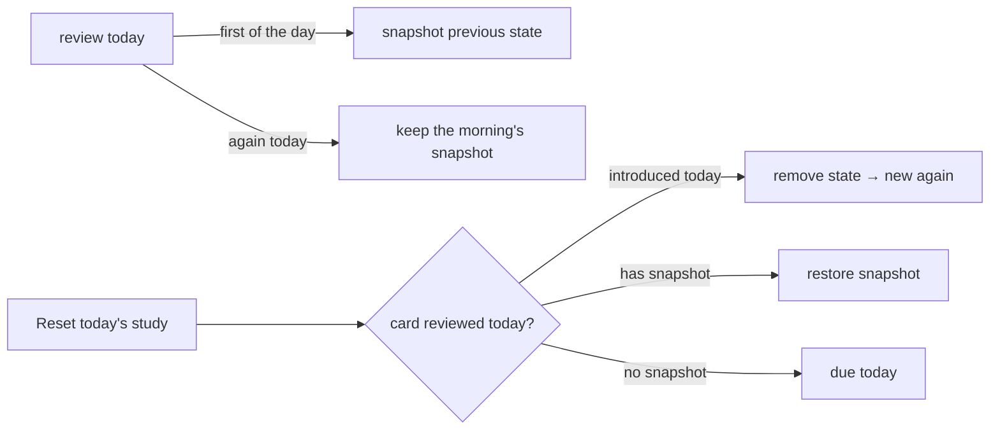

# Spaced repetition (SM-2)

How Solid Memo schedules cards. Implemented entirely in the domain layer
([sm2.ts](../packages/domain/src/sm2.ts), [scheduling.ts](../packages/domain/src/scheduling.ts))
as pure functions.

## Prompts and directions

A session asks *prompts*: a card seen from one side (`Prompt` in
[deck.ts](../packages/domain/src/deck.ts)). A deck's direction decides which
prompts its cards make — front→back, back→front, or both (a
*bidirectional* deck, two prompts per card). Each prompt is scheduled on
its own: knowing "Sweden → Stockholm" says nothing about knowing
"Stockholm → Sweden". Everything below — review state, budgets, the
queue, the session — is per prompt.

## Review state

Each prompt (card + direction) carries one `ReviewState`:

| Field | Meaning |
|---|---|
| `easeFactor` | SM-2 easiness (starts 2.5, never below 1.3) |
| `intervalDays` | Days until the next review |
| `repetitions` | Consecutive correct answers |
| `due` | Study day ("YYYY-MM-DD") the card is next due |
| `firstReviewedAt` | Introduction timestamp (counts against the new-card budget) |
| `lastReviewedAt` | Latest review timestamp (counts against the review budget) |

A prompt with no `ReviewState` is *new*. Changing a deck's direction
keeps every state: a card's front→back state waits, unused, while the
deck is studied back→front.

## The SM-2 transition

The user grades each answer with a quality `q` from 0 (blackout) to 5
(perfect). `applySm2` transitions `(easeFactor, intervalDays, repetitions)`:

```mermaid
flowchart TD
    A[answer graded q] --> B{q >= 3?}
    B -- no (lapse) --> C[repetitions = 0<br/>interval = 1 day<br/>ease factor kept]
    B -- yes --> D[update ease factor<br/>EF' = EF + 0.1 − (5−q)(0.08 + (5−q)·0.02)<br/>floor 1.3]
    D --> E{repetition #}
    E -- 1st --> F[interval = 1 day]
    E -- 2nd --> G[interval = 6 days]
    E -- 3rd+ --> H[interval = round(previous × EF')]
```

Decisions fixed in code (and tests):

- The **updated** ease factor drives interval growth (computed before the
  interval, per Wozniak's original description).
- Lapses (`q < 3`) keep the ease factor; only repetitions and interval reset.
  The card returns the next study day (interval 1).
- A grade of 0 or 1 additionally sends the card round again **within the
  session** (`repeatsInSession`); see *Study sessions*. Each pass is a
  full SM-2 review, so the state stored after the repeat is the one that
  counts.

## Answer scales

Sessions grade with one of two button sets, chosen per instance in the
preferences (`sm:answerScale`, default `sm2`):

| Scale | Buttons | Records |
|---|---|---|
| `sm2` | 0 — Blackout … 5 — Easy | that grade |
| `minimal` | Again · Hard · Good · Easy | 1 · 3 · 4 · 5 |

The minimal scale is a view over SM-2, not a second algorithm. Again stands
for 0–1 and Hard for 2–3, but each button must record one value: Again
records 1 (0 and 1 schedule identically) and Hard records **3**, the lowest
passing grade — recording 2 would make Hard a lapse, indistinguishable from
Again. So on the minimal scale only Again repeats in the session
([answerScale.ts](../packages/domain/src/answerScale.ts)).

## Multiple-choice answers in a course

A [course](courses.md) asks a card as a multiple-choice question: its
back among its distractors. The answer is right or wrong, not graded by
the learner, and `gradeOfChoice` in
[course.ts](../packages/domain/src/course.ts) maps it to SM-2:

| Choice | Grade | Why |
|---|---|---|
| right | 3 | The lowest passing grade: a choice says that the answer was known, not how well. |
| wrong | 1 | A lapse. |

That function is the only place a choice becomes a grade, so another
scheduler (FSRS) replaces this map alone. The grade then goes through
the same transition as a study review (`applyGrade` in
[useCases.ts](../packages/application/src/useCases.ts), which
`recordReview` uses too). Course answers are front→back.

Whether an answer is graded at all depends on the card's state
(`courseAnswerEffect`):

| The card | Right | Wrong |
|---|---|---|
| no state: answered for the first time, in a step | introduced, grade 3: 1 repetition, ease 2.36, due the next study day | introduced, grade 1: 0 repetitions, due the next study day |
| graded earlier the same study day, as in the final review after its step | nothing written: the day's grade stands | grade 1 |
| due this study day or earlier, not graded today | grade 3 | grade 1 |
| due on a later study day: a step revisited or a chapter retaken | nothing written: practice | nothing written: practice |

- **A step** introduces each card the first time its question is
  answered. The card is written into the deck first, then graded. A
  retry the same day writes nothing when it is right, and is another
  lapse when it is wrong.
- **The final review** asks every question of the chapter, usually the
  same day. A right answer leaves the day's grade as it is, so the card
  is not pushed further out by an answer it was just shown. A wrong one
  is a lapse. A question answered wrongly comes back until it is
  answered right.
- **Revisiting** writes nothing while the card is not due, since grading
  a card early would cut its interval short. A card that is due is
  reviewed, as in study.
- **No daily limit** applies: the learner reached the card in the
  course. A card introduced there still counts as introduced that day,
  so it uses up the deck's new-card budget in study (below).
- **Afterwards** the cards are studied by flip-and-grade, with the
  instance's answer scale.

## Study days and the queue

Scheduling works in *study days*, not calendar days. `studyDayOf` shifts an
instant back by `dayBoundaryHour` (default 4) before taking the local date —
reviewing at 03:00 still counts as yesterday. Timezone caveat: study days are
device-local; travelling shifts due times by a few hours (accepted for v1).

`buildStudyQueue` produces the day's session from cards + the deck's
direction + review states + preferences — the instance's, with the
deck's own daily limits in their place where it sets them
(`deckPreferences` in `domain/deckPace.ts`) (`now` is always passed in, never
read from a clock — that keeps it deterministic and testable). Retired
cards (`owl:deprecated true`) make no prompts: their review states are
kept, but never due and never new:

- **due**: prompts whose `due <= today`, oldest due first, capped at
  `maxReviewsPerDay` minus reviews already done today.
- **new**: prompts without review state, **drawn at random** (Fisher–Yates
  over an injected `random` source, so tests stay deterministic), capped at
  `newCardsPerDay` minus prompts introduced today. A long deck is
  therefore not introduced front to back, and a bidirectional deck's two
  prompts of one card need not arrive together — or even the same day.

The budgets count prompts, so a bidirectional deck spends two of the
day's new-card budget on a card introduced both ways.

Both budgets clamp at zero.

New instances start at 5 new cards per day: every new card brings
reviews in the days after, so a high number now piles them up later. The
preferences say so beside the field. (A format-1 preferences document
without the field still means the 20 of its day; see
[migrations](migrations.md).)

The deck list needs only the counts, which `getStudyCounts` takes from
the deck's schedule in the instance's [digest](data-model.md#the-digest)
while neither of its documents has changed (`studyCountsOf` in
`domain/studyDigest.ts`, tested against `buildStudyQueue` for every
direction and cap). A schedule holds its counts by study day, so it
stays right as days pass: any review since it was computed would have
changed the reviews document, so on a later day nothing was reviewed or
introduced yet.

The queue is a snapshot taken at session start;
the session then owns its own order (below) and a refetch never reshuffles
it.

## Study sessions

A deck offers one session, **Study** ([StudyContainer](../apps/web/src/ui/StudyContainer.tsx)):
today's due prompts plus new ones up to the daily new-card budget, the
new ones spread evenly among the due (`interleave`) rather than queued
after them, so a deck with a backlog still introduces something new
early on. The session opens with a due prompt when there is one. (There
used to be a separate due-only mode; one button with everything for the
day proved simpler.)

A session walks its queue one prompt at a time: the side asked → reveal
the other side → grade. A back→front prompt shows the card's back first.
A card graded 0 or 1 is put back into the *remainder* of the session at a
random position (`requeueCard`) — never as the very next card, unless it is
the only card left, in which case it simply repeats until it passes. The
"Card x of y" counter grows with each repeat. Each answer runs the
`recordReview` use case
([useCases.ts](../packages/application/src/useCases.ts)): load the card's stored
state (or start from the initial SM-2 state), apply the transition, compute
the next due day, persist to `reviews/<deckId>.ttl`, and return the new
state. A failed save keeps the card in place with an error; the queue only
advances on success. Ending the session invalidates the review caches so
other screens see fresh state.

Storage note: `sm:due` is stored as a plain `"YYYY-MM-DD"` string literal,
not `xsd:date` — a study day is a calendar label, and date round-trips
through `Date` objects risk timezone off-by-one shifts.

## Suggesting a session

The app only suggests a session that has something in it, so nobody starts
one to learn there was nothing to study. Both the deck page and each
deck-list row read the deck's queue for today:

| Today's queue | Deck page | Deck-list row |
|---|---|---|
| prompts due and/or new within budget | **Study**, with "N due today, and M new to introduce" | **Study** with "N due · M new" |
| nothing | "All cards have been studied" | "Nothing to study today" |
| unknown (loading / unreadable) | loading or error | no suggestion |

Rows load independently and share the `["studyQueue", deckUrl]` cache entry
with the deck page. Concurrent reads of the instance's preferences are
shared (one request for all rows) but never cached beyond the request.

## Resetting the day

The deck page offers **Reset today's study** once something has been
studied today. It undoes the current study day for that deck, as if the
day's sessions had not happened.

A review overwrites a card's state, so undoing needs a record of what was
overwritten. `recordReview` therefore stores a snapshot (`ReviewState.previous`,
the `sm:previous*` triples) of the state from **before the study day's first
review** — a second review the same day keeps that snapshot instead of
replacing it (`snapshotBeforeReview`).

`resetStudyDay` (pure, in [scheduling.ts](../packages/domain/src/scheduling.ts)) then
decides, per card reviewed today:

| Card | Reset does |
|---|---|
| introduced today (`firstReviewedAt` is today) | removes its state — it is a new card again |
| reviewed today, has a snapshot | restores the snapshot (ease, interval, repetitions, due, last review) |
| reviewed today, no snapshot (state written before snapshots existed) | can't be restored: made due today, so it can at least be studied again |
| not reviewed today | untouched |



Because the daily budgets are derived from the same timestamps
(`lastReviewedAt` / `firstReviewedAt` falling in today), restoring them also
frees today's review and new-card budget. All changes go out in one save of
the reviews document (`applyReviewChanges`), so a reset is never half-applied.
The day's answers of that deck then leave the
[answer log](data-model.md#the-answer-log) as well, so the statistics
match the cards: answers still on their way to the log are added first,
then removed with the rest.
"Today" honours the instance's `dayBoundaryHour`, like the queue.

In a [course](courses.md)'s deck, a reset treats the day's course
answers like study answers:

- A card introduced today loses its state but stays in the deck, with
  its distractors. Study then shows it as new, and the course counts its
  step as not done again. Answering its question in the course
  introduces it again.
- A card reviewed today gets its snapshot back.
- The day's multiple-choice answers leave the answer log.
- A chapter completed today stays completed: `sm:completedChapter` is
  on the catalog entry, which a reset does not touch.
