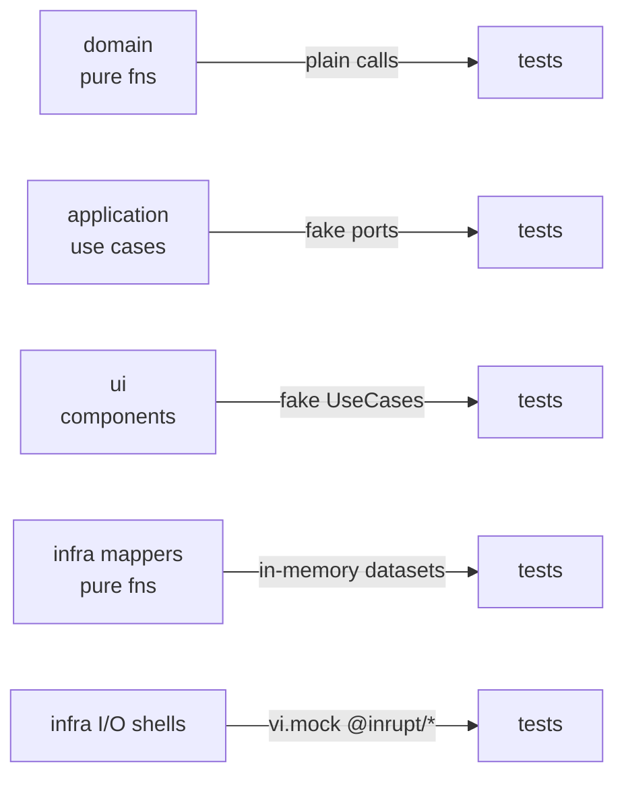

# Testing

Unit tests with [Vitest](https://vitest.dev/) in every package, in node
unless the package runs in the browser: `apps/web`, `solid` and `browser`
run in `happy-dom` (but for the test of the built site, in node), and the UI's tests use `@testing-library/preact`
([vitest.shared.ts](../vitest.shared.ts)). Coverage is enforced at
**100%** (statements, branches, functions, lines) per package: each
package's own tests cover its own code — `npm test` fails below that.

## Commands

```sh
npm test          # every package's tests, with coverage thresholds (turbo)
npm run check     # the same, plus typecheck, drift, formatting, boundaries
npm run test:unit -- apps/web/src/ui/App.test.tsx   # some files, or all with none, without coverage (root vitest.config.ts)
npm run test:watch # watch mode, every package's tests
npm run test:unit -w @solid-memo/domain -- account.test.ts   # one package's (test:watch too)
npm run crosscheck # the pySHACL cross-check, as CI runs it (needs scripts/requirements-ci.txt)
npm run test:pod  # the end-to-end tests, against the Solid servers they start in Docker
npm run servers -w @solid-memo/e2e-pod   # pull or build those servers' images ahead (`-- css-6` for one)
npm run pod       # a Community Solid Server at http://127.0.0.1:3999/, in memory, to poke at by hand
npm run pod:clean # take down the servers an interrupted run left
npm run journeys  # the user journeys: the built app in Chromium, against a Community Solid Server 7 started in Docker
npm run journeys -- --ui  # the same in Playwright's UI mode: watch, pick, step through and time-travel a journey
npm run journeys -- -g smoke   # only the journeys whose title matches (or --repeat-each=10, or any other Playwright option)
npm run css -w @solid-memo/e2e-journeys   # keep such a server up; JOURNEY_SERVER_URL=<its url> npm run journeys reuses it
npm run journeys:report -w @solid-memo/e2e-journeys   # open the last run's report
npm run css:clean -w @solid-memo/e2e-journeys   # take down the servers an interrupted run left
```

`npm run test:pod` runs `e2e/pod/` once against each Solid server
[servers.ts](../e2e/pod/servers.ts) knows, which its global setup
([globalSetup.ts](../e2e/pod/globalSetup.ts)) starts in Docker, each on a
free port of 127.0.0.1 and told that URL, and takes down after (or as
the run ends, on Ctrl-C); the test names say which server and version:

| Id | Server | Image | Tier |
|---|---|---|---|
| `css-7` | Community Solid Server 7.x, in memory | its own, `solidproject/community-server`, pinned by digest | blocking |
| `css-6` | Community Solid Server 6.x, in memory | the same | blocking |
| `nss-6` | node-solid-server 6.x | built here from its lockfile ([servers/nss/](../e2e/pod/servers/nss/Dockerfile)), in a root whose ACL lets anyone read and write | blocking |
| `nss-5` | node-solid-server 5.x | the same | blocking |
| `css-8` | Community Solid Server 8, still in alpha, in memory | its own, pinned by digest | advisory |
| `pivot` | Pivot, the server of solidcommunity.net (the Community Solid Server 7 with Pivot's components), in memory | built here from its lockfile ([servers/pivot/](../e2e/pod/servers/pivot/Dockerfile)) with a configuration of its own, its root open | advisory |
| `nextcloud` | Solid-Nextcloud: Nextcloud 32 with the Solid app, on SQLite, the pod `apps/solid/~alice/storage/` | built here from a commit of the app ([servers/nextcloud/](../e2e/pod/servers/nextcloud/Dockerfile)), installed on every start, alice's pod opened by a hook | advisory |
| `jss` | JavaScript Solid Server, files in the container, open to anyone (`--public`, which skips its access control) | built here from its lockfile ([servers/jss/](../e2e/pod/servers/jss/Dockerfile)), unmodified and pushed nowhere (it is AGPL) | advisory |

A **blocking** server's tests gate CI, and so deploys and Renovate's
merges: every test passes or skips, for a reason the tests give. An
**advisory** server's results are reported, not a gate: the Interop
workflow ([interop.yml](../.github/workflows/interop.yml)) runs them on
pushes to `main` that touch the app's Solid code, weekly, and by hand,
and a job fails only on a test failing that
`e2e/pod/servers/<id>/expected-failures.json` (`{ "<file> > <test>":
"<why>" }`, the test named without its server) does not list, or when
no test ran ([compare.ts](../e2e/pod/compare.ts) says which in the job's
summary, and what passes though listed, to take off the list). CI still
checks that every advisory server starts and meets the contract, so a
change that breaks one is not merged unnoticed, and Renovate merges an
advisory server's updates once that passes, as it does a blocking one's. Solid-Nextcloud's SQLite
refuses writes made at once, so with it in a run the test files run one
at a time (`serialFiles` in servers.ts); what it fails, and why, is its
`expected-failures.json`. css-8 becomes blocking at
8.0.0, and css-6 then goes.

Each server is a compose file, `e2e/pod/servers/<id>/compose.yml`. It may
ask only for `E2E_PORT` (the port on 127.0.0.1 the harness picked, which
the server must be told) and `E2E_SECRET` (a password made up for the
run), publishes on 127.0.0.1 only, and gets nothing of the host; `npm
test` checks that of every one ([servers.test.ts](../e2e/pod/servers.test.ts)).
Images built here are tagged `localhost/solid-memo-e2e-<id>:local` and
pushed nowhere; the others are pulled once. Before the tests, every
server must meet a contract ([contract.ts](../e2e/pod/contract.ts)): a
document anyone writes in its pod root reads back, is listed there at the
URL it was written to, and deletes. A server that is not open, or does
not know the URL it is reached at, fails there, saying so, not in every
test. What a server prints goes to `e2e/pod/logs/<id>.log`, which CI
keeps when a job fails.

`SOLID_SERVERS=css-7,nss-5` runs the suite against some only (`all`
against every one; unset, the blocking ones; `css-8` for the advisory);
`SOLID_SERVER_URL` against a server of your own instead, which must let
anyone read and write, as `npm run pod`'s does (`SOLID_SERVER_NAME` names
it in the tests; `NODE_EXTRA_CA_CERTS` trusts its certificate, if a CA of
your own signed it). CI runs one job per blocking server, side by side, none
stopping the others ([migrations.md](migrations.md#proof-on-a-real-server));
Renovate keeps each server on its major (`renovate.json5`), and which
servers each workflow runs is the table's in servers.ts (`npm test`
checks).

They need Docker: Docker Engine 28.3.3 or later on Linux (before it, a
port published on 127.0.0.1 could be reached from the local network,
CVE-2025-54388), or Docker Desktop. A run killed before its teardown
leaves its servers; the next run takes them down, as does `npm run
pod:clean`. `npm run pod`'s server lets anyone read and write: keep no
real data in it, and stop it when done.

The servers differ in what they enforce, and the tests ask each rather
than assume ([serverTraits.ts](../e2e/pod/src/serverTraits.ts)):

- **node-solid-server** gives no ETag on a read and ignores `If-Match`, so
  there an edit cannot be made conditional and the test that proves an
  edit is refused is skipped; without ETags no
  [digest](data-model.md#the-digest) is kept either, so the test of two
  pages learning at once is skipped, and the others check that every
  visit reads everything. (5.7.4 also ignored `If-None-Match: *` on a
  PUT; 5.8.8 and 6.0.0 enforce it.)
- **Community Solid Server 6** builds its ETag from the modification time
  in whole seconds: an edit in the same second as a read keeps the ETag,
  so a changed document looks unchanged. The tests edit within the
  second, so there the test that proves an edit is refused and the
  digest's tests are skipped. 7 stamps milliseconds. The tests of an
  update stopped, or undone, by a change made elsewhere instead wait for
  the next second before they make it, on every server whose ETag does
  not change on every edit (one without ETags included), and so run on
  every server.

Every skip says why. Everything else runs on every server. A test may
skip only where the server does something the Solid Protocol allows and
the app copes with, as above; what the app needs and has no way around (a
PATCH it can send, an ACL it can write, every insert of several at once
kept) is never a reason to skip, and a probe that cannot tell throws.
What the tests need only for themselves they ask of the server too: an
ACL document is where its `Link rel="acl"` says, and a change "another
app" makes is an N3 Patch, a SPARQL Update or the whole document, as its
`Accept-Patch` allows. What each blocking server does is pinned
([serverTraits.integration.test.ts](../e2e/pod/src/serverTraits.integration.test.ts)):
a release that changes it fails there, not as tests quietly starting or
stopping to skip, and the pin moves by hand once the change is
understood.

The Community Solid Server's in-memory store (the one these tests use)
cuts a document short after a PATCH to it when the document holds
characters outside ASCII (`å`, `ä`, `ö`), even when the patch itself is
ASCII: it stores as many bytes as there were characters. Its file store
does not; keep test data that is patched ASCII, or measure on
`-c @css:config/file.json -f <dir>`.

solid-server 6.0.0 is packaged with faults its image works around: it
lacks the root ACL template it copies on first start (so the image has
one in its config folder), and it lists its own commit-hook tool
`@fastify/pre-commit` as a dependency, whose install script would put a
git hook in place; 5.8.8 does too. The image installs without install
scripts. node-solid-server prints every request it handles (`solid:*`),
so its log runs to tens of megabytes.

The vocabulary, the deck library and the pod catalog fixtures are also
cross-checked by pySHACL in CI (`npm run crosscheck`;
see [validation.md](validation.md#the-ci-cross-check)).

## User journeys

`e2e/journeys/` drives the built app (`npm run build -w @solid-memo/web`,
served by `vite preview` at http://127.0.0.1:4173/) in Chromium with
[Playwright](https://playwright.dev/), through whole journeys a user
takes: logging in with a WebID at a real identity provider, setting
preferences, making and studying decks, grouping them, importing from
the library, describing a deck in two languages, validating the
instance, logging out. Each journey runs against a fresh account, pod
and WebID on a Community Solid Server 7
([css/compose.yml](../e2e/journeys/css/compose.yml)) that the global
setup starts in Docker and takes down after. The app logs in only with
https WebIDs and issuers, so the server sits behind Caddy at
`https://127.0.0.1:<port>/` with Caddy's own certificate, which the
browser is told to accept. The server shares Caddy's network, so it
reaches its own https address too (to read the WebIDs it checks tokens
for). It keeps its pods in files, not in memory, because the journeys
PATCH Swedish text (see above). The journeys need Docker and Chromium
(`npm run browsers -w @solid-memo/e2e-journeys` installs it), and CI
runs them on every push. They block, as the blocking servers do.

The journeys must run the same way every time. Each page's
`Math.random` is seeded (the seed is in the report; `JOURNEY_SEED=<n>`
replays it). The browser's time zone is one where it is about noon, far
from the day boundary. Requests to any host other than 127.0.0.1 fail
the journey (the language selector's flags are stubbed). A journey
never asserts which card a shuffled queue shows, only how many there
are.

**When a journey fails**, the CI job's summary names it, the step it
failed in (the spec's numbered step › the page object's action) and the
error. The job's `journeys-<attempt>` artifact holds everything else:

- `test-results/<journey>/trace.zip`: the whole journey, replayable step
  by step. Each step shows the page before and after every action, the
  network (the login's redirects included) and the console. Open it with
  `npx playwright show-trace <trace.zip>` or at
  https://trace.playwright.dev. Traces hold the throwaway account's
  password and tokens, which is harmless.
- `playwright-report/`: the steps as a tree, with a screenshot at the
  end of each journey step, a video, and these attachments:
  - `diagnostics.json`: console, page errors, failed and refused
    requests, the seed, the time zone;
  - `css.log`: the server's log for the journey's time;
  - `pod-dump.ttl`: every document in the journey's pod when it failed.
  Open the report with `npx playwright show-report <dir>`.
- `logs/css.log`: the server's whole log.

**The latest report is online** at https://solid-memo.com/journeys/,
published with each deploy (`main`, CI green). It shows every journey's
steps and screenshots, and its **Trace** link opens the step-by-step
timeline in the browser (the trace viewer is part of the report and
needs it served, as it is there, not opened as a file). On `main` the
journeys always keep their traces for this. The report is public and
holds the throwaway accounts' passwords and tokens, which die with the
run's server, and it is kept out of search engines (`robots.txt`).
Since only a green run deploys, a failure on `main` is read from the
run's artifact.

A run by hand (Actions › CI › Run workflow) with *trace* ticked keeps
traces for passing journeys on any branch. Locally, `JOURNEY_TRACE=on
npm run journeys` does the same, and `npm run journeys:report -w
@solid-memo/e2e-journeys` serves the report so its traces open.

### Writing a journey

A journey is one file, `e2e/journeys/journeys/<name>.journey.ts`, with
one `test` whose steps are numbered as the journey's spec words them:

```ts
test("a learner's first deck @smoke", async ({ app, account, runId }) => {
  await app.step("01 · Visit Solid Memo", () => app.onboarding.visit());
  await app.step("02 · Log in with a WebID", () => logInAndCreateInstance(app, account, `Instance ${runId}`));
  await app.step("03 · Create a deck", async () => {
    await app.decks.openDeckCreator();
    await app.deckCreator.create(`Deck ${runId}`);
  });
});
```

- **Fixtures** ([fixtures.ts](../e2e/journeys/fixtures.ts)): `account`
  is a fresh account, pod and WebID; `runId` names what the run makes;
  `app` is the app as page objects.
- **Page objects** ([pages/](../e2e/journeys/pages/)): one per screen,
  registered on [App.ts](../e2e/journeys/pages/App.ts). Their methods
  are what a user does, and each is a step of its own in the report.
  They find elements by role and accessible name, with the app's own text
  ([harness/strings.ts](../e2e/journeys/harness/strings.ts) reads
  `apps/web/src/i18n/`), so a journey follows the language it switches
  to. They never use CSS classes; where the app gives no accessible
  name, the app gets one.
- **Flows** ([flows/](../e2e/journeys/flows/)): the steps many journeys
  share, such as logging in.
- **Dialogs**: a step that expects a `confirm` names it with
  `app.expectDialog(pattern)`; any other dialog fails the journey.

The harness's own code (`harness/`) has unit tests (`npm test`, so `npm
run check`). The page objects and journeys are themselves tests, run by
`npm run journeys`, and have no coverage of their own, as with
`e2e/pod`.

## Without the network

Apart from the end-to-end tests' Docker images and the journeys'
browser, nothing needs the network: the vocabulary, the shapes and the deck library are read from
the repository's `ns/` and `decks/`, at the IRIs the site publishes
them under.

## Coverage policy

100% of every package's `src/` (and `tooling/` or `node/` where it has
one), set up once in [vitest.shared.ts](../vitest.shared.ts), with these
documented exclusions:

- `apps/web/src/main.tsx` — composition root; pure wiring, no logic
  (configured in [vite.config.ts](../apps/web/vite.config.ts)).
- `src/test/` and `src/testing/` — test setup and helpers other
  packages' tests import (`@solid-memo/domain/testing/libraryDeck`,
  `@solid-memo/shacl/testing/turtle`), not product code.
- `e2e/pod/` and `e2e/journeys/` — they are tests. Their harnesses'
  logic is unit-tested (what they make of a server's answers, the
  journeys' time zone, seed, text and CI summary), but no threshold
  applies.

Code that cannot reach 100% is restructured until it can (e.g. an
unreachable defensive branch is removed rather than excluded). New code
ships with its tests in the same change; coverage never dips.

## Strategy per layer

Dependency inversion gives every layer a seam that makes mocks trivial:

| Layer | Seam | Technique |
|---|---|---|
| Domain | none needed | Pure functions; inputs (including `now: Date`) passed as parameters. Plain assertions. |
| Application | ports | Inject fake port objects (`vi.fn` per method). No module mocking. |
| UI | `UseCases` prop | Render with a fake `UseCases`; assert via testing-library queries. Query-dependent components get a fresh `QueryClient` (retries off). |
| Infrastructure mappers | none needed | Pure `SolidDataset`/`Thing` → domain functions; feed in-memory datasets built with `mockSolidDatasetFrom`/`buildThing`. |
| Infrastructure I/O shells | injected `fetch` + `vi.mock` | Mock `@inrupt/*` module functions; assert the shell orchestrates fetch → map → return. |
| Shapes (`packages/shacl/`, `packages/solid/src/conformance.test.ts`) | the real engine | The real `rdf-validate-shacl` over the real shapes in `ns/shapes/`: fixture documents under `packages/vocab/fixtures/` pass or fail as a table says; a record written through every descriptor, and every migration step's output, conforms (`conformance.test.ts`). Every library deck passes too, by `npm run library:check` ([deck-library.md](deck-library.md#checks)). Shape documents are read through a `fetch` that serves the repository's files at their IRIs (`shapesFetch` in [sources.ts](../packages/vocab/tooling/sources.ts), a `Response` with its `url` set), exactly as the browser reads them. |
| The library (`packages/solid/src/libraryReleases.test.ts`) | the real library adapter | Every release in `decks/` and the index, read through `createSolidDeckLibrary` over a fetch that serves the repository's files at their IRIs, as the app reads them: the index lists every deck, each release reads with every card it has (its retired ones retired), and a course's outline has every chapter and step it has in use, each asking cards the app can ask (a back and at least two distractors). The library check validates the releases; this is what the app makes of them. |
| Markdown (`packages/markdown/`) | none needed | Pure functions over strings: every node in both profiles, the folds, each rule for a release (`markdownProblems`), the limits at every entry point, and the cmark and commonmark.js pathological inputs at the length cap within a time budget ([markdown.md](markdown.md)). |
| The built site (`apps/web/src/build.test.ts`) | Vite's build API | Builds the app as `vite build` does, without writing it, and checks the bundle has no HTML sink but Preact's own and the page's Content Security Policy still lets its inline script run ([markdown.md](markdown.md#safety)). |
| Generated code | drift test | `packages/vocab/tooling/generate.test.ts` renders the generators' output and compares it with the committed files; generated modules are data only, so importing them covers them (`packages/vocab/src/generated.test.ts`). |
| End to end | real Solid servers | `e2e/pod/` wires the real use cases and Solid adapters as `main.tsx` does, over a fetch that records every request, against Community Solid Server 7 and 6 and node-solid-server 6 and 5. |
| User journeys | the built app in a browser | `e2e/journeys/` drives the app in Chromium (Playwright) through whole journeys, logging in at a real identity provider (Community Solid Server 7 behind TLS) ([User journeys](#user-journeys)). |



## Conventions

- Tests are colocated: `foo.ts` ↔ `foo.test.ts`.
- Test files follow the same import boundaries as their subject
  ([boundaries.md](boundaries.md)); `packages/shacl/src/testing/turtle.ts` parses Turtle
  through `@inrupt/solid-client` for the SHACL tests.
- Node tooling tests may read the repository's `ns/` and `decks/`
  (through `NS_ROOT` and `DECKS_ROOT`) and the vocab package's `vendor/`
  and `fixtures/` (through `VOCAB_ROOT`): they are the fixtures.
- Preact-compat note: `@tanstack/react-query` must be inlined in the vitest
  server deps so the `react → preact/compat` alias applies (see
  `apps/web/vite.config.ts`).
