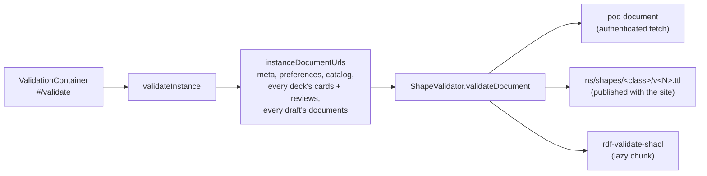

# Validation

Solid Memo checks the data it works on against its [shapes](shapes.md)
and the [DCAT-AP profile](#profiles-dcat-ap-and-skos), in the browser:

- **Every instance is checked when it is opened**, and what happens with
  data that does not conform is the user's
  [invalid data policy](#the-invalid-data-policy). What another app
  wrote is only ever warned about ([below](#data-another-app-wrote)).
- **Every write is checked before it is saved**, so the app never adds
  invalid data to a pod ([write check](#the-write-check)).
- **What can be repaired is repaired on request**; what cannot is shown,
  and can be removed ([repair](#repair)).
- The same report is a developer tool too: `#/validate?instance=…`,
  linked as "Validate this instance" at the bottom of the workspace
  while developer mode (a per-instance [preference](data-model.md#instance-layout))
  is on, shows it in full.
- The Studio's [health](studio.md#health) screen shows what the check
  finds to every user, of the instance or of one deck (`checkDeck`, its
  entry and documents only), with the repairs, beside what else is
  wrong with a deck.

Text in Markdown is never invalid: CommonMark has no invalid document,
so no shape constrains it, and the app shows any text safely
([markdown.md](markdown.md#safety)). A library release is held to more
when it is published, by `npm run library:check`'s
[Markdown rules](deck-library.md#markdown-rules), which are about how
its text shows, not whether it conforms.

## Flow

- `validateInstance` (application) lists the decks, names every document
  the instance may hold, the [answer log](data-model.md#the-answer-log)'s
  month documents included, and the documents of the
  [drafts](data-model.md#drafts-and-releases) its catalogue links, and
  asks the `ShapeValidator` port about each, saying where it is: a
  draft's document is checked as a draft's (`"draft"`, below), against
  the draft shapes and without DCAT-AP; `summarize` (domain) counts the
  violations. It reads only.
- **Opening an instance** runs `checkInstance` instead: the same check,
  but a document still at a version the instance's
  [digest](data-model.md#the-digest) says conformed, by the same rules,
  is neither downloaded nor checked again (`validateDocumentSince`: a
  304 is enough). A document that conforms is given a receipt. The rules
  are named by a hash of every shape and vendored profile file, computed
  when the site is built (`siteDefines` in
  `packages/vocab/tooling/siteBuild.ts`, which
  `apps/web/vite.config.ts` uses), so a site with other shapes checks everything again. It leaves out the
  answer log, which grows every session: answers are checked as they are
  written, and in the full check. The developer report always runs the
  full `validateInstance`.
- The [format update](migrations.md#the-pod-migration) and a
  [library upgrade](migrations.md#how-an-upgrade-is-applied) check what
  they write as every save does: each subject a write touches, against
  its shape, before the write is sent (the [write check](#the-write-check)). A
  document such a write would make fail is not written
  (`dataNotConforming`): it stays as it was, named with why; the format
  update goes on with the other documents, and a library upgrade stops
  there, as at any failure. What another app wrote has warnings, not
  violations, so it never stops a write.
- [shaclShapeValidator.ts](../packages/solid/src/shaclShapeValidator.ts)
  fetches the document, converts it to an RDF/JS dataset
  (`toRdfJsDataset`) and, for every subject, picks the shape by class
  and stored version exactly as the mappers do (`pickShape`); a subject
  with a Solid Memo class is checked against that class's shapes only,
  so a deck group, also a `dcat:Catalog`, is never checked as the
  catalogue. A subject
  is then `checked` (with its violations), `newer` (a format this app
  does not know: skipped, reported) or `untyped` (no Solid Memo class:
  listed so strays are visible; a cards document's own subject, which
  only says which deck the document is part of, is one). A document that does not exist is
  `missing`, which is normal, not a problem. A subject another app
  wrote is marked `foreign` and its results are warnings
  ([below](#data-another-app-wrote)).
- The shapes are fetched at their IRIs, under
  `https://solid-memo.com/ns/shapes/` (`SHAPES_BASE`), not bundled: they
  are published with the site anyway, and the document the browser
  checks against is the one CI validated. `siteFetch` in
  [appUseCases.ts](../packages/composition/src/appUseCases.ts) reads them from wherever the
  site is served, so `npm run dev` and `npm run preview` use the
  repository's `ns/`. Each shape document is fetched once per session.
- The SHACL engine ([engine.ts](../packages/shacl/src/engine.ts),
  the only module that imports `rdf-validate-shacl`) is loaded with a
  dynamic import, so the library is a separate chunk fetched only when a
  validation is asked for. It validates one focus node against one node
  shape (`validateNode`), so no `sh:targetClass` is needed.
- One engine is made per shape document and shared by every document
  checked against it. An engine runs one check at a time: the library
  keeps a single report per validator, so two checks at once (two
  documents checked together) would mix up their results.

## Profiles: DCAT-AP and SKOS

Besides Solid Memo's own shapes, data is held to two published
profiles, vendored verbatim under [packages/vocab/vendor/README.md](../packages/vocab/vendor/README.md)
(pinned by commit and sha256 in `packages/vocab/vendor/manifest.json`, which a test
checks) and published with the site at `/vendor/`:

| Profile | Shapes | Applies to |
|---|---|---|
| `dcat-ap` | DCAT-AP 3.0.1 (SEMIC) | catalogues, decks and deck releases, distributions, agents |
| `skos` | SkoHub `skos.shacl.ttl` + `skos.bestPractice.shacl.ttl` | the concept schemes in `ns/vocab/` |

- [profiles.ts](../packages/shacl/src/profiles.ts) names each
  profile's files. Their shapes pick their own targets
  (`sh:targetClass`), so a profile checks a whole graph with the
  engine's `validate`, not one subject with `validateNode`.
- The engine is SHACL Core only: `coreOnly` drops the SPARQL-based
  constraints (SkoHub has some) when the shapes are loaded. The CI
  cross-check runs them in full ([below](#the-ci-cross-check)).
- DCAT-AP's class checks (`dcat:theme` must be a `skos:Concept`,
  `dcterms:language` a `dcterms:LinguisticSystem`, …) look for the
  value's type in the data graph, so the reference data in
  [ns/vocab/external.ttl](../ns/vocab/external.ttl) (the EU authority-table
  entries and media types Solid Memo uses) is loaded next to the data
  being checked. Add a term there before data uses it.
- A member a catalogue or deck group lists from another document
  (`dcat:dataset`, `dcat:catalog`), such as a dataset another app added
  to the catalogue, is described in that document, which a check of this
  one cannot see. In the browser (`isMemberElsewhere` in
  [shaclShapeValidator.ts](../packages/solid/src/shaclShapeValidator.ts))
  DCAT-AP's class check on such a link says nothing: neither the data
  check nor the [write check](#the-write-check) holds it to its class. A
  member of the same document still must be a `dcat:Dataset` or
  `dcat:Catalog`.
- In node (`npm run library`, the tests) `validateProfile` ([packages/shacl/node/shacl.ts](../packages/shacl/node/shacl.ts))
  fails on any violation about a subject of the document. Warnings (a
  profile's recommendations) fail too for Solid Memo's own concept
  schemes, which are held to SKOS best practice.
- Fixtures under `packages/vocab/fixtures/profile/<profile>/{valid,invalid}/`
  pin every property DCAT-AP makes mandatory on the classes Solid Memo
  writes: title and description on a catalogue, dataset and dataset
  series, a publisher on a catalogue, an access URL on a distribution,
  a name on an agent, and the class of `dcterms:source`, `dcat:theme`
  and `dcterms:language` values, and of the members a catalogue or deck
  group lists: a deck (`dcat:dataset`) must be a `dcat:Dataset` and a
  group (`dcat:catalog`) a `dcat:Catalog`, so a member the document does
  not describe fails.

## The report

Per document, its URL and status; per subject, "conforms to deck format
2", "deck format 3 is newer than this app knows; skipped", "not a Solid
Memo subject", a subject only DCAT-AP has something to say about (a
licence, say), "written by another app; Solid Memo only warns about
it", or a table of severity, property, message and value (DCAT-AP's
results marked as such). The summary line says "All 9
documents conform" or "3 violations in 2 documents". A subject is
checked in its *stored* format, so outdated but valid data passes: the
[format update](migrations.md) is a separate matter.

## The invalid data policy

`validateInstance` runs when an instance is opened (`Workspace`, query
`["validation", instance]`, shared with the developer view) and again
after a repair or a format update. What happens when the report does
not conform is a preference, `sm:invalidDataPolicy`, a concept of
`sm:InvalidDataPolicies` ([vocab.md](vocab.md#concept-schemes)):

| Policy | What the app does |
|---|---|
| Block the instance (`sm:blockInstance`) | The workspace waits for the check, then shows the Data check notice with the repair in place of every screen. Preferences and the validation view stay reachable, so the policy can be changed. |
| Set invalid data aside (`sm:blockSubject`, the default) | A deck whose entry, cards or review states do not conform is set aside (`setAsideDecks`): listed as "Set aside", not offered for study, its pages saying so. The catalogue itself or a deck group that does not conform sets the arrangement of the deck list aside (`arrangementSetAside`): the list shows every deck, but cannot be rearranged, nor its groups renamed or deleted, until it is repaired, as a list a [newer version arranged](data-model.md#deck-groups) cannot. Any other subject that does not conform (a deck's agents or distribution, the catalogue's publisher, the preferences, the instance record) sets nothing aside: the notice reports it, and the write check still refuses a write that would leave it not conforming. Everything else works. The notice names the decks set aside, and says when the list cannot be rearranged. |
| Warn only (`sm:warnOnly`) | The notice, and nothing else. |

- **The default is a choice of the app, not of the data.** Preferences
  format 3 and later state a policy, so the default applies only where
  none is stated: an instance whose preferences were never saved, and
  preferences format 2, which the [step to format 3](migrations.md)
  gives the default. Preferences saved with "Block the instance" keep
  it. In the vocabulary the default concept's definition says "The
  default.", as `sm:systemTheme`'s does.
- **Until the preferences are read, the workspace waits for the check**
  as under "Block the instance", so a user who chose it never sees data
  before it is checked. Preferences that cannot be read leave the
  default.
- **Under "Set invalid data aside", nothing is used before the check
  says what is set aside**: until it is done, a deck's pages (its
  browser, study, preferences and course) wait for it, and the deck
  list shows but cannot be rearranged, so no write lands on data the
  check would set aside (a review state a reader drops would be studied
  as new, and the first answer would write over its history). A check
  that fails sets nothing aside.
- A check that cannot run (the shapes unreachable, say) is a warning,
  not a block: the app does not lock a user out of their data over its
  own trouble.
- **The Studio holds to the same check and policy** (`useDataCheck` in
  `ui`, which Solid Memo's workspace uses too): it shows a deck set
  aside, or every deck of an instance blocked, read-only, leaves it out
  of every bulk action, and changes nothing until the check is done
  ([studio.md](studio.md#data-set-aside)).

### Data another app wrote

The pod is shared: another app may list a dataset in the catalogue, or
add its own subjects to a cards document. A subject is Solid Memo's
when it has a Solid Memo class (`sm:Deck`, `sm:Card`, …), carries
`sm:formatVersion`, the stamp Solid Memo writes on every subject it
writes, is the catalogue (`catalog.ttl#catalog`), or is named by one of
Solid Memo's subjects as its `dcterms:creator`, `dcterms:publisher` or
`dcat:distribution`: the catalogue, a deck's agents and its
distribution have no Solid Memo class, and they stay Solid Memo's when
another app's rewrite has dropped their stamp
([ownership.ts](../packages/solid/src/ownership.ts)). A review state
of another scheduler (any value of `sm:scheduler` but the `sm:sm2`
IRI, a literal too) is
never Solid Memo's, whatever its class or stamp: its fields are another
algorithm's, which need not fit the review-state shape, so it is only
warned about ([data-model.md](data-model.md#decks-and-cards)). Any other subject
is another app's, and
[shaclShapeValidator.ts](../packages/solid/src/shaclShapeValidator.ts)
marks it `foreign`: it is still checked, against the shape its class
picks (a `foaf:Agent` against `AgentV1`) and DCAT-AP, but every result
about it, DCAT-AP's included, is a warning. So under every policy it
sets no deck aside, leaves the arrangement as it is and blocks no
instance, and the document holding it still conforms (and gets its
[receipt](#flow)). The developer report shows its results; the notice,
which is about violations, does not, and the repair offers nothing for
it: a warning is no problem. A subject another app wrote with a Solid
Memo class is held to that class's shape, as Solid Memo's own are.

A catalogue's or deck group's link to a member another app wrote is
that app's data too. When the member is a subject of the same document
that is not Solid Memo's (a `schema:Dataset`, say, which fails DCAT-AP's
class check) or a blank node (which fails the shape's `sh:nodeKind
sh:IRI`), the result about the link is a warning, in the check and in
the write check alike: the catalogue still conforms, the arrangement
stays editable, and no repair unlinks the member. The drop-dangling-members
repair, and writing the catalogue whole, keep such a link; a link to a
subject of the document that nothing describes is still the
catalogue's own problem.

## The write check

Every repository write (a deck, its agents and distribution, the
catalogue, cards, review states, preferences, the instance record) is
checked before it is saved: the subjects the write touches against their
shapes, and — in a document with DCAT subjects — against DCAT-AP
(`checkSubjects` in [shaclShapeValidator.ts](../packages/solid/src/shaclShapeValidator.ts),
wired into the repositories as `checkWrite` in
[appUseCases.ts](../packages/composition/src/appUseCases.ts)). A write that
would not conform is refused with every problem named, and nothing is
saved. Only what the write touches is checked, so a document with an
old problem elsewhere can still be written to.

Every caller names where the write goes (`WriteContext` in
[writeCheck.ts](../packages/solid/src/writeCheck.ts)), and that picks
the shapes, as `pickShape` picks them for a read:

- `"pod"`: an instance's documents, checked against the pod's shapes
  and, where they have DCAT subjects, DCAT-AP. Every write the app makes
  is one, but a draft's.
- `"draft"`: a release's draft. Its deck, chapters and steps are checked
  against the draft shapes (`DraftDeckV1`, `DraftChapterV1`,
  `DraftStepV1`, [shapes.md](shapes.md#version-by-version)), which do
  not yet ask what a release needs; its cards, distractors and agents
  against the shapes every context shares. DCAT-AP is not run: a draft
  may still lack what a published dataset needs, such as a description.
  The [release check](studio.md#the-release-check) holds the draft to
  all of it before it is published: `validateRelease` checks the
  release it will be, moved to its address, against the library shapes
  (`"library"`), DCAT-AP and SKOS, with a library's index beside it
  for the library's policy. Its publisher and series are often in
  another document, a library's index. When nothing beside the release
  describes them (in a pod, the index is not read), DCAT-AP's class
  check on `dcterms:publisher`, `dcat:inSeries` and
  `dcterms:isVersionOf` says nothing (`isLinkElsewhere`), as with a
  member listed from elsewhere. With the index beside it, they are held
  to their class.
  Every write of a draft is one
  ([solidReleaseDraftRepository.ts](../packages/solid/src/solidReleaseDraftRepository.ts)),
  and so is the check of a draft's documents.

A published release is never written, so no write is checked as one.

A release a learner adds [from a link](deck-library.md#from-a-link) is
read, not written, and checked as a document in the `"library"` context
(`validateDocument(url, "library")`): each subject against its library
shape, no DCAT-AP. It is read as anyone reads it, with the fetch the
shapes are read with: no login goes to its host. A violation refuses
the release; a warning does not.

## Repair

`planRepair` ([domain/repair.ts](../packages/domain/src/repair.ts)) turns a
report into repairs for the problems with one safe answer, written in
the subject's own stored format:

| Problem | Repair |
|---|---|
| A deck without a description | The default description, "Flashcards: <title>." |
| A deck without a study direction, or an unknown one | Front to back, as format 1 studied every deck |
| A review state with half an undo snapshot | The snapshot dropped (as the review-state 1 → 2 migration does) |
| A malformed due day | Recomputed from the last review and the interval |
| An agent without a name | Named after its IRI |
| A catalogue or [deck group](data-model.md#deck-groups) listing a deck or group the document does not describe (DCAT-AP's class check on `dcat:dataset` or `dcat:catalog`) | Those links dropped (a member typed `sm:Deck` or `sm:DeckGroup` alone is kept, and so is every link to another document) |

Every other problem is listed with its document linked, to be fixed
there or removed (after a confirmation). Removing a subject also drops
the catalogue's and the deck groups' membership links to it
(`dcat:dataset`, `dcat:catalog`), and only those: who else names it, a
deck its creator or the catalogue its publisher, is left as it is. `applyRepairs`
([solidRepairRepository.ts](../packages/solid/src/solidRepairRepository.ts))
reads each document once, applies its repairs, writes it once, and the
instance is checked again.

## The CI cross-check

CI checks what
Solid Memo publishes again with an independent SHACL engine, pySHACL
(pinned in `scripts/requirements-ci.txt`), which also runs SPARQL-based
constraints: [scripts/shacl_crosscheck.py](../scripts/shacl_crosscheck.py)
holds the [deck library](deck-library.md)'s index and every version,
and the pod catalog documents of the deck format 4, 5 and 6 fixtures (format 5 titles a deck in any
language, English or not; format 6 tags its keywords) and of the deck group 1 fixtures (nested
groups), to DCAT-AP, and the vocabulary's concept schemes to
SkoHub's SKOS shapes, best practice included. It also holds a release
published in a pod (the library deck 6 fixtures, which describe their
series and publisher themselves) to DCAT-AP with no index beside it, and
that release and the draft fixtures (draft deck, chapter and step 1) to
Solid Memo's own shapes: the script picks each subject's shape by class,
format version and context as `pickShape` does, and targets it with
`sh:targetNode`. A disagreement between the
engines, or a constraint the browser's engine cannot run, fails CI. It
reads `ns/` and `decks/` from the repository, each file at the IRI the
site publishes it under, and needs neither a build nor the network, so
it runs as its own job beside the build. Locally: `pip install -r
scripts/requirements-ci.txt`, then `npm run crosscheck` (which runs
`python3 scripts/shacl_crosscheck.py`, and says what to install if
pySHACL is missing).
