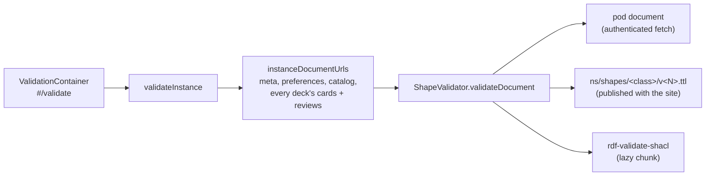

# Validation

Solid Memo checks the data it works on against its [shapes](shapes.md)
and the [DCAT-AP profile](#profiles-dcat-ap-and-skos), in the browser:

- **Every instance is checked when it is opened**, and what happens with
  data that does not conform is the user's
  [invalid data policy](#the-invalid-data-policy).
- **Every write is checked before it is saved**, so the app never adds
  invalid data to a pod ([write check](#the-write-check)).
- **What can be repaired is repaired on request**; what cannot is shown,
  and can be removed ([repair](#repair)).
- The same report is a developer tool too: `#/validate?instance=…`,
  linked as "Validate this instance" at the bottom of the workspace
  while developer mode (a per-instance [preference](data-model.md#instance-layout))
  is on, shows it in full.

## Flow

- `validateInstance` (application) lists the decks, names every document
  the instance may hold, the [answer log](data-model.md#the-answer-log)'s
  month documents included, and asks the `ShapeValidator` port about
  each; `summarize` (domain) counts the violations. It reads only.
- **Opening an instance** runs `checkInstance` instead: the same check,
  but a document still at a version the instance's
  [digest](data-model.md#the-digest) says conformed, by the same rules,
  is neither downloaded nor checked again (`validateDocumentSince`: a
  304 is enough). A document that conforms is given a receipt. The rules
  are named by a hash of every shape and vendored profile file, computed
  when the site is built (`__SHAPES_RULESET__` in `apps/web/vite.config.ts`),
  so a site with other shapes checks everything again. It leaves out the
  answer log, which grows every session: answers are checked as they are
  written, and in the full check. The developer report and the format
  update always run the full `validateInstance`.
- The [format update](migrations.md#the-pod-migration) runs the same
  check on its updated copy before switching over: a copy with any
  violation is deleted and the user's instance is left as it was.
- [shaclShapeValidator.ts](../packages/solid/src/shaclShapeValidator.ts)
  fetches the document, converts it to an RDF/JS dataset
  (`toRdfJsDataset`) and, for every subject, picks the shape by class
  and stored version exactly as the mappers do (`pickShape`). A subject
  is then `checked` (with its violations), `newer` (a format this app
  does not know: skipped, reported) or `untyped` (no Solid Memo class:
  listed so strays are visible). A document that does not exist is
  `missing`, which is normal, not a problem.
- The shapes are fetched at their IRIs, under
  `https://solid-memo.com/ns/shapes/` (`SHAPES_BASE`), not bundled: they
  are published with the site anyway, and the document the browser
  checks against is the one CI validated. `siteFetch` in
  [main.tsx](../apps/web/src/main.tsx) reads them from wherever the
  site is served, so `npm run dev` and `npm run preview` use the
  repository's `ns/`. Each shape document is fetched once per session.
- The SHACL engine ([engine.ts](../packages/shacl/src/engine.ts),
  the only module that imports `rdf-validate-shacl`) is loaded with a
  dynamic import, so the library is a separate chunk fetched only when a
  validation is asked for. It validates one focus node against one node
  shape (`validateNode`), so no `sh:targetClass` is needed.

## Profiles: DCAT-AP and SKOS

Besides Solid Memo's own shapes, data is held to two published
profiles, vendored verbatim under [packages/vocab/vendor/README.md](../packages/vocab/vendor/README.md)
(pinned by commit and sha256 in `packages/vocab/vendor/manifest.json`, which a test
checks) and published with the site at `/vendor/`:

| Profile | Shapes | Applies to |
|---|---|---|
| `dcat-ap` | DCAT-AP 3.0.1 (SEMIC) | catalogues, decks and deck releases, distributions, agents |
| `skos` | SkoHub `skos.shacl.ttl` + `skos.bestPractice.shacl.ttl` | the concept schemes in `ns/vocab/` |

- [profiles.ts](../packages/shacl/src/profiles.ts) names each
  profile's files. Their shapes pick their own targets
  (`sh:targetClass`), so a profile checks a whole graph with the
  engine's `validate`, not one subject with `validateNode`.
- The engine is SHACL Core only: `coreOnly` drops the SPARQL-based
  constraints (SkoHub has some) when the shapes are loaded. The CI
  cross-check runs them in full ([below](#the-ci-cross-check)).
- DCAT-AP's class checks (`dcat:theme` must be a `skos:Concept`,
  `dcterms:language` a `dcterms:LinguisticSystem`, …) look for the
  value's type in the data graph, so the reference data in
  [ns/vocab/external.ttl](../ns/vocab/external.ttl) (the EU authority-table
  entries and media types Solid Memo uses) is loaded next to the data
  being checked. Add a term there before data uses it.
- In node (`npm run library`, the tests) `validateProfile` ([packages/shacl/node/shacl.ts](../packages/shacl/node/shacl.ts))
  fails on any violation about a subject of the document. Warnings (a
  profile's recommendations) fail too for Solid Memo's own concept
  schemes, which are held to SKOS best practice.
- Fixtures under `packages/vocab/fixtures/profile/<profile>/{valid,invalid}/`
  pin every property DCAT-AP makes mandatory on the classes Solid Memo
  writes: title and description on a catalogue, dataset and dataset
  series, a publisher on a catalogue, an access URL on a distribution,
  a name on an agent, and the class of `dcterms:source`, `dcat:theme`
  and `dcterms:language` values.

## The report

Per document, its URL and status; per subject, "conforms to deck format
2", "deck format 3 is newer than this app knows; skipped", "not a Solid
Memo subject", a subject only DCAT-AP has something to say about (a
licence, say), or a table of severity, property, message and value
(DCAT-AP's results marked as such). The summary line says "All 9
documents conform" or "3 violations in 2 documents". A subject is
checked in its *stored* format, so outdated but valid data passes: the
[format update](migrations.md) is a separate matter.

## The invalid data policy

`validateInstance` runs when an instance is opened (`Workspace`, query
`["validation", instance]`, shared with the developer view) and again
after a repair or a format update. What happens when the report does
not conform is a preference, `sm:invalidDataPolicy`, a concept of
`sm:InvalidDataPolicies` ([vocab.md](vocab.md#concept-schemes)):

| Policy | What the app does |
|---|---|
| Block the instance (`sm:blockInstance`, the default) | The workspace waits for the check, then shows the Data check notice with the repair in place of every screen. Preferences and the validation view stay reachable, so the policy can be changed. |
| Set invalid data aside (`sm:blockSubject`) | A deck whose entry, cards or review states do not conform is set aside (`setAsideDecks`): listed as "Set aside", not offered for study, its pages saying so. Everything else works. The notice names the decks set aside. |
| Warn only (`sm:warnOnly`) | The notice, and nothing else. |

A check that cannot run (the shapes unreachable, say) is a warning, not a
block: the app does not lock a user out of their data over its own
trouble.

## The write check

Every repository write (a deck, its agents and distribution, the
catalogue, cards, review states, preferences, the instance record) is
checked before it is saved: the subjects the write touches against their
shapes, and — in a document with DCAT subjects — against DCAT-AP
(`checkSubjects` in [shaclShapeValidator.ts](../packages/solid/src/shaclShapeValidator.ts),
wired into the repositories as `checkWrite` in `main.tsx`). A write that
would not conform is refused with every problem named, and nothing is
saved. Only what the write touches is checked, so a document with an
old problem elsewhere can still be written to.

## Repair

`planRepair` ([domain/repair.ts](../packages/domain/src/repair.ts)) turns a
report into repairs for the problems with one safe answer, written in
the subject's own stored format:

| Problem | Repair |
|---|---|
| A deck without a description | The default description, "Flashcards: <title>." |
| A deck without a study direction, or an unknown one | Front to back, as format 1 studied every deck |
| A review state with half an undo snapshot | The snapshot dropped (as the review-state 1 → 2 migration does) |
| A malformed due day | Recomputed from the last review and the interval |
| An agent without a name | Named after its IRI |

Every other problem is listed with its document linked, to be fixed
there or removed (after a confirmation). `applyRepairs`
([solidRepairRepository.ts](../packages/solid/src/solidRepairRepository.ts))
reads each document once, applies its repairs, writes it once, and the
instance is checked again.

## The CI cross-check

CI (and the [ns workflow](../.github/workflows/ns.yml)) checks what
Solid Memo publishes again with an independent SHACL engine, pySHACL
(pinned in `scripts/requirements-ci.txt`), which also runs SPARQL-based
constraints: [scripts/shacl_crosscheck.py](../scripts/shacl_crosscheck.py)
holds the [deck library](deck-library.md)'s index and every version,
and the pod catalog documents of the deck format 4, 5 and 6 fixtures (format 5 titles a deck in any
language, English or not; format 6 tags its keywords), to DCAT-AP, and the vocabulary's concept schemes to
SkoHub's SKOS shapes, best practice included. A disagreement between the
engines, or a constraint the browser's engine cannot run, fails CI. It
reads `ns/` and `decks/` from the repository, each file at the IRI the
site publishes it under, and needs neither a build nor the network.
Locally: `pip install -r scripts/requirements-ci.txt`, then `python3
scripts/shacl_crosscheck.py`.
