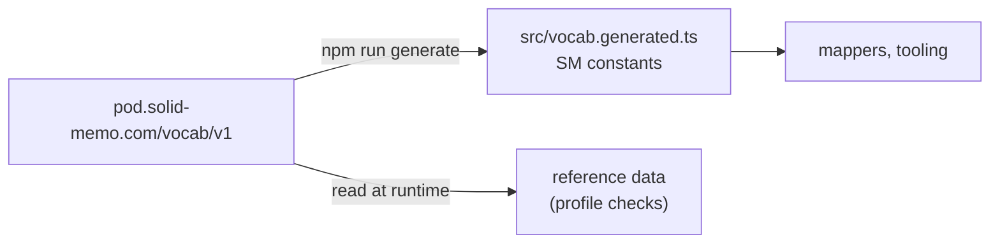

# Vocabulary

Solid Memo's own RDF terms, where they are defined, how they are
versioned and how the app's constants are produced from them. The
namespace is `https://pod.solid-memo.com/vocab/v1#` — declared as
`solid-memo:` in the Turtle files, abbreviated to `sm:` in these docs;
no existing vocabulary covers spaced repetition.

## Source of truth

The vocabulary lives on its own pod, https://pod.solid-memo.com/vocab/
([pods.ts](../packages/vocab/src/pods.ts)), and nowhere else: this
repository keeps no copy. Its documents are `v1` (the ontology),
`topics` (the topics scheme) and `external` (reference data), each at
an address without an extension that is also its IRI, so every term
IRI is a fragment of the document that defines it.

[`v1`](https://pod.solid-memo.com/vocab/v1) is an RDFS/OWL ontology: the
`owl:Ontology` subject carries `owl:versionInfo` and a `skos:changeNote`
per release, and every term is an `owl:Class`, `owl:DatatypeProperty`
(literal-valued, with an `xsd:` range) or `owl:ObjectProperty`
(IRI-valued) with `rdfs:label`, `rdfs:comment`, `rdfs:domain` where it
has one class, `rdfs:range`, `rdfs:isDefinedBy` and a
`skos:historyNote` saying when it arrived.

`SM` in [vocab.ts](../packages/solid/src/vocab.ts) is a re-export
of the generated constants; the external vocabularies there (Solid, PIM,
Dublin Core, RDF, RDFS, FOAF) are not ours to publish and stay
hand-written. The generator copies each term's comment and history note
into the constant's JSDoc, so the meaning is one hover away.

## Concept schemes

Where a value is one of a fixed set, it is a SKOS concept, not a
string, so other applications can look up what it means:

| Scheme | Where | Concepts | Used by |
|---|---|---|---|
| `sm:StudyDirections` | [`v1`](https://pod.solid-memo.com/vocab/v1) | `sm:frontToBack`, `sm:backToFront`, `sm:bidirectional` | `sm:studyDirection` on a deck |
| `sm:InvalidDataPolicies` | [`v1`](https://pod.solid-memo.com/vocab/v1) | `sm:blockInstance` (default), `sm:blockSubject`, `sm:warnOnly` | `sm:invalidDataPolicy` in preferences |
| `sm:Themes` | [`v1`](https://pod.solid-memo.com/vocab/v1) | `sm:systemTheme` (default), `sm:lightTheme`, `sm:darkTheme` | `sm:theme` in preferences ([theme.md](theme.md)) |
| Topics (`https://pod.solid-memo.com/vocab/topics`) | [`topics`](https://pod.solid-memo.com/vocab/topics) | languages (swedish), geography, computing, science (chemistry), art, labour-market | `dcat:theme` on a deck, next to the EU data theme `EDUC` |

- Every scheme has a `dcterms:title` and a `skos:definition`; every
  concept a `skos:prefLabel` and `skos:definition` in each language the
  scheme's title is in (English always; the topics in English and
  Swedish, the app's languages) and its `skos:inScheme`. The generator
  refuses a concept that misses one. Top concepts say `skos:topConceptOf`, narrower ones
  `skos:broader`. The files are held to SKOS, SkoHub's best practice
  included (see [validation.md](validation.md#profiles-dcat-ap-and-skos)).
- A concept that replaces a string the app used before carries that
  string as its `skos:notation` (`sm:frontToBack` is `"front-to-back"`),
  so the mapping between them is data.
- `npm run generate` renders every scheme into
  `packages/vocab/src/concepts.generated.ts` (`STUDY_DIRECTIONS`,
  `INVALID_DATA_POLICIES`, `TOPICS`), which the app lists and labels
  from, in the language the user reads; [concepts.ts](../packages/domain/src/concepts.ts) looks concepts up by
  IRI or notation. The topics scheme's IRI lands on an HTML page
  (`vocab/topics/`), as the vocabulary's does.
- Concepts are only ever added. One that should go is deprecated
  (`owl:deprecated`), never removed: decks point at it.

## Versioning policy

- **Within v1, terms are only ever added.** An addition bumps
  `owl:versionInfo` (1.0 → 1.1 → …) and appends to the change note. A
  term's meaning, datatype or range never changes. A term that should no
  longer be written is deprecated (`owl:deprecated true`, with
  `dcterms:isReplacedBy`), not removed: `sm:direction` gave way to
  `sm:studyDirection` in 1.6. The generated constant carries
  `@deprecated`.
- **An optional term may join a shape's current format without a format
  bump** when a reader that ignores it loses nothing: the deck's own
  study caps (`sm:deckNewCardsPerDay`, `sm:deckMaxReviewsPerDay`, 1.7)
  and the description of a card's pictures (`sm:frontImageDescription`,
  `sm:backImageDescription`, 1.12) are such terms. The vocabulary still
  moves to the next 1.x.
- **A breaking change is a new namespace** (`vocab/v2#`, with
  `owl:priorVersion` pointing back), never an edit of v1: the v1 IRIs
  are baked into every pod that ever wrote them.
- The [shapes](shapes.md) say which terms a subject of a given class and
  format version uses; the vocabulary only says what each term means.

## The language of text

Solid Memo's text properties (`sm:front`, `sm:back`, `sm:frontNote`,
`sm:backLabel`, `sm:backNote`, `sm:frontImageDescription`,
`sm:backImageDescription`, and `dcterms:title` and
`dcterms:description` on a deck) say their language with the literal's
own language tag (`"Huvudstäder"@sv`), one value per language, not
with a term of ours. A deck's keywords (`dcat:keyword`) are tagged the
same way, the one text with several values per language
(`"capitals"@en, "countries"@en, "huvudstäder"@sv`). Tags are BCP 47, stored in lower case. Text in no
language — codes, numbers, symbols ("404", "Fe") — is tagged `zxx`,
BCP 47's "no linguistic content", rather than with a language it is
not in; a page shows it with no `lang`. A card side saved untagged
(`xsd:string`), or a keyword saved before deck format 6, says nothing about its language: it is not known, not
none. Which formats require which tags is the [shapes](shapes.md)'
business.

There is no term for a deck's languages: the app works out which
languages to offer from the tags the deck's text already uses (see
[i18n.md](i18n.md#text-in-the-users-languages)). Optional
`sm:frontLanguage` / `sm:backLanguage` defaults could join without a
format bump, as above, should that prove too weak. `dcterms:language`
is used only on library releases, for DCAT-AP: it names EU
authority-table languages and cannot tell a card's front from its back.

## What dereferences

| IRI | What is served |
|---|---|
| `https://pod.solid-memo.com/vocab/v1#Deck` (any term) | The ontology, `…/vocab/v1`, as Turtle (or JSON-LD, which the Solid server converts it to on request): the term is a subject of it. |
| `https://pod.solid-memo.com/vocab/topics#geography` (any topic) | The topics scheme, `…/vocab/topics`. |
| `https://pod.solid-memo.com/vocab/external` | Reference data, not terms of ours: the external terms (EU authority-table entries, media types) Solid Memo data points at, typed so [profile validation](validation.md#profiles-dcat-ap-and-skos) can check them. |

Each is public on the pod, which serves it with CORS, so the browser
reads it directly. The site publishes none of them.

## Adding a term

1. Add it to `https://pod.solid-memo.com/vocab/v1`, as the vocabulary
   pod's owner, with every annotation; bump the version and the change
   note.
2. `npm run generate`, which reads the pod (CI runs `npm run
   generate:check` and fails on drift; the drift test in
   `packages/vocab/tooling/generate.test.ts` does too, and so does any
   change on the pod the generated code has not caught up with).
3. Use it in a [shape](shapes.md) — the fixture test checks that every
   `sm:` predicate a shape uses is declared here.
