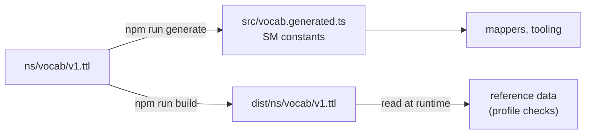

# Vocabulary

Solid Memo's own RDF terms, where they are defined, how they are
versioned and how the app's constants are produced from them. The
namespace is `https://solid-memo.com/ns/vocab/v1.ttl#` — declared as
`solid-memo:` in the Turtle files, abbreviated to `sm:` in these docs;
no existing vocabulary covers spaced repetition.

## Source of truth

The vocabulary lives in this repository's [`ns/vocab/`](../ns/vocab/)
folder and is published with the site at
`https://solid-memo.com/ns/vocab/` ([ns.ts](../packages/vocab/src/ns.ts),
[deployment.md](deployment.md)). Its documents are `v1.ttl` (the
ontology), `topics.ttl` (the topics scheme) and `external.ttl`
(reference data), each at an address that is also its IRI and its
`@base`, so every term IRI is a fragment of the document that defines
it. Changes to them go through git and CI like any other change
([ns.yml](../.github/workflows/ns.yml)).

[`ns/vocab/v1.ttl`](../ns/vocab/v1.ttl) is an RDFS/OWL ontology: the
`owl:Ontology` subject carries `owl:versionInfo` and a `skos:changeNote`
per release, and every term is an `owl:Class`, `owl:DatatypeProperty`
(literal-valued, with an `xsd:` range) or `owl:ObjectProperty`
(IRI-valued) with `rdfs:label`, `rdfs:comment`, `rdfs:domain` where it
has one class, `rdfs:range`, `rdfs:isDefinedBy` and a
`skos:historyNote` saying when it arrived.

`SM` in [vocab.ts](../packages/solid/src/vocab.ts) is a re-export
of the generated constants; the external vocabularies there (Solid, PIM,
Dublin Core, RDF, RDFS, FOAF) are not ours to publish and stay
hand-written. The generator copies each term's comment and history note
into the constant's JSDoc, so the meaning is one hover away.

## Concept schemes

Where a value is one of a fixed set, it is a SKOS concept, not a
string, so other applications can look up what it means:

| Scheme | Where | Concepts | Used by |
|---|---|---|---|
| `sm:StudyDirections` | [`v1.ttl`](../ns/vocab/v1.ttl) | `sm:frontToBack`, `sm:backToFront`, `sm:bidirectional` | `sm:studyDirection` on a deck |
| `sm:InvalidDataPolicies` | [`v1.ttl`](../ns/vocab/v1.ttl) | `sm:blockInstance`, `sm:blockSubject` (default), `sm:warnOnly` | `sm:invalidDataPolicy` in preferences |
| `sm:Themes` | [`v1.ttl`](../ns/vocab/v1.ttl) | `sm:systemTheme` (default), `sm:lightTheme`, `sm:darkTheme` | `sm:theme` in preferences ([theme.md](theme.md)) |
| `sm:AnswerModes` | [`v1.ttl`](../ns/vocab/v1.ttl) | `sm:recall` (absent means this), `sm:multipleChoice` | `sm:answerMode` on an answer in the [answer log](data-model.md#the-answer-log) |
| `sm:TextFormats` | [`v1.ttl`](../ns/vocab/v1.ttl) | `sm:plainText` (absent means this), `sm:markdown` | `sm:textFormat` on a card, a course step or a chapter ([Text formats](#text-formats)) |
| Topics (`https://solid-memo.com/ns/vocab/topics.ttl`) | [`topics.ttl`](../ns/vocab/topics.ttl) | languages (swedish), geography, computing (linked-data), science (chemistry), art, labour-market | `dcat:theme` on a deck, next to the EU data theme `EDUC` |

- Every scheme has a `dcterms:title` and a `skos:definition`; every
  concept a `skos:prefLabel` and `skos:definition` in each language the
  scheme's title is in (English always; the topics in English and
  Swedish, the app's languages) and its `skos:inScheme`. The generator
  refuses a concept that misses one. Top concepts say `skos:topConceptOf`, narrower ones
  `skos:broader`. The files are held to SKOS, SkoHub's best practice
  included (see [validation.md](validation.md#profiles-dcat-ap-and-skos)).
- A concept that replaces a string the app used before carries that
  string as its `skos:notation` (`sm:frontToBack` is `"front-to-back"`),
  so the mapping between them is data.
- `npm run generate` renders every scheme into
  `packages/vocab/src/concepts.generated.ts` (`STUDY_DIRECTIONS`,
  `INVALID_DATA_POLICIES`, `ANSWER_MODES`, `TEXT_FORMATS`, `TOPICS`), which the app lists and labels
  from, in the language the user reads; [concepts.ts](../packages/domain/src/concepts.ts) looks concepts up by
  IRI or notation.
- Concepts are only ever added. One that should go is deprecated
  (`owl:deprecated`), never removed: decks point at it.
- The topics scheme is versioned the way `v1` is, but without a version
  in its IRI. A topic is only a name decks point at, and adding one or
  improving its labels breaks nothing, so there is never a
  `topics/v2`. The scheme carries `owl:versionInfo` and a
  `skos:changeNote` per release, each addition bumping it (1.0 → 1.1 →
  …), and every topic carries a `skos:historyNote` saying when it
  arrived ("Since 1.4.").

## Versioning policy

- **Within v1, terms are only ever added.** An addition bumps
  `owl:versionInfo` (1.0 → 1.1 → …) and appends to the change note. A
  term's meaning, datatype or range never changes. A term that should no
  longer be written is deprecated (`owl:deprecated true`, with
  `dcterms:isReplacedBy`), not removed: `sm:direction` gave way to
  `sm:studyDirection` in 1.6. The generated constant carries
  `@deprecated`.
- **An optional term may join a shape's current format without a format
  bump** when a reader that ignores it loses nothing: the deck's own
  study caps (`sm:deckNewCardsPerDay`, `sm:deckMaxReviewsPerDay`, 1.7)
  and the description of a card's pictures (`sm:frontImageDescription`,
  `sm:backImageDescription`, 1.12) are such terms. The vocabulary still
  moves to the next 1.x. A term may also be written on a subject outside
  its shape, which neither owns nor checks it: `sm:position` (1.13), a
  deck's place on the [arranged deck list](data-model.md#deck-groups),
  is kept by every writer of a deck because `DeckV6` does not own it, so
  the deck format did not move. 1.14 added both kinds: `sm:distractor`
  joined card format 5 and `sm:answerMode` and `sm:chosenDistractor`
  answer format 1, each optional, and `sm:completedChapter` is written
  on a deck outside `DeckV6`, as `sm:position` is
  ([courses.md](courses.md)). 1.15's `sm:textFormat` joined card format
  5, step format 1 and chapter format 1 the first way
  ([Text formats](#text-formats)).
- **A new concept of a scheme whose property shape lists no `sh:in`
  needs no format bump.** `sm:textFormat` is such a property: its shape
  says only "at most one IRI", so a reader that meets a concept it does
  not know reads the value, keeps it through an edit and treats the text
  as plain, rather than erasing it or calling the subject invalid. A
  scheme whose shape does list its concepts (`sm:studyDirection`,
  `sm:theme`) is an `iriEnum`, and there a new concept is a new format.
- **Which concept is the app's default is the app's, not the
  vocabulary's.** A scheme's default concept says "The default." in its
  definition, a note on what the app does where data states no concept,
  which moves with the app: when "Set invalid data aside" became the
  default ([validation.md](validation.md#the-invalid-data-policy)), the
  note moved from `sm:blockInstance` to `sm:blockSubject` without a
  version bump, as no term was added and no stored value changed its
  meaning.
- **A breaking change is a new namespace** (`ns/vocab/v2.ttl#`, with
  `owl:priorVersion` pointing back), never an edit of v1: the v1 IRIs
  are baked into every pod that ever wrote them.
- The [shapes](shapes.md) say which terms a subject of a given class and
  format version uses; the vocabulary only says what each term means.

## Courses

Version 1.14 added the terms of a [course](courses.md): a library
release that is also a `schema:Course`, with chapters of steps whose
questions are its cards.

| Term | Kind | Domain → range | Alignment |
|---|---|---|---|
| `sm:Chapter` | class | | subclass of `schema:Syllabus` |
| `sm:Step` | class | | subclass of `schema:LearningResource` |
| `sm:Distractor` | class | | subclass of `schema:Answer` |
| `sm:theory` | datatype property | Step → language-tagged text | subproperty of `schema:text` |
| `sm:checkedBy` | object property | Step → Card | |
| `sm:reviewQuestion` | object property | Chapter → Card | |
| `sm:distractor` | object property | Card → Distractor | see also `schema:suggestedAnswer` |
| `sm:distractorText` | datatype property | Distractor → text, untagged or tagged as `sm:back` is | subproperty of `schema:text` |
| `sm:distractorNote` | datatype property | Distractor → language-tagged text | see also `schema:answerExplanation` |
| `sm:completedChapter` | object property | Deck → Chapter | |
| `sm:answerMode` | object property | Answer → a concept of `sm:AnswerModes` | |
| `sm:chosenDistractor` | object property | Answer → Distractor | |

- **Every new class has an `sm:` class beside the schema.org one.** A
  shape is picked by a Solid Memo, DCAT or FOAF class
  ([shapes.md](shapes.md#conventions)), so the schema.org types are
  extra types that the shapes state. A course needs no `sm:Course`: the
  release is an `sm:Deck` already.
- **External terms are reused where they mean the same:**
  `schema:isPartOf` and `schema:position` place a chapter in its course
  and a step in its chapter. `sm:position` keeps its one meaning, a
  place on the arranged deck list.
- **The vocabulary's `schema:` prefix is `https://schema.org/`.**

## Text formats

Version 1.15 added how a text is written: `sm:textFormat`, a concept of
`sm:TextFormats`, on the subject that holds the text.

| Concept | Notation | Meaning |
|---|---|---|
| `sm:plainText` | `plain` | Shown as written. The same as no text format; the app writes it where a person chose it, so a deliberate choice is told from a marker an older app lost. |
| `sm:markdown` | `markdown` | CommonMark 0.31.2, with GitHub Flavored Markdown pipe tables as its one extension (`skos:broadMatch` IANA `text/markdown`). |

- **What it covers is fixed for 1.x**, by the subject's class: on an
  `sm:Card` its `sm:front`, `sm:back`, `sm:frontNote`, `sm:backNote` and
  `sm:backLabel`, and the `sm:distractorText` and `sm:distractorNote` of
  its distractors, which carry no format of their own (they are read
  and written only with their card); on an `sm:Step` its `sm:theory`;
  on an `sm:Chapter` its `dcterms:description`. A picture's description,
  a chapter's title and every deck-level text are always plain: they
  serve as `alt` text, headings and DCAT metadata. A new text predicate
  needs its own decision.
- **Opt-in on every subject, never inherited.** Absent means plain
  text, exactly as before 1.15: published text already holds strings
  Markdown would misread (`&aring;`, `git clone <url>`, `M87*`), and
  frozen releases are never retro-marked. A card copied or imported
  alone keeps its meaning, since the marker is on the card, not the
  deck. Theory and chapter descriptions are not Markdown by definition
  for the same reason: 1.14 published them as plain.
- **The definition is syntax only.** How the app shows it (raw HTML as
  text, pictures as their alt text, which links are live) is render
  policy ([markdown.md](markdown.md)), which may change without touching
  data.
- **A wider dialect is a new concept** (strikethrough or autolinks would
  change how existing Markdown text reads); an older app reads it as
  plain text and keeps it (see the versioning policy above).
- **Not `dcterms:format` or `schema:encodingFormat`.** Both describe a
  resource's media, not its text: a card also carries pictures, and a
  `schema:LearningResource`'s encoding format names its own media.
  Other schema.org or DCAT readers see the Markdown source as the
  literal's value.
- Literals stay `rdf:langString` (or untagged `xsd:string` where a
  shape allows it): each language's value is its own document, and the
  [language rules](#the-language-of-text) are unchanged.

## The language of text

Solid Memo's text properties (`sm:front`, `sm:back`, `sm:frontNote`,
`sm:backLabel`, `sm:backNote`, `sm:frontImageDescription`,
`sm:backImageDescription`, a course's `sm:theory`,
`sm:distractorText` and `sm:distractorNote`, and `dcterms:title` and
`dcterms:description` on a deck or chapter) say their language with the literal's
own language tag (`"Huvudstäder"@sv`), one value per language, not
with a term of ours. A deck's keywords (`dcat:keyword`) are tagged the
same way, the one text with several values per language
(`"capitals"@en, "countries"@en, "huvudstäder"@sv`). Tags are BCP 47, stored in lower case. Text in no
language — codes, numbers, symbols ("404", "Fe") — is tagged `zxx`,
BCP 47's "no linguistic content", rather than with a language it is
not in; a page shows it with no `lang`. A card side saved untagged
(`xsd:string`), or a keyword saved before deck format 6, says nothing about its language: it is not known, not
none. Which formats require which tags is the [shapes](shapes.md)'
business.

There is no term for a deck's languages: the app works out which
languages to offer from the tags the deck's text already uses (see
[i18n.md](i18n.md#text-in-the-users-languages)). Optional
`sm:frontLanguage` / `sm:backLanguage` defaults could join without a
format bump, as above, should that prove too weak. `dcterms:language`
is used only on library releases, for DCAT-AP: it names EU
authority-table languages and cannot tell a card's front from its back.

## What dereferences

| IRI | What is served |
|---|---|
| `https://solid-memo.com/ns/vocab/v1.ttl#Deck` (any term) | The ontology, `…/ns/vocab/v1.ttl`, as Turtle: the term is a subject of it. |
| `https://solid-memo.com/ns/vocab/topics.ttl#geography` (any topic) | The topics scheme, `…/ns/vocab/topics.ttl`. |
| `https://solid-memo.com/ns/vocab/external.ttl` | Reference data, not terms of ours: the external terms (EU authority-table entries, media types) Solid Memo data points at, typed so [profile validation](validation.md#profiles-dcat-ap-and-skos) can check them. |

GitHub Pages serves each as `text/turtle` with
`Access-Control-Allow-Origin: *`, so any application reads it
directly. It negotiates no content: the documents are Turtle only, and
an IRI without the `.ttl` would be a 404, which is why the namespace
keeps the extension. The `turtleDirectoryPlugin` in
[packages/vocab/tooling/publishTurtle.ts](../packages/vocab/tooling/publishTurtle.ts)
emits them into the build and serves them in dev.

## Adding a term

1. Add it to [`ns/vocab/v1.ttl`](../ns/vocab/v1.ttl) with every
   annotation; bump the version and the change note.
2. `npm run generate` (CI runs `npm run generate:check` and fails on
   drift; the drift test in `packages/vocab/tooling/generate.test.ts`
   does too).
3. Use it in a [shape](shapes.md) — the fixture test checks that every
   `sm:` predicate a shape uses is declared here.
